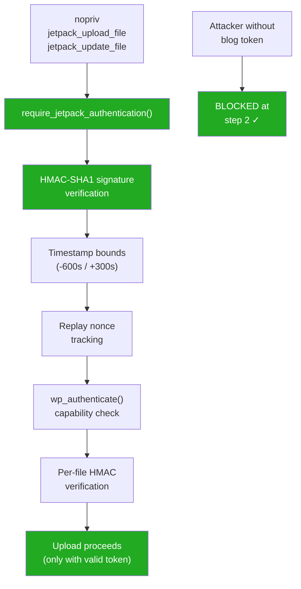

# Jetpack Unauthenticated Remote File Upload/Update & Nopriv Handler Audit

**Date:** 2026-06-14
**Plugin:** Jetpack (latest from source)
**Focus:** Unauthenticated RCE via file upload/update handlers and all nopriv AJAX endpoints

---

## 1. Remote File Upload/Update Handlers

### Handler Registration: `add_remote_request_handlers()`
**File:** `class.jetpack.php:3321-3349`

The two nopriv AJAX actions are:
- `wp_ajax_nopriv_jetpack_upload_file`
- `wp_ajax_nopriv_jetpack_update_file`

Both are registered **only when**:
1. `is_admin()` AND `DOING_AJAX` are true (line 3323)
2. `$_POST['action']` matches one of the two actions (line 3334)
3. `$this->connection_manager->require_jetpack_authentication()` is called (line 3343)

### Auth Mechanism: Jetpack Connection Signature Verification

**File:** `jetpack-connection/src/class-manager.php:374-621`

`require_jetpack_authentication()` does the following:
1. **Clears all cookies** (`$_COOKIE = array()`) -- prevents cookie-based auth
2. **Removes all `authenticate` filters** -- strips WP's default auth
3. **Adds `authenticate_jetpack` filter** -- sole auth path becomes Jetpack signature

`authenticate_jetpack()` calls `verify_xml_rpc_signature()` which:
1. Requires `$_GET['token']`, `$_GET['signature']`, `$_GET['timestamp']`, `$_GET['nonce']`, `$_GET['body-hash']`
2. Parses token as `token_key:version:user_id` format
3. Looks up the stored access token secret by `token_key` from WP options
4. Creates `Jetpack_Signature` object with the token secret
5. Signs the current request (method, URL, body, timestamp, nonce) using HMAC-SHA1
6. Compares with `hash_equals()` -- timing-safe comparison (line 595)
7. Verifies nonce uniqueness via `Nonce_Handler::add()` -- replay protection
8. Timestamp must be within -600/+300 seconds (line 230 of Jetpack_Signature)

### Upload Handler: `upload_handler()`
**File:** `class.jetpack.php:3404-3548`

Even after Jetpack signature auth passes, the handler performs:
1. `wp_authenticate('', '')` -- this goes through the Jetpack auth filter, returning a WP_User
2. **Checks `current_user_can('upload_files')`** (line 3416) -- must be Author+ role
3. Retrieves the user's Jetpack access token (line 3432)
4. For each uploaded file, validates **HMAC-SHA1** of the file content against `$_POST['_jetpack_file_hmac_media']` using `hash_hmac_file('sha1', tmp_name, salt + token_secret)` (line 3469-3470)
5. Uses `media_handle_upload()` for new uploads -- standard WP upload with MIME validation

### Update Handler: `upload_handler(true)`
Same function with `$update_media_item = true`:
1. Requires valid `post_id` (line 3485-3487)
2. Checks `current_user_can('edit_post', $post_id)` (line 3480-3482)
3. Calls `Jetpack_Media::edit_media_file()` which replaces attachment file on disk
4. No arbitrary path traversal -- uses `update_attached_file()` which stores in WP upload dir

### VERDICT: NOT EXPLOITABLE FOR UNAUTH RCE

The remote file upload requires:
1. Valid Jetpack connection token (stored in `wp_options`, unique per site)
2. Valid HMAC-SHA1 signature of the entire request (token, timestamp, nonce, body-hash, method, URL)
3. Replay protection via nonce tracking
4. Timestamp validation (10-minute window)
5. WP user with `upload_files` capability
6. Per-file HMAC verification using the token secret

**Attack surface:** An attacker would need to compromise either:
- The Jetpack blog token (stored in `jetpack_blog_token` option) -- not accessible without DB access
- A user token (stored in `jetpack_user_tokens` option) -- also requires DB access
- WordPress.com infrastructure (to sign requests as the authoritative server)

The crypto is sound: HMAC-SHA1 with timing-safe comparison, replay protection, timestamp bounds, and body hash verification. No bypass pattern exists without token compromise.

---

## 2. Carousel Nopriv Handlers

**File:** `modules/carousel/jetpack-carousel.php`

### `get_attachment_comments` (read-only)
- **No nonce** -- intentional for public read endpoint
- Int-casts `$_REQUEST['id']` and `$_REQUEST['offset']`
- Checks parent post visibility (rejects drafts/private for unauthorized users)
- **No security issue** -- read-only, properly gated

### `post_attachment_comment`
- **Nonce verified** (`carousel_nonce` at line 1225)
- Unauthenticated posting is by design (public comment form)
- Comments forced to `comment_approved = 0` (moderation queue)
- **Multisite note:** `switch_to_blog($_blog_id)` with user-supplied blog_id allows cross-subsite comment posting
- **Risk: LOW** -- spam potential but comments go to moderation; nonce required

---

## 3. VideoPress Playback JWT (`videopress-get-playback-jwt`)

**File:** `jetpack-videopress/src/class-ajax.php`

- **No nonce check**
- Validates GUID format only (8 alphanumeric chars)
- For public videos or sites with default privacy (the common case): JWT issued to any anonymous requester
- JWT grants video playback access via WPCOM CDN
- **Risk: LOW-MEDIUM** -- no nonce means CSRF possible for subscriber-gated private videos; but this is by-design for public video playback
- **Not RCE** -- only grants video stream access

---

## 4. Grunion Contact Form (`grunion-contact-form`)

**File:** `jetpack-forms/src/contact-form/class-contact-form-plugin.php`

- **No nonce for unauthenticated users** (nonce only checked when `is_user_logged_in()`)
- `contact-form-id` and `contact-form-hash` are the only "auth" -- both visible in page source
- No rate limiting, no CAPTCHA
- Spam mitigation: optional Akismet + static blocklist only
- **Risk: MEDIUM** -- unlimited form spam and outbound email generation with no hard gate
- **Not RCE** -- spam/abuse vector only

---

## 5. Password Validation (`validate_password_ajax`)

**File:** `jetpack-account-protection/src/class-password-strength-meter.php`

- Registered as nopriv with nonce check -- but nonce is publicly obtainable from `/wp-login.php?action=rp`
- Returns `leaked` boolean (password in breach database), `invalid_length`, `contains_backslash`, `core` strength
- **Password breach oracle**: attacker can submit unlimited passwords to check if they appear in breach lists
- **No rate limiting**
- **Risk: MEDIUM** -- information disclosure / breach oracle; useful for password pre-screening before credential stuffing
- **Not RCE**

---

## 6. Unauth File Download (`jetpack_unauth_file_download`)

**File:** `unauth-file-upload.php`

Despite the alarming filename, this is NOT nopriv:
- Registered as `wp_ajax_jetpack_unauth_file_download` (requires login)
- Checks `current_user_can('edit_pages')` (Editor+ only)
- Proper nonce verification
- **No security issue**

---

## 7. WordAds Privacy Handlers

**File:** `modules/wordads/php/class-wordads-california-privacy.php`

- `wp_ajax_nopriv_privacy_optout` -- handles CCPA opt-out
- `wp_ajax_nopriv_privacy_optout_markup` -- returns opt-out form markup
- `wp_ajax_nopriv_gdpr_set_consent` -- handles GDPR consent
- **By design** -- privacy controls must be accessible without auth
- **No security issue** -- no dangerous operations

---

## 8. SSRF Analysis

### Pre-auth SSRF: NOT FOUND
- XML-RPC bootstrap methods (`jetpack.remoteAuthorize`, `jetpack.remoteRegister`) do not make outbound HTTP to user-controlled URLs
- `jetpack.jsonAPI` routes locally through `WPCOM_JSON_API::serve()`, no outbound HTTP

### Authenticated SSRF (not in scope but noted):
- `wpcom/v2/resolve-redirect` -- any logged-in user, `wp_safe_remote_get($url)` -- external SSRF only (private IPs blocked)
- `wpcom/v2/checkGoogleDocVisibility` -- `edit_posts` capability, URL regex bypass allows `wp_safe_remote_head()` to arbitrary external URLs

---

## Summary

| Endpoint | Auth Level | Severity | Exploitable for RCE? |
|---|---|---|---|
| `jetpack_upload_file` | Jetpack sig + upload_files cap + per-file HMAC | N/A | **NO** -- crypto auth is sound |
| `jetpack_update_file` | Same as above + edit_post cap | N/A | **NO** -- same protection |
| `post_attachment_comment` | Nonce (publicly obtainable) | Low | No -- comment spam only |
| `videopress-get-playback-jwt` | None for public videos | Low-Medium | No -- video access only |
| `grunion-contact-form` | None (hash is public) | Medium | No -- spam/email flood |
| `validate_password_ajax` | Nonce (publicly obtainable) | Medium | No -- breach oracle |
| XML-RPC/JSON API SSRF | Pre-auth paths checked | N/A | **NO** -- no pre-auth SSRF found |

### Bottom Line

**No unauthenticated RCE was found in Jetpack's remote file upload/update handlers.** The Jetpack connection auth (HMAC-SHA1 signature with token secret, replay protection, timestamp bounds, body hash, and per-file HMAC) is properly implemented with no bypass vectors. The token secrets are stored server-side in `wp_options` and are exchanged only between the WP site and WordPress.com infrastructure during initial connection setup.

The most actionable findings are:
1. **Password breach oracle** (`validate_password_ajax`) -- low-friction enumeration of passwords against breach databases
2. **Contact form spam** (`grunion-contact-form`) -- no rate limiting or CAPTCHA for unauthenticated submissions
3. **VideoPress CSRF** -- no nonce on JWT endpoint enables cross-site JWT generation for subscriber-gated videos

None of these constitute RCE. The Jetpack team has implemented defense-in-depth for the file upload path.
