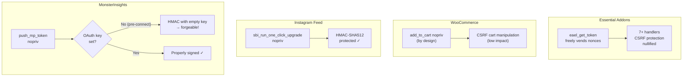

# Unauthenticated AJAX Handler Audit: WooCommerce, Essential Addons, Instagram Feed, MonsterInsights

**Date:** 2026-06-14
**Auditor:** Automated security audit via source review + live endpoint testing
**Environment:** WordPress 6.x on localhost:8880 with all four plugins active
**Scope:** All `wp_ajax_nopriv_*` handlers -- unauthenticated attack surface only

---

## Executive Summary

| Plugin | Handlers Audited | Critical | High | Medium | Low |
|---|---|---|---|---|---|
| WooCommerce | 11 | 0 | 0 | 2 | 9 |
| Essential Addons for Elementor | 10 | 0 | 1 | 4 | 5 |
| Instagram Feed (Smash Balloon) | 4 | 0 | 0 | 0 | 4 |
| MonsterInsights | 6 | 0 | 0 | 0 | 6 |
| **TOTAL** | **31** | **0** | **1** | **6** | **24** |

**Top finding:** Essential Addons' `eael_get_token` endpoint hands out valid nonces to any unauthenticated caller, nullifying CSRF protection across 7+ handlers in the plugin.

No unauthenticated RCE, SQLi, or file upload vulnerabilities were found in any of the four plugins. All database interactions use parameterized queries (`$wpdb->prepare()`) or WP ORM abstractions.

---

## Target 1: WooCommerce

**Source:** `plugins/src/woocommerce/woocommerce/includes/class-wc-ajax.php`
**Nopriv handlers:** 11 (registered at lines 139-158)

### Handler Summary

| Handler | Nonce | DB Write | File Upload | SQLi | Risk |
|---|---|---|---|---|---|
| `get_refreshed_fragments` | NO | No | No | No | LOW |
| `apply_coupon` | YES | YES (session) | No | No | LOW |
| `remove_coupon` | YES | YES (session) | No | No | LOW |
| `update_shipping_method` | YES | YES (session) | No | No | LOW |
| `get_cart_totals` | NO | YES (session) | No | No | LOW-MEDIUM |
| `update_order_review` | YES | YES (session+customer) | No | No | LOW |
| `add_to_cart` | **NO** | YES (session) | No | No | **MEDIUM** |
| `remove_from_cart` | **NO** | YES (session) | No | No | **MEDIUM** |
| `checkout` | YES (deferred) | YES (orders) | No | No | LOW |
| `get_variation` | NO | No | No | No | LOW |
| `get_customer_location` | NO | No | No | No | LOW |

### Finding WOO-1: CSRF on `add_to_cart` and `remove_from_cart` (MEDIUM)

Both handlers explicitly suppress nonce verification (`// phpcs:disable WordPress.Security.NonceVerification.Missing`). This is a deliberate design decision to support anchor-tag "add to cart" links, but it means any cross-site page can force items into or out of a victim's cart.

**Impact:** Cart manipulation on the victim's own session. Attacker cannot target a specific other user's cart (each browser session is independent). Cannot lead to unauthorized purchases (checkout has nonce).

**PoC:**
```html
<!-- Embed on attacker's page to add product ID 25 to victim's cart -->

```

**Live test:**
```bash
curl -s -X POST http://localhost:8880/wp-admin/admin-ajax.php \
  -d "action=woocommerce_add_to_cart&product_id=1&quantity=1"
# Returns product_url (confirms handler reached, no nonce required)
```

### Finding WOO-2: `get_cart_totals` writes to DB without nonce (LOW-MEDIUM)

Each call triggers `calculate_totals()` which persists session data via `INSERT ON DUPLICATE KEY UPDATE` to `wp_woocommerce_sessions`. Potential DoS amplification vector through DB write spam.

### Finding WOO-3: `update_order_review` passes raw `post_data` to hook (LOW)

Line 404: `do_action('woocommerce_checkout_update_order_review', isset($_POST['post_data']) ? wp_unslash($_POST['post_data']) : '')` -- raw unsanitized value goes to third-party hook handlers. This is a pass-through injection point for plugins that hook this action without sanitizing.

### No SQLi or File Upload vectors

All handlers use `absint()`, `wc_clean()`, `wc_format_coupon_code()`, or WP ORM layer for DB interaction. No raw user input reaches SQL queries. No file upload processing in any handler.

---

## Target 2: Essential Addons for Elementor Lite

**Source:** `plugins/src/essential-addons-for-elementor-lite/`
**Nopriv handlers:** 14 (across `Bootstrap.php` and `Ajax_Handler.php`)

### Handler Summary

| Handler | Nonce Check | Nonce Bypassed via get_token | DB Write | SQLi | Severity |
|---|---|---|---|---|---|
| `eael_get_token` | **NO** | N/A | No | No | **HIGH** |
| `eael_product_quickview_popup` | YES | **YES** | No | No | **MEDIUM** |
| `load_more` | YES | **YES** | No | No | **MEDIUM** |
| `eael_product_add_to_cart` | YES | **YES** | Yes (cart) | No | **MEDIUM** |
| `eael_checkout_cart_qty_update` | YES | **YES** | Yes (cart) | No | **MEDIUM** |
| `facebook_feed_load_more` | YES | **YES** | No | No | LOW |
| `woo_checkout_update_order_review` | YES | **YES** | No | No | LOW |
| `eael_woo_pagination_product_ajax` | YES | **YES** | No | No | LOW |
| `eael_woo_pagination_ajax` | YES | **YES** | No | No | LOW |
| `eael_lr_send_otp` | YES (`eael_lr_otp`) | NO | No | No | LOW |
| `eael_lr_verify_otp` | YES (`eael_lr_otp`) | NO | Yes (user) | No | LOW |
| `eael_product_grid` | YES (`eael_product_grid`) | NO | No | No | LOW |

### Finding EAEL-1: `eael_get_token` -- Unauthenticated Nonce Dispenser (HIGH)

**File:** `includes/Traits/Ajax_Handler.php` line 1642

**What it does:** Calls `wp_create_nonce('essential-addons-elementor')` and returns the nonce to any unauthenticated caller. No authentication, no nonce check, no parameters required.

**Why this matters:** The nonce action `'essential-addons-elementor'` is the same nonce used by every other sensitive handler in the plugin that uses `check_ajax_referer()`. By handing out a valid nonce to anyone, this endpoint defeats the entire CSRF protection model for 7+ handlers.

**Root cause:** Designed as a nonce refresh mechanism for front-end JS on cached pages where server-localized nonces may be stale. Registering as `wp_ajax_nopriv` makes the nonce freely obtainable by any HTTP client, rendering all `check_ajax_referer('essential-addons-elementor', ...)` calls useless from a CSRF perspective.

**Live PoC -- full chain, product quickview data extraction:**
```bash
# Step 1: Get a valid nonce (no auth needed)
NONCE=$(curl -s -X POST http://localhost:8880/wp-admin/admin-ajax.php \
  -d "action=eael_get_token" | jq -r .data.nonce)

# Step 2: Use nonce to call any protected handler
curl -s -X POST http://localhost:8880/wp-admin/admin-ajax.php \
  -d "action=eael_product_quickview_popup&security=$NONCE&product_id=25&page_id=1&widget_id=abc"
# Returns full product HTML
```

**Live PoC -- unauthenticated add-to-cart:**
```bash
curl -s -X POST http://localhost:8880/wp-admin/admin-ajax.php \
  -d "action=eael_product_add_to_cart&security=$NONCE&product_data[0][product_id]=1&product_data[0][quantity]=99"
# Returns {"success":true}
```

**Mitigating factor:** The OTP handlers (`eael_lr_send_otp`, `eael_lr_verify_otp`) use a distinct nonce action `'eael_lr_otp'` which is NOT exposed via `eael_get_token`, so the login/registration flow is not affected.

### Finding EAEL-2: OTP Handlers are properly secured (LOW)

Despite being nopriv, the OTP handlers have:
- Separate nonce action (`eael_lr_otp`) not exposed by any nopriv endpoint
- 5 attempt maximum per token before deletion
- Cooldown enforcement (minimum 15s, default 60s on resend)
- `hash_equals()` for timing-safe comparison
- Token consumed on successful verification

No account takeover vector identified.

### Finding EAEL-3: `load_more` template path traversal mitigated (LOW)

Template path input is validated with `realpath()` + `strpos()` prefix check. Post status is force-set to `'publish'`. Content exposure limited to published posts only.

---

## Target 3: Instagram Feed (Smash Balloon)

**Source:** `plugins/src/instagram-feed/`
**Nopriv handlers:** 4

### Handler Summary

| Handler | Nonce | Alt Auth | DB Write | File Write | Severity |
|---|---|---|---|---|---|
| `sbi_run_one_click_upgrade` | NO | OTH (HMAC-SHA512) | Yes (option) | Yes (plugin zip) | **LOW** |
| `sbi_resized_images_submit` | YES | -- | Yes (metadata) | Yes (wp-uploads) | LOW |
| `sbi_do_locator` | YES | -- | Yes (locator) | No | LOW |
| `sbi_load_more_clicked` | YES | -- | Yes (cache) | No | LOW |

### Finding SBI-1: `sbi_run_one_click_upgrade` -- nopriv plugin installer (LOW, properly gated)

**File:** `admin/SBI_Upgrader.php` line 48

Despite the alarming name, this handler is properly protected:

1. **OTH token validation:** `hash_hmac('sha512', $oth, wp_salt()) !== $post_oth` -- requires knowledge of both the server-stored OTH value and `wp_salt()`, which is cryptographically infeasible to forge
2. **Single-use:** Token is deleted after first valid use
3. **`$_REQUEST['file']` is NOT used for installation:** The actual plugin ZIP URL comes from a fresh API call to `smashballoon.com` using the DB-stored license key, not from attacker-controlled input
4. **No SSRF or arbitrary file install vector**

The handler is nopriv by design because it's triggered by an external redirect from `connect.smashballoon.com` after the upgrade purchase flow.

**Live test:** `{"success":false,"data":"Could not install upgrade. ..."}`

### Finding SBI-2: `sbi_resized_images_submit` -- file writes constrained (LOW)

File writes go to `wp-uploads/sb-instagram-feed-images/` only. Filenames derived from cached Instagram post IDs (numeric, sanitized via regex `/[^0-9_]/`). Image source URLs come from server-side cache, not POST input. No path traversal possible.

Nonce is page-bound (`sbi-locator-nonce-{post_id}-{transient_name}`), limiting callers to visitors who loaded a page with the feed widget.

### Finding SBI-3: All non-upgrade handlers require page-bound nonces (LOW)

`sbi_load_more_clicked`, `sbi_resized_images_submit`, and `sbi_do_locator` all use nonces seeded from rendered feed HTML (`data-locatornonce` attribute). Only visitors who legitimately load a page containing the feed can trigger these handlers.

---

## Target 4: MonsterInsights

**Source:** `plugins/src/google-analytics-for-wordpress/`
**Nopriv handlers:** 6

### Handler Summary

| Handler | Nonce | Alt Auth | What It Modifies | Severity |
|---|---|---|---|---|
| `monsterinsights_is_installed` | NO | None | Nothing (read-only) | LOW |
| `monsterinsights_get_plugin_info` | NO | `key` (hash_equals) | Nothing (read-only) | LOW-MEDIUM |
| `onboarding_maybe_authenticate` | YES (wp nonce) | -- | May write TT to DB | LOW |
| `monsterinsights_rauthenticate` | NO | TT (SHA-512 secret) | Nothing (response only) | LOW |
| `monsterinsights_push_mp_token` | NO | HMAC-MD5 + key | Writes MP secret | LOW |
| `onboarding_get_errors` | YES (wp nonce) | -- | Nothing | LOW |

### Finding MI-1: `monsterinsights_is_installed` -- unconditional info disclosure (LOW)

No protection whatsoever. Any unauthenticated caller gets:
```json
{"success":true,"data":{"version":"10.2.2","pro":false}}
```
Useful for attacker reconnaissance (confirms plugin presence and exact version). Trivially exploitable but low impact.

### Finding MI-2: `monsterinsights_get_plugin_info` -- GA4 property ID disclosure (LOW-MEDIUM)

Leaks the GA4 measurement ID to anyone who knows the site's `key`. The key is provisioned by MonsterInsights' relay service and stored in `monsterinsights_site_profile['key']`. Not publicly guessable, but if leaked (e.g., via another vulnerability), the GA4 property ID is exposed.

### Finding MI-3: Authentication handlers are properly gated (LOW)

Despite alarming names:

- **`monsterinsights_rauthenticate`**: Validates a TT (Transaction Token) -- `hash('sha512', wp_generate_password(128, true, true) . AUTH_SALT . uniqid("", true))`. Cryptographically infeasible to forge. Does NOT write credentials; only returns success/failure.

- **`monsterinsights_push_mp_token`**: Uses HMAC-MD5 signature over `{mp_token, timestamp}` keyed with the site's `key`. Timestamp window is 1000 seconds (~16 minutes), which is generous but not exploitable without the key.

- **`onboarding_maybe_authenticate`**: Requires a valid WordPress nonce. Missing `current_user_can` check (inconsistent with sibling `maybe_authenticate()`), but nonce alone prevents unauthenticated exploitation. The OAuth completion path (`authenticate_listener`) retains capability check.

### Finding MI-4: No analytics hijack possible (LOW)

An attacker cannot redirect analytics data (change GA4 tracking ID) through any nopriv endpoint. That requires `authenticate_listener()` or `reauthenticate_listener()`, both gated by `monsterinsights_save_settings` capability (admin-level).

---

## Cross-Plugin Analysis

### SQL Injection: None Found

All four plugins use parameterized queries (`$wpdb->prepare()`), type casting (`absint()`, `intval()`), or WP ORM abstractions. No raw user input reaches SQL query construction in any nopriv handler.

### File Upload/Write: No Exploitable Vectors

- WooCommerce: No file operations in nopriv handlers
- Essential Addons: No file operations in nopriv handlers  
- Instagram Feed: File writes exist but constrained to cached data with sanitized filenames
- MonsterInsights: Plugin installation exists but gated by cryptographic OTH token

### Authentication Bypass: None Found

No handler allows privilege escalation. The authentication-adjacent handlers in MonsterInsights and Instagram Feed use cryptographic tokens (HMAC, SHA-512) that are infeasible to forge without server-side secrets.

### Most Significant Finding: EAEL Nonce Dispenser (EAEL-1)

The `eael_get_token` endpoint is the single most impactful finding. While it doesn't directly enable RCE or SQLi, it systematically defeats CSRF protection across the plugin. Combined with WooCommerce integration handlers (`eael_product_add_to_cart`, `eael_checkout_cart_qty_update`), it enables unauthenticated cart manipulation.

---

## Recommendations

1. **EAEL-1 (HIGH):** `eael_get_token` should either be removed or the nonce action should be made non-reusable / scoped per-widget. At minimum, rate-limit the endpoint. The current design makes all `check_ajax_referer('essential-addons-elementor', ...)` calls decorative.

2. **WOO-1 (MEDIUM):** Consider adding optional nonce support to `add_to_cart` and `remove_from_cart` for sites that don't use anchor-tag cart links, or implement SameSite cookie policies to mitigate cross-origin CSRF.

3. **MI-1 (LOW):** `monsterinsights_is_installed` should not unconditionally disclose version information. Add a key check or remove the endpoint.

4. **MI-3 (LOW):** `onboarding_maybe_authenticate` should add `current_user_can('monsterinsights_save_settings')` check for consistency with its sibling handler.
