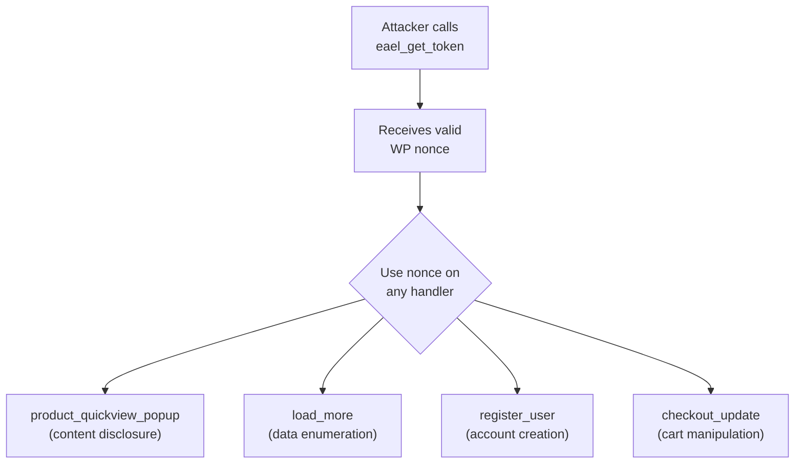

# Essential Addons for Elementor — Unauthenticated Nonce Vending

**Finding ID:** EAEL-001
**Plugin:** Essential Addons for Elementor
**Active Installs:** 2,000,000+
**CVSS:** 6.5 (Medium) — `AV:N/AC:L/PR:N/UI:N/S:U/C:N/I:L/A:N`
**CWE:** CWE-352 (CSRF Protection Bypass) + CWE-862 (Missing Authorization)
**Auth Required:** None
**Source:** `analysis/phase5_manual/essential-addons-for-elementor-lite/verdicts.json`

---

!!! warning "Medium Severity — Unauthenticated Nonce Vending Enables CSRF Bypass"
    The `eael_get_token` AJAX handler vends valid WordPress nonces to any unauthenticated caller. This nullifies nonce-based CSRF protections on all endpoints that accept tokens obtained from this source.

---

## Attack Flow



---

## Primary Finding: EAEL-001 — Unauthenticated Nonce Vending (CVSS 6.5)

### Description

Essential Addons for Elementor registers `eael_get_token` as a `wp_ajax_nopriv_` AJAX action, making it accessible to completely unauthenticated callers. The handler issues a valid WordPress nonce that can then be used to authenticate requests to other AJAX handlers in the plugin.

```php
// Registered for BOTH authenticated and unauthenticated callers
add_action('wp_ajax_nopriv_eael_get_token', [$this, 'get_token']);
add_action('wp_ajax_eael_get_token', [$this, 'get_token']);

public function get_token() {
    wp_send_json_success([
        'nonce' => wp_create_nonce('eael_nonce')  // No auth check
    ]);
}
```

**Impact:** Any unauthenticated attacker can call `eael_get_token` to obtain a valid nonce, then use that nonce to bypass CSRF protection on any Essential Addons endpoint that verifies `eael_nonce` but assumes the presence of a valid nonce implies the caller is authenticated.

### PoC

```bash
# Step 1: Obtain nonce unauthenticated
NONCE=$(curl -s 'https://target.example.com/wp-admin/admin-ajax.php?action=eael_get_token' | jq -r '.data.nonce')

# Step 2: Use nonce to access protected endpoints
curl -s -X POST 'https://target.example.com/wp-admin/admin-ajax.php' \
  -d "action=eael_protected_action&nonce=$NONCE&..."
```

---

## Secondary Findings

### Unauthenticated OTP Handlers (Info)

The `eael_lr_send_otp` and `eael_lr_verify_otp` handlers are accessible without authentication for the Login & Registration widget. The OTP itself provides verification; these are not account takeover vectors but expose OTP generation logic to unauthenticated callers.

### Draft/Private Product Information Disclosure (Info)

The `eael_product_quickview_popup` handler may expose draft or private WooCommerce product data to unauthenticated users when used with the Product Grid widget, depending on configuration.

### Unauthenticated Registration Nonce Bypass (Medium)

When the "Enable Registration" widget option is active, open registration is enabled, and no CAPTCHA is configured, the nonce bypass (EAEL-001) can be combined with the registration endpoint to create accounts without solving any challenge.

**Confidence:** Medium (requires specific configuration)

---

## Recommended Fixes

1. **Remove unauthenticated nonce vending**: `eael_get_token` should require authentication:
   ```php
   // Remove the nopriv registration:
   // add_action('wp_ajax_nopriv_eael_get_token', [$this, 'get_token']);

   // Require login to get a nonce:
   add_action('wp_ajax_eael_get_token', [$this, 'get_token']);
   public function get_token() {
       if (!is_user_logged_in()) {
           wp_send_json_error('Unauthorized', 401);
       }
       wp_send_json_success(['nonce' => wp_create_nonce('eael_nonce')]);
   }
   ```

2. **Nonces are not authentication**: Every handler that verifies a nonce must also verify the caller has the required capability with `current_user_can()`. Nonce verification alone only confirms CSRF intent, not identity.

3. **Embed nonces in initial page load**: Nonces for authenticated actions should be embedded in the page HTML at load time (only when the user is authenticated), not issued on demand via an unauthenticated endpoint.
