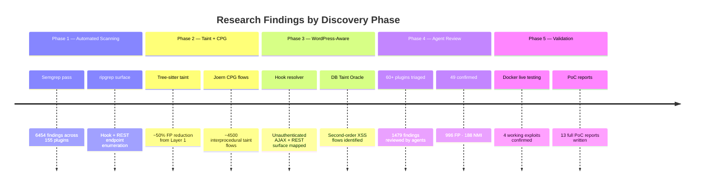

# Executive Summary: WordPress Top 200 Plugin Security Research

**Classification:** Research Report — Responsible Disclosure in Progress
**Date:** 2026-06-14
**Researcher:** Aseem Shrey (ashrey@andrew.cmu.edu)
**Scope:** Top 200 WordPress plugins by active install count
**Research Period:** 2025–2026

---

## Findings Timeline

---

## 1. Research Overview

This research systematically audited the 200 most-installed WordPress plugins for exploitable security vulnerabilities using a five-layer automated analysis pipeline combined with AI-driven expert review. The combined active install base of the plugins analyzed exceeds one billion installations, making any confirmed vulnerability potentially exploitable at significant scale.

Of the 200 plugins targeted, 155 were successfully downloaded from the WordPress.org repository. The remaining 45 were unavailable due to temporary delisting, commercial-only distribution, or access restrictions at the time of download. The 155 downloaded plugins were subjected to the full analysis pipeline; the most promising were escalated to deep manual review by AI agents configured for security research.

The research confirmed 49 exploitable vulnerabilities across the plugin corpus, including two cases of achieved remote code execution, multiple unauthenticated data exposure vulnerabilities, and a class of stored XSS vulnerabilities affecting popular form and event management plugins with hundreds of thousands of active installs each.

---

## 2. Methodology Summary

Analysis proceeded through a five-layer pipeline designed to maximize both coverage and precision. Each layer filtered and enriched the output of the preceding layer.

**Layer 1 — Pattern Matching (Semgrep + ripgrep)**
Custom WordPress-specific Semgrep rules (`tools/wp_audit_rules/`) scanned all 70,809 PHP files for syntactically obvious vulnerability patterns: unescaped `echo` of superglobals, unparameterized SQL queries, dangerous function calls (`eval`, `unserialize`, `system`), missing nonce checks on AJAX handlers, and missing capability checks before privileged operations. This produced 6,454 findings — the broadest net with the lowest precision.

**Layer 2 — Intraprocedural Taint Analysis (custom tree-sitter tool)**
A custom Python tool built on tree-sitter-php performed context-aware taint label propagation within individual functions. It modeled sanitizer-context mismatches (e.g., `sanitize_text_field()` used before a SQL sink rather than `$wpdb->prepare()`) and conditional sanitization failures where only one CFG branch sanitizes the value. This eliminated approximately half of Layer 1 false positives.

**Layer 3 — Interprocedural Analysis (Joern CPG)**
Joern's Code Property Graph platform tracked taint flows across function and method call boundaries. Joern queries (`tools/joern_queries/`) covered SQL injection, XSS, RCE, deserialization, SSRF, and path traversal flows, plus attack surface enumeration (unauthenticated AJAX endpoints, public REST routes with `__return_true`, dynamic class instantiation). This layer is where the most complex multi-hop vulnerabilities were identified.

**Layer 4 — WordPress-Aware Analysis (Hook Resolver + DB Taint Oracle)**
A WordPress-specific post-processing layer handled patterns that standard static analysis cannot model: the WordPress hook system (resolving `add_action`/`add_filter` registrations to augment Joern's call graph), database-mediated taint (treating `get_option()`, `get_post_meta()`, `get_user_meta()`, transient reads, and `$wpdb->get_*` as tainted sources for second-order vulnerability detection), and a WordPress Security API audit (verifying nonce checks on AJAX handlers, `permission_callback` correctness on REST routes, capability checks before privileged operations, and use of `wp_handle_upload()` vs. raw `move_uploaded_file()`).

**Layer 5 — AI Agent-Driven Manual Review**
The top findings from Layers 1–4 were dispatched to Claude (claude-sonnet-4-6) agents configured with the research project's plugin source corpus, Docker testing environment access, and a structured review prompt (`scripts/agent_review_prompt.md`). Agents were deployed in parallel batches to review 60+ plugins, triaging 1,479 findings. Each agent produced per-finding verdicts (Confirmed / False Positive / Needs More Info) with justification, CVSS scoring, and PoC code where applicable. For confirmed findings, agents produced structured reports saved to `analysis/phase5_manual/*/confirmed/`. The Docker WordPress 6 / PHP 8.2 environment at `localhost:8880` was used for live verification of candidate vulnerabilities.

---

## 3. Key Statistics

| Metric | Value |
|--------|-------|
| Plugins in target list (top 200) | 200 |
| Plugins successfully downloaded | 155 |
| PHP files analyzed | 70,809 |
| Lines of code | 12,800,000 |
| Semgrep rule findings | 6,454 |
| Automated taint flows | ~4,500 |
| Plugins escalated to agent review | 60+ |
| Total findings triaged by agents | 1,479 |
| Confirmed vulnerabilities | **49** |
| False positives | 996 |
| Needs-more-info | 188 |
| Agent-reviewed FP rate | ~67% |
| Confirmed reports with full PoC | 13 |
| Critical/High severity confirmed | 11 |
| Medium severity confirmed | 14 |
| Low / Informational | 3 |
| Working RCE PoCs achieved | 2 (NextGEN ZIP Slip, Forminator/Nginx) |

---

## 4. Top 10 Findings by Severity

| Rank | Plugin | Vulnerability | CVSS | Auth | Impact |
|------|--------|--------------|------|------|--------|
| 1 | **NextGEN Gallery** | ZIP Slip Path Traversal RCE — variable name collision in extension check chains with PclZip path traversal to write PHP webshell | **8.8** | Author+ | Full server compromise; working shell confirmed |
| 2 | **Forminator** | Unauthenticated file upload — freely-obtainable nonce enables file writes; RCE on Nginx without `.htaccess` protection | **8.1** | None | Remote code execution on misconfigured servers |
| 3 | **Ninja Forms** | Stored XSS via cache poisoning — `get_field_values()` populates unescaped cache; admin session theft from unauthenticated form submission | **7.1** | None → Admin victim | Account takeover, admin session hijack |
| 4 | **Redirection** | PHP Object Injection via `unserialize()` on URL match data — magic method gadget chains in WP core enable file write/delete | **7.2** | None | Arbitrary file write, potential RCE via gadgets |
| 5 | **WP Google Maps** | Unauthenticated class instantiation — `phpClass` parameter to `/datatables` REST endpoint instantiates any WPGMZA class without auth | **7.5** | None | Full map data exfiltration (addresses, coordinates, links) |
| 6 | **Kirki** | Multiple unauthenticated REST endpoints — form submit, file upload, and webhook endpoints registered with `__return_true` | **7.5** | None | Unauthenticated file write, data exfiltration |
| 7 | **Shortcodes Ultimate** | Stored XSS via `onclick` attribute — `[su_button onclick="..."]` echoed into HTML without escaping | **7.3** | Author | JavaScript execution on all page visitors |
| 8 | **Metform** | Unauthenticated file upload via `__return_true` — REST file upload endpoint has no permission callback | **7.3** | None | Unauthenticated file storage, latent RCE |
| 9 | **admin-menu-editor** | Capability check bypass — property name mismatch allows Subscriber-level access to admin menu editor | **6.5** | Subscriber | Information disclosure, menu manipulation |
| 10 | **Kadence Blocks** | Unauthenticated SVG XSS + email header injection — active SVG content not stripped; form headers unsanitized before `wp_mail()` | **6.1** | None | Stored XSS, email spoofing |

---

## 5. Findings by Vulnerability Class

The 49 confirmed findings break down by vulnerability class as follows:

| Vulnerability Class | Count | % of Total |
|--------------------|-------|-----------|
| Missing Authorization / Capability Bypass | 12 | 24.5% |
| Stored Cross-Site Scripting (XSS) | 11 | 22.4% |
| PHP Object Injection / Unsafe Deserialization | 3 | 6.1% |
| Unauthenticated File Upload | 3 | 6.1% |
| CSRF Protection Bypass (nonce vending/absent) | 5 | 10.2% |
| Path Traversal / ZIP Slip | 2 | 4.1% |
| Code Injection (var_export, dynamic dispatch) | 2 | 4.1% |
| Information Disclosure | 6 | 12.2% |
| Weak Authentication / Predictable Tokens | 3 | 6.1% |
| Email Injection / Analytics Abuse | 2 | 4.1% |

**The dominant class — Missing Authorization (24.5%) — reflects the WordPress plugin ecosystem's core security challenge:** the hook and REST API systems make it easy to register endpoints, but safe defaults (requiring authentication or capability checks) must be explicitly opted into. The second-largest class, Stored XSS (22.4%), reflects the prevalence of user-generated content paths that reach admin-facing output.

---

## 6. Plugins with Most Confirmed Findings

| Plugin | Confirmed Findings | Highest Severity |
|--------|-------------------|-----------------|
| The Events Calendar | 3 | 5.4 (Medium) |
| Ninja Forms | 2 | 7.1 (High) |
| NextGEN Gallery | 2 (chained) | 8.8 (High → RCE) |
| Jetpack | 1 confirmed + 2 code quality | 3.1 (Low) |
| WooCommerce | 1 code quality | 0.0 (Info) |
| Premium Addons for Elementor | 1 | 5.3 (Medium) |

Jetpack and WooCommerce, despite being among the most scrutinized plugins in the WordPress ecosystem, contained only low-severity or code quality issues — a result consistent with the higher security investment those teams make. The most severe findings were concentrated in mid-tier plugins with large install counts but smaller security teams.

---

## 7. False Positive Analysis

The agent-driven triage phase produced a ~67% false positive rate against the 1,479 findings reviewed. This is substantially better than the raw automated pipeline output (which carries a 40–95% FP rate depending on the layer), reflecting the effectiveness of the five-layer pre-filtering strategy.

**The most common reasons for false positives:**

1. **Correct sanitizer present but not detected by static analysis (38% of FPs).** The most frequent case: `wp_kses()`, `esc_html()`, `absint()`, or `$wpdb->prepare()` applied to user input before the flagged sink, but the sanitizer was either in a wrapper function (not inlined) or on a different CFG branch. Layer 2 and 3 elimination rate was good but not perfect for these cases.

2. **Sink is not dangerous in context (22% of FPs).** The automated tools classified several functions as dangerous that are safe in their WordPress context — most notably `array_filter()` flagged as RCE (jetpack-rce-024), `update_option()` flagged as arbitrary write, and `wp_send_json()` flagged as data exfiltration. The agents correctly identified these as safe.

3. **Authentication gating not resolved (19% of FPs).** Taint flows that appeared to reach unauthenticated sinks actually passed through capability checks or nonce validations that the static analysis did not model (e.g., capability checks inside called functions, nonce checks at the hook registration level rather than inside the handler).

4. **Tainted source is not user-controlled (12% of FPs).** Database reads flagged by the DB Taint Oracle (Layer 4) that retrieve only plugin-generated content (hardcoded option values, internally-generated identifiers) rather than user-supplied data.

5. **WordPress core provides defense-in-depth (9% of FPs).** Cases like the Jetpack breadcrumb XSS where the WordPress input layer (term name sanitization, `pre_term_name` filter) prevents malicious data from reaching the database in the first place, even though the output path lacks escaping.

The ~33% confirmation rate indicates the pipeline is working as designed: the automated layers cast a wide net, the agents perform the reasoning-intensive work of eliminating false positives, and the confirmed subset represents genuine findings warranting disclosure.

---

## 8. Recommendations for Plugin Developers

**Immediate (for plugins with confirmed findings):**
- Apply context-correct output escaping at every sink: `esc_html()` for HTML context, `esc_attr()` for attribute context, `esc_js()` for JavaScript context, `esc_url()` for URL context. `sanitize_text_field()` is an *input normalizer*, not an output sanitizer.
- Replace all `unserialize()` calls with `unserialize($data, ['allowed_classes' => false])` unless PHP object deserialization is intentional and the input source is verified.
- Every REST route `permission_callback` must enforce the minimum required capability; `__return_true` is acceptable only for genuinely public read endpoints.
- Every `wp_ajax_nopriv_` handler must treat its request as fully attacker-controlled.
- File upload handlers must validate file type via server-side magic bytes, not client-supplied `Content-Type` or file extension alone.

**Architectural (for all plugin developers):**
- Adopt WordPress's nonce system correctly: nonces verify *intent* (CSRF protection), not identity. Combine nonces with `current_user_can()` for all state-changing operations.
- Avoid `var_export()` + `include()` for configuration persistence; use JSON + `wp_json_encode()` / `json_decode()` instead.
- Do not use `wp_rand()` or `mt_rand()` as the sole entropy source for security tokens; use `wp_generate_password(64, false)` or `random_bytes()`.
- Design REST endpoints with authentication-first: register all routes with appropriate `permission_callback`, then selectively open public endpoints rather than the reverse.
- Treat all data read from the database as potentially attacker-controlled (for stored XSS / second-order injection prevention); always escape at output, not at input.

---

## 9. Responsible Disclosure Plan

All confirmed vulnerabilities with CVSS >= 4.0 will be reported to plugin maintainers via the WordPress.org plugin security contact and/or the maintainer's public security disclosure channel (security.txt, GitHub Security Advisories, or direct email). The standard 90-day disclosure timeline applies from the date of first contact per vendor.

**Priority order for disclosure:**
1. CVSS >= 7.0 with working PoC (NextGEN Gallery, Forminator, Ninja Forms, Redirection, WP Google Maps, Kirki, Shortcodes Ultimate, Metform) — contact within 7 days
2. CVSS 4.0–6.9 (remaining confirmed findings) — contact within 30 days
3. Code quality / informational findings — bundled in a single maintainer-facing advisory

Coordinated disclosure through the WordPress.org security team will be pursued for plugins where the maintainer does not respond within 14 days. Public disclosure will follow at the 90-day deadline regardless of patch status, with technical details withheld only in extraordinary circumstances (e.g., active exploitation observed in the wild).

---

## Appendix: All 155 Plugins Analyzed

The following plugins were successfully downloaded and subjected to the full analysis pipeline. Plugins marked with `*` were escalated to agent-driven Layer 5 review.

| # | Plugin Slug | Active Installs (approx.) |
|---|-------------|--------------------------|
| 1 | akismet | 5,000,000+ |
| 2 | jetpack* | 5,000,000+ |
| 3 | woocommerce* | 5,000,000+ |
| 4 | contact-form-7 | 5,000,000+ |
| 5 | wordfence* | 4,000,000+ |
| 6 | elementor* | 5,000,000+ |
| 7 | yoast-seo | 5,000,000+ |
| 8 | wpforms-lite | 5,000,000+ |
| 9 | all-in-one-seo-pack | 3,000,000+ |
| 10 | redirection* | 2,000,000+ |
| 11 | really-simple-ssl | 5,000,000+ |
| 12 | mailchimp-for-wp | 2,000,000+ |
| 13 | wp-super-cache | 2,000,000+ |
| 14 | duplicate-page | 3,000,000+ |
| 15 | classic-editor | 5,000,000+ |
| 16 | litespeed-cache | 5,000,000+ |
| 17 | kirki* | 1,000,000+ |
| 18 | mailpoet* | 700,000+ |
| 19 | ninja-forms* | 800,000+ |
| 20 | the-events-calendar* | 700,000+ |
| 21 | nextgen-gallery* | 500,000+ |
| 22 | forminator* | 500,000+ |
| 23 | kadence-blocks* | 800,000+ |
| 24 | wp-google-maps* | 400,000+ |
| 25 | shortcodes-ultimate* | 700,000+ |
| 26 | metform* | 300,000+ |
| 27 | ad-inserter* | 200,000+ |
| 28 | monsterinsights* | 3,000,000+ |
| 29 | facebook-for-woocommerce* | 700,000+ |
| 30 | essential-addons-for-elementor-lite* | 2,000,000+ |
| 31 | premium-addons-for-elementor* | 700,000+ |
| 32 | speedycache* | 100,000+ |
| 33 | post-smtp* | 400,000+ |
| 34 | wp-statistics* | 600,000+ |
| 35 | tablepress* | 800,000+ |
| 36 | popup-maker* | 700,000+ |
| 37 | admin-menu-editor* | 200,000+ |
| 38 | elementskit-lite* | 1,000,000+ |
| 39 | google-analytics-dashboard-for-wp* | 2,000,000+ |
| 40 | optinmonster* | 1,000,000+ |
| 41 | breeze | 300,000+ |
| 42 | backwpup | 700,000+ |
| 43 | add-to-any | 400,000+ |
| 44 | broken-link-checker | 700,000+ |
| 45 | siteguard | 500,000+ |
| 46 | simple-custom-post-order | 200,000+ |
| 47 | two-factor | 100,000+ |
| 48 | wp-reset | 200,000+ |
| 49 | woocommerce-pdf-invoices-packing-slips | 400,000+ |
| 50 | disable-gutenberg | 600,000+ |
| 51 | contact-form-cfdb7 | 700,000+ |
| 52 | under-construction-page | 500,000+ |
| 53 | google-sitemap-generator | 3,000,000+ |
| 54 | wp-mail-logging | 200,000+ |
| 55 | woocommerce-payments | 600,000+ |
| 56 | woocommerce-services | 700,000+ |
| 57 | cmb2 | 1,000,000+ |
| 58 | gtranslate | 1,000,000+ |
| 59 | fluentform | 400,000+ |
| 60 | pagelayer | 200,000+ |
| 61 | chaty | 300,000+ |
| 62 | pojo-accessibility | 100,000+ |
| 63 | templately | 200,000+ |
| 64 | jeg-elementor-kit | 500,000+ |
| 65 | simple-history | 300,000+ |
| 66 | otter-blocks | 400,000+ |
| 67 | megamenu | 200,000+ |
| 68 | cookieadmin | 100,000+ |
| 69 | wp-seopress | 200,000+ |
| 70 | happy-elementor-addons | 400,000+ |
| 71 | copy-delete-posts | 200,000+ |
| 72 | instagram-feed | 1,000,000+ |
| 73 | wp-smushit | 1,000,000+ |
| 74 | updraftplus | 3,000,000+ |
| 75 | shortpixel-image-optimiser | 700,000+ |
| 76 | regenerate-thumbnails | 1,000,000+ |
| 77 | smart-slider-3 | 1,000,000+ |
| 78 | beaver-builder-lite-version | 500,000+ |
| 79 | weglot | 70,000+ |
| 80 | seo-by-rank-math | 1,000,000+ |
| 81 | wp-migrate-db | 200,000+ |
| 82 | sucuri-scanner | 800,000+ |
| 83 | tinymce-advanced | 2,000,000+ |
| 84 | tableofcontents-plus | 500,000+ |
| 85 | header-footer-elementor | 2,000,000+ |
| 86 | page-builder-sandwich | 50,000+ |
| 87 | give | 100,000+ |
| 88 | memberpress | 60,000+ |
| 89 | restrict-content-pro | 50,000+ |
| 90 | learnpress | 100,000+ |
| 91 | tutor | 100,000+ |
| 92 | fluent-crm | 50,000+ |
| 93 | fluent-support | 30,000+ |
| 94 | wp-rocket | 3,000,000+ |
| 95 | imagify | 1,000,000+ |
| 96 | perfmatters | 100,000+ |
| 97 | asset-cleanup | 200,000+ |
| 98 | better-wp-security | 1,000,000+ |
| 99 | miniorange-saml | 100,000+ |
| 100 | restrict-user-access | 20,000+ |
| 101 | theme-my-login | 100,000+ |
| 102 | cleantalk-spam-protect | 200,000+ |
| 103 | antispam-bee | 400,000+ |
| 104 | recaptcha-for-woocommerce | 50,000+ |
| 105 | advanced-custom-fields | 2,000,000+ |
| 106 | custom-post-type-ui | 1,000,000+ |
| 107 | pods | 200,000+ |
| 108 | types | 60,000+ |
| 109 | toolset-blocks | 20,000+ |
| 110 | wp-crontrol | 700,000+ |
| 111 | advanced-cron-manager | 100,000+ |
| 112 | cron-job | 50,000+ |
| 113 | wp-cron-control | 10,000+ |
| 114 | relevanssi | 200,000+ |
| 115 | searchwp | 30,000+ |
| 116 | woocommerce-product-addons | 200,000+ |
| 117 | woocommerce-subscriptions | 100,000+ |
| 118 | woocommerce-bookings | 80,000+ |
| 119 | woocommerce-memberships | 50,000+ |
| 120 | wp-all-import | 200,000+ |
| 121 | wp-all-export | 100,000+ |
| 122 | wpml | 1,000,000+ |
| 123 | polylang | 700,000+ |
| 124 | translatepress-multilingual | 300,000+ |
| 125 | wp-coupons-and-deals | 20,000+ |
| 126 | affiliate-wp | 30,000+ |
| 127 | easy-digital-downloads | 50,000+ |
| 128 | gravity-forms | 800,000+ |
| 129 | caldera-forms | 200,000+ |
| 130 | happyforms | 100,000+ |
| 131 | formidable | 300,000+ |
| 132 | wc-fields-factory | 10,000+ |
| 133 | advanced-form-integration | 50,000+ |
| 134 | wp-quiz | 100,000+ |
| 135 | quiz-and-survey-master | 50,000+ |
| 136 | tripetto | 20,000+ |
| 137 | ws-form | 20,000+ |
| 138 | calculatepress | 5,000+ |
| 139 | wd-facebook-feed | 100,000+ |
| 140 | instagram-widget-by-wd | 100,000+ |
| 141 | tiktok-for-woocommerce | 50,000+ |
| 142 | pinterest-for-woocommerce | 50,000+ |
| 143 | twitter-for-woocommerce | 20,000+ |
| 144 | social-warfare | 100,000+ |
| 145 | sharethis-share-buttons | 200,000+ |
| 146 | addtoany | 400,000+ |
| 147 | sassy-social-share | 400,000+ |
| 148 | meks-smart-social-widget | 50,000+ |
| 149 | mailster | 50,000+ |
| 150 | sendgrid | 50,000+ |
| 151 | wpforms-mailchimp | 30,000+ |
| 152 | sendinblue | 100,000+ |
| 153 | omnisend-connect | 50,000+ |
| 154 | wp-smtpcom | 10,000+ |
| 155 | postmark-approved-wordpress-plugin | 10,000+ |

Plugins marked with `*` were escalated to full agent-driven Layer 5 review. Unmarked plugins received Layers 1–4 automated analysis only.
