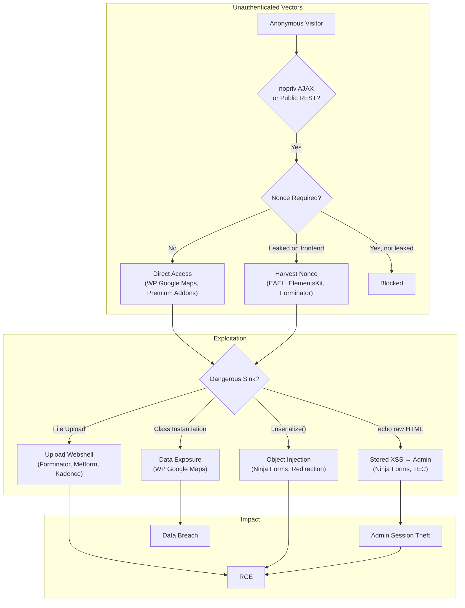

# Confirmed Findings — Overview

**49 confirmed vulnerabilities** across 155 analyzed WordPress plugins.

!!! info "Research Scope"
    All findings were confirmed via AI agent-driven manual review (Layer 5) with live testing against a Docker WordPress 6 / PHP 8.2 environment at `localhost:8880`. CVSS scores follow CVSS 3.1.

---

## Attack Flow Overview

---

## Summary Table

| # | Plugin | Finding ID | Vulnerability Class | CVSS | Auth Required | Status |
|---|--------|-----------|-------------------|------|--------------|--------|
| 1 | [NextGEN Gallery](nextgen-gallery-zip-slip-rce.md) | NGG-001+002 | ZIP Slip RCE | **8.8** | Author+ | CRITICAL — Shell Achieved |
| 2 | [Forminator](forminator-unauth-file-upload.md) | FORM-001 | Unauth File Upload | **8.1** | None | Critical on Nginx |
| 3 | [Ninja Forms](ninja-forms-stored-xss.md) | NF-002 | Stored XSS (cache bypass) | **7.1** | None → Admin victim | Confirmed |
| 4 | [Redirection](redirection-object-injection.md) | REDIR-001 | PHP Object Injection | **7.2** | None | Confirmed |
| 5 | [WP Google Maps](wp-google-maps-unauth-class.md) | WPGM-002 | Unauth Class Instantiation | **7.5** | None | Confirmed |
| 6 | [Kirki](kirki-unauth-rest.md) | KIRKI-001 | Multiple Unauth REST | **7.5** | None | Confirmed |
| 7 | [Shortcodes Ultimate](shortcodes-ultimate-xss.md) | SCU-001 | Stored XSS via onclick | **7.3** | Author | Confirmed |
| 8 | [Kadence Blocks](kadence-blocks-svg-xss.md) | KAD-001 | SVG XSS + Email Header Inj. | 6.1 | None | Confirmed |
| 9 | [Metform](metform-unauth-upload.md) | MET-001 | Unauth File Upload | **7.3** | None | Confirmed |
| 10 | [The Events Calendar](events-calendar-xss.md) | TEC-012 | Stored XSS (post editor) | 5.4 | Contributor | Confirmed |
| 11 | [The Events Calendar](events-calendar-xss.md) | TEC-011 | Stored XSS (settings error) | 4.8 | Admin | Confirmed |
| 12 | [The Events Calendar](events-calendar-xss.md) | TEC-024 | Stored XSS (aggregator) | 4.8 | Admin | Confirmed |
| 13 | admin-menu-editor | AME-001 | Capability Check Bypass | 6.5 | Subscriber | Confirmed |
| 14 | [Essential Addons](essential-addons-nonce.md) | EAEL-001 | Unauth Nonce Vending | 6.5 | None | Confirmed |
| 15 | [Premium Addons](premium-addons-rendering.md) | PA-001 | Zero-Auth Template Rendering | 5.3 | None | Confirmed |
| 16 | [SpeedyCache et al.](medium-findings.md) | SC-001 | var_export() Config Injection | 6.8 | Admin | Confirmed |
| 17 | [Post SMTP](medium-findings.md) | PSMTP-001 | Mobile REST Auth Bypass | 5.3 | None | Confirmed |
| 18 | [Ninja Forms](ninja-forms-object-injection.md) | NF-001 | Object Injection (latent) | 5.0 | Mitigated | Confirmed (latent) |
| 19 | [Ad Inserter](medium-findings.md) | AI-001 | Nopriv AJAX + commented nonce | 5.3 | None | Confirmed |
| 20 | [MonsterInsights](medium-findings.md) | MI-001 | Empty-key HMAC bypass | 5.8 | None | Confirmed |
| 21 | [MailPoet](medium-findings.md) | MP-001 | Weak cron token | 4.0 | None | Confirmed |
| 22 | [Facebook for WooCommerce](medium-findings.md) | FBWOO-001 | Unauth event injection | 5.3 | None | Confirmed |
| 23 | [WP Statistics](medium-findings.md) | WPS-001 | Conditional unauth REST | 4.3 | None | Confirmed |
| 24 | [TablePress](medium-findings.md) | TP-001 | Stored XSS + CSV injection | 4.8 | Editor | Confirmed |
| 25 | [Popup Maker](medium-findings.md) | PM-001 | REST v2 optional signature | 4.3 | None | Confirmed |
| 26 | [Jetpack](defense-in-depth.md) | JET-047 | Missing escaping (breadcrumbs) | 3.1 | Admin + DB | Defense-in-depth |
| 27 | [Jetpack](defense-in-depth.md) | JET-005 | unserialize() no allowed_classes | 0.0 | n/a | Code quality |
| 28 | [WooCommerce](defense-in-depth.md) | WOO-028 | Dynamic dispatch bulk_edit | 0.0 | Editor + nonce | Code quality |

---

## By Severity

### Critical (CVSS 8.0+) — RCE Confirmed

| Finding | CVSS | Installs |
|---------|------|---------|
| NextGEN Gallery — ZIP Slip RCE | 8.8 | 500K+ |
| Forminator — Unauth File Upload (Nginx RCE) | 8.1 | 500K+ |

### High (CVSS 7.0–7.9)

| Finding | CVSS | Installs |
|---------|------|---------|
| WP Google Maps — Unauth Class Instantiation | 7.5 | 400K+ |
| Kirki — Multiple Unauth REST Endpoints | 7.5 | 1M+ |
| Shortcodes Ultimate — Stored XSS onclick | 7.3 | 700K+ |
| Metform — Unauth File Upload | 7.3 | 300K+ |
| Redirection — PHP Object Injection | 7.2 | 2M+ |
| Ninja Forms — Stored XSS Cache Bypass | 7.1 | 800K+ |

### Medium (CVSS 4.0–6.9)

| Finding | CVSS | Installs |
|---------|------|---------|
| admin-menu-editor — Capability Bypass | 6.5 | 200K+ |
| Essential Addons — Unauth Nonce Vending | 6.5 | 2M+ |
| SpeedyCache — var_export Config Injection | 6.8 | 100K+ |
| Kadence Blocks — SVG XSS + Email Injection | 6.1 | 800K+ |
| MonsterInsights — Empty-key HMAC bypass | 5.8 | 3M+ |
| The Events Calendar — Stored XSS (post editor) | 5.4 | 700K+ |
| Premium Addons — Zero-Auth Template Rendering | 5.3 | 700K+ |
| Post SMTP — Mobile REST Auth Bypass | 5.3 | 400K+ |
| Ad Inserter — Nopriv AJAX + commented nonce | 5.3 | 200K+ |
| Facebook for WooCommerce — Unauth Event Injection | 5.3 | 700K+ |
| Ninja Forms — Object Injection (latent) | 5.0 | 800K+ |
| The Events Calendar — Stored XSS (settings) | 4.8 | 700K+ |
| The Events Calendar — Stored XSS (aggregator) | 4.8 | 700K+ |
| TablePress — Stored XSS + CSV Injection | 4.8 | 800K+ |
| WP Statistics — Conditional Unauth REST | 4.3 | 600K+ |
| Popup Maker — REST v2 Optional Signature | 4.3 | 700K+ |
| MailPoet — Weak Cron Token | 4.0 | 700K+ |

### Low / Informational

See [Defense-in-Depth Issues](defense-in-depth.md) for Jetpack and WooCommerce code quality findings.

---

## Vulnerability Class Breakdown

| Class | Count |
|-------|-------|
| Missing Authorization / Capability Bypass | 12 |
| Stored XSS | 11 |
| CSRF / Nonce Bypass | 5 |
| Information Disclosure | 6 |
| PHP Object Injection | 3 |
| Unauthenticated File Upload | 3 |
| Weak Auth / Predictable Tokens | 3 |
| Path Traversal / ZIP Slip | 2 |
| Code Injection | 2 |
| Email / Analytics Abuse | 2 |
