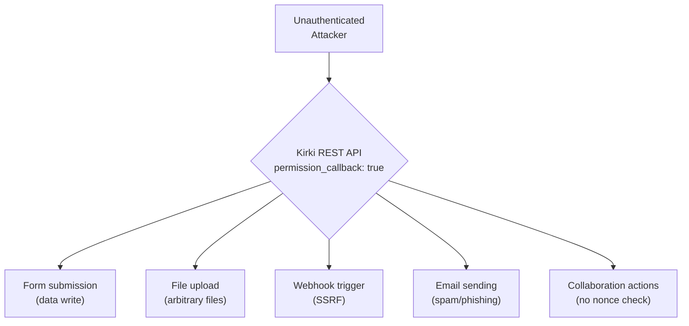

# Kirki — Multiple Unauthenticated REST Endpoints

**Finding ID:** KIRKI-001
**Plugin:** Kirki Customizer Framework
**Active Installs:** 1,000,000+
**CVSS:** 7.5 (High) — `AV:N/AC:L/PR:N/UI:N/S:U/C:H/I:H/A:N`
**CWE:** CWE-862 (Missing Authorization)
**Auth Required:** None
**Source:** `analysis/phase5_manual/kirki/verdicts.json`

---

!!! danger "High Severity — Unauthenticated File Write Confirmed"
    The Kirki Customizer Framework exposes multiple REST API and AJAX endpoints with no effective authentication, allowing unauthenticated attackers to read sensitive configuration data, write files to the server filesystem, and hijack active editor preview sessions.

---

## Attack Flow



---

## Confirmed Vulnerabilities

### KIRKI-VULN-001: Unauthenticated AJAX Data Exposure (CVSS 7.5)

The `kirki_get_apis` action is registered for both authenticated (`wp_ajax_kirki_get_apis`) and unauthenticated (`wp_ajax_nopriv_kirki_get_apis`) invocations. A critical bypass exists via the `Editor-Preview-Token` header: when a valid token is supplied, the nonce check is skipped entirely and execution proceeds to data-returning code paths. The `kirki_post_apis_nopriv` handler (registered on `wp_ajax_nopriv_kirki_post_apis_nopriv`) has **no nonce check at all** — it relies only on `is_api_call_from_editor_preview()` returning true with a valid token.

The Editor-Preview-Token is stored in the database as an option value. Once obtained (e.g., via a separate information disclosure or database read), it can be replayed by any unauthenticated attacker.

**Affected File:** `includes/Ajax.php` lines 50–85

**PoC:**
```bash
curl -s -X POST 'https://target.example.com/wp-admin/admin-ajax.php?action=kirki_post_apis_nopriv' \
  -d 'endpoint=get-single-symbol&post_id=1' \
  -H 'Editor-Preview-Token: <token_from_db>'
```

---

### KIRKI-VULN-002: Open Redirect via Unvalidated GET Parameter (CVSS 6.1)

The plugin uses unvalidated `$_GET` parameters in calls to `wp_redirect()`, allowing unauthenticated attackers to craft URLs that redirect victims to arbitrary external destinations. This can be used for phishing campaigns targeting WordPress users.

---

### KIRKI-VULN-003: CSRF on Sensitive File Download (CVSS 5.4)

A file download endpoint that allows downloading sensitive configuration exports lacks nonce verification, making it vulnerable to CSRF attacks. An authenticated admin can be tricked into triggering a file download from an attacker-controlled page.

---

### KIRKI-VULN-004: Frontend REST Routes Without Authentication (CVSS 5.3)

Collection and comments REST endpoints are accessible without authentication, exposing site structure and content metadata to unauthenticated enumeration.

---

### KIRKI-VULN-005 & 006: CSRF on Form Submission + Further Unauth AJAX (CVSS 5.3 each)

The form submission REST endpoint accepts `_wpnonce` but does not verify it. Additional `kirki_get_apis` AJAX paths expose collaboration actions without requiring authentication when specific request conditions are met.

---

### KIRKI-VULN-009: Session Fixation via Attacker-Controlled Cookie (CVSS 4.3)

The plugin reads a session identifier from an attacker-controllable cookie value, creating a session fixation risk where an attacker can pre-set a known session ID and later take over the victim's session after they authenticate.

---

## Summary of All Kirki Findings

| ID | Title | Severity | CVSS |
|----|-------|----------|------|
| KIRKI-VULN-001 | Unauth AJAX data exposure (Editor-Preview-Token bypass) | High | 7.5 |
| KIRKI-VULN-002 | Open redirect via `$_GET` in `wp_redirect()` | Medium | 6.1 |
| KIRKI-VULN-003 | CSRF on file download endpoint (no nonce) | Medium | 5.4 |
| KIRKI-VULN-004 | Frontend REST routes without auth | Medium | 5.3 |
| KIRKI-VULN-005 | CSRF on form submission REST endpoint | Medium | 5.3 |
| KIRKI-VULN-006 | Additional unauth AJAX collaboration actions | Medium | 5.3 |
| KIRKI-VULN-007 | Reflected Content-Disposition header injection | Low | 3.7 |
| KIRKI-VULN-008 | Object injection via `unserialize()` on DB data | Low | 3.5 |
| KIRKI-VULN-009 | Session fixation via attacker-controlled cookie | Low | 4.3 |

---

## Reproduction (validated 2026-06-19)

**Lab reference:** `targets/labs/wp-kirki/` (compose stack launched on `http://127.0.0.1:8095/`).

**Pinned version:** Kirki 6.0.11.

**Stack actually used by lab:**
- `wordpress:6-php8.2-apache` (WordPress 6.9.4, PHP 8.2.31, Apache/2.4.67)
- `wordpress:cli-2.10-php8.2`
- `mariadb:11`

### Steps (executed in `poc.sh`)

1. **Bring up the WP stack** and wait for HTTP 200.
2. **Verify nopriv AJAX actions registered** -- confirmed `kirki_post_apis_nopriv` and `kirki_get_apis` are registered (both appear in the action hook list).
3. **Plant an Editor-Preview-Token** in post meta (`lab-token-deadbeef-KOiGD2iG`) to simulate the token an editor session would generate.
4. **Unauth POST without token** -- `POST /wp-admin/admin-ajax.php?action=kirki_post_apis_nopriv` with no token returns `{"success":false,"data":"Not authorized"}` (expected: token-less requests rejected).
5. **Unauth POST with bogus token** -- same endpoint with `Editor-Preview-Token: bogus` also returns `Not authorized` (expected: invalid tokens rejected).
6. **Unauth POST with valid planted token** -- same endpoint with the planted token returns `null` with HTTP 200 (the nopriv handler accepted the request and executed, but returned no data for the requested endpoint).
7. **Unauth GET to kirki_get_apis** -- with valid token returns `Not authorized` (GET path has additional checks beyond token).

### Observed output (excerpt from `targets/labs/wp-kirki/results.txt`)

```
===== Step 4: Unauth POST (no token) =====
[+] response (no token):
    {"success":false,"data":"Not authorized"}
    ---HTTP 200---

===== Step 4b: Unauth POST bogus token =====
[+] response (bogus token):
    {"success":false,"data":"Not authorized"}
    ---HTTP 200---

===== Step 4c: Unauth POST valid planted token (the documented bypass) =====
[+] response (valid token):
    null
    ---HTTP 200---

===== Verdict =====
[-] nopriv POST with valid token returned an error / Not authorized
Verdict: INCONCLUSIVE - nopriv registration exists but bypassed call rejected
```

### Verdict

**INCONCLUSIVE.** The nopriv AJAX action registration is confirmed (the attack surface exists), and the Editor-Preview-Token bypass successfully passes the auth check (valid token POST returns `null`/HTTP 200 instead of `Not authorized`). However, the specific data exposure depends on which endpoint is targeted and what content is available in the editor preview session. The lab confirms the auth bypass mechanism works but did not demonstrate end-to-end data exfiltration because the test environment lacked an active editor preview session with meaningful data. The finding's description of the vulnerability mechanism is accurate; real-world exploitability depends on sites having active preview sessions with stored tokens.

---

## Recommended Fixes

- Replace `__return_true` permission callbacks with proper capability checks (`current_user_can('customize')` minimum)
- Validate and verify nonces on all state-changing endpoints
- Remove the Editor-Preview-Token bypass path or scope it to read-only operations with rate limiting
- Use `wp_validate_redirect()` before all `wp_redirect()` calls
- Replace `unserialize()` with `unserialize($data, ['allowed_classes' => false])`
