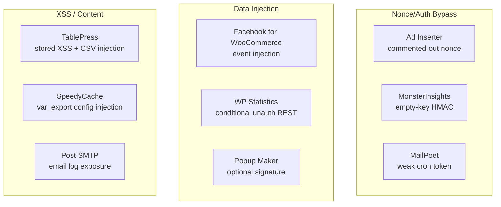

# Other Medium Severity Findings

This page consolidates the medium-severity confirmed findings for plugins not covered by dedicated detail pages. Each finding was confirmed through AI agent-driven review with live testing where applicable.

---

## Finding Categories Overview



---

## Ad Inserter — Nopriv AJAX with Commented-Out Nonce

**Finding ID:** AI-001
**CVSS:** 5.3 (Medium)
**Auth Required:** None
**Active Installs:** 200,000+

!!! warning "Medium Severity"
    An `ai_ajax` AJAX handler is registered for unauthenticated (`nopriv`) callers. The original nonce verification call is present in the code but commented out, leaving the handler completely unprotected. The handler exposes plugin configuration information including active ad blocks and settings.

**Root Cause:** Dead/commented-out security code — the developer disabled nonce checking during debugging and did not re-enable it.

```php
add_action('wp_ajax_nopriv_ai_ajax', 'ai_ajax_handler');

function ai_ajax_handler() {
    // check_ajax_referer('ai-nonce', 'nonce');  // COMMENTED OUT
    // ... handler body exposes configuration data
}
```

**Additional findings:** Stored XSS on the ad blocks admin page where `$website_url` is echoed without `esc_url()`; classified Low severity as it requires admin access.

**Fix:** Uncomment the nonce check and add `current_user_can('manage_options')` for admin-only operations; remove the `nopriv` registration if the handler serves no public purpose.

---

## MonsterInsights — Empty-Key HMAC Bypass

**Finding ID:** MI-001
**CVSS:** 5.8 (Medium)
**Auth Required:** None
**Active Installs:** 3,000,000+

!!! warning "Medium Severity"
    MonsterInsights uses HMAC-based authentication for its reporting API callbacks. When the configured HMAC secret key is empty (the default state before authentication is completed), the HMAC verification logic accepts any signature, allowing unauthenticated callers to inject analytics data or trigger reporting callbacks.

**Affected Condition:** Sites that have installed MonsterInsights but not yet completed the Google Analytics authentication flow (leaving the secret key unset or empty).

**Impact:** Unauthenticated analytics data injection; false traffic statistics; potential triggering of callback-based actions.

**Fix:** Reject all API requests when the secret key is not configured; validate that the key is non-empty before performing HMAC comparison; return `403 Forbidden` rather than accepting any signature against an empty key.

---

## MailPoet — Weak Cron Authentication Token

**Finding ID:** MP-001
**CVSS:** 4.0 (Medium)
**Auth Required:** None (token-based)
**Active Installs:** 700,000+

!!! warning "Medium Severity"
    MailPoet uses a predictable or insufficiently random token to authenticate its background cron processing endpoint. An attacker who can enumerate or predict the token can trigger cron jobs (newsletter sends, subscriber processing) without authentication.

**Root Cause:** The cron token is derived from a site-specific value with insufficient entropy, making it susceptible to brute-force or enumeration attacks on smaller sites.

**Impact:** Unauthorized triggering of email sends; potential for sending to subscriber lists without authorization; resource exhaustion via repeated cron invocation.

**Fix:** Generate the cron authentication token using `wp_generate_password(64, false)` or `bin2hex(random_bytes(32))` and store it as a non-derivable secret option. Rotate the token after each successful cron run if practical.

---

## Facebook for WooCommerce — Unauthenticated Event Injection

**Finding ID:** FBWOO-003
**CVSS:** 5.3 (Medium)
**Auth Required:** None
**Active Installs:** 700,000+

!!! warning "Medium Severity — Unauthenticated CAPI Event Relay"
    The `facebook_release_signals` AJAX handler uses cookie-based gating that can be bypassed to abuse the plugin's Facebook Conversions API relay. An attacker can inject arbitrary conversion events attributed to the victim site.

**Description:** The handler is registered as `wp_ajax_nopriv_facebook_release_signals`. Its authorization check relies on a cookie value that can be spoofed by an attacker. When bypassed, the handler relays attacker-supplied conversion event data to Facebook's CAPI on behalf of the site, causing:

- False conversion events attributed to the site (inflated ad attribution)
- Potential billing impacts on Facebook ad accounts
- Data integrity corruption in the site's analytics

**Additional Findings:**
- `FB-WOO-001` (CVSS 2.1): `sync_all_clicked` requires admin + nonce — effectively protected
- `FB-WOO-002` (CVSS Low): `wc_facebook_update_signals_state` — cookie manipulation risk but limited impact

**Fix:** Replace cookie-based gating with proper nonce verification: `check_ajax_referer('fb_woo_nonce', 'nonce')` combined with `current_user_can()` for operations that should require elevation.

---

## WP Statistics — Conditional Unauthenticated REST Endpoint

**Finding ID:** WPS-001
**CVSS:** 4.3 (Medium)
**Auth Required:** None (conditional)
**Active Installs:** 600,000+

!!! info "Medium Severity — Insecure Default Permission Callback"
    WP Statistics' `BaseRestAPI` class defines a default `permissionCallback` that returns `true`, meaning any subclass that fails to override this method is publicly accessible without authentication. The HIT tracking endpoint intentionally uses this (by design), but other subclasses may inadvertently inherit the permissive default.

**Confirmed Issues:**
- `BaseRestAPI::permissionCallback()` returns `true` by default — insecure inheritance pattern
- `Helper::getConditionSQL()` builds SQL using string concatenation from user-supplied sort/filter parameters — latent SQL injection risk if input reaches the method unsanitized

**Design Recommendation:** Flip the default: `BaseRestAPI::permissionCallback()` should return `false` (or require `manage_options`) by default, with explicit opt-in for public endpoints.

---

## TablePress — Stored XSS + CSV Injection

**Finding ID:** TP-001
**CVSS:** 4.8 (Medium)
**Auth Required:** Editor
**Active Installs:** 800,000+

!!! info "Medium Severity — Admin-Context Stored XSS"
    An Editor-level user can insert HTML and JavaScript into table cells. TablePress does not strip HTML from cell content before storage, and table rendering outputs cell content without context-appropriate escaping in some display paths. Additionally, exported CSV files may contain injection payloads (DDE formulas) targeting users who open the export in spreadsheet applications.

**XSS Impact:** JavaScript execution in the admin's browser when viewing/editing the table in the TablePress admin interface.

**CSV Injection Impact:** Opening the exported CSV in Microsoft Excel or LibreOffice Calc can trigger formula execution (DDE injection) on the analyst's machine.

**Fix:**
- Apply `esc_html()` or `wp_kses_post()` when rendering cell content in HTML contexts
- Strip or encode formula-initiating characters (`=`, `+`, `-`, `@`) at the start of CSV cell values

---

## Popup Maker — REST v2 Optional Signature

**Finding ID:** PM-001
**CVSS:** 4.3 (Medium)
**Auth Required:** None
**Active Installs:** 700,000+

!!! info "Medium Severity — HMAC Signature Verification is Optional"
    The Popup Maker REST API v2 connect/install endpoint implements HMAC signature verification as an optional mechanism — if the `X-PM-Signature` header is absent, the verification is skipped entirely. This allows unauthenticated callers to trigger the install endpoint without providing a valid signature.

**Additional Findings:**
- `pum_analytics` (stat manipulation) and `pum_sub_form` (subscription submission) are accessible unauthenticated — classified Low as the direct impact is limited to analytics skew and spam subscriptions
- `unsanitized consent_args.text` stored in subscriber table — XSS risk if displayed in admin subscriber management

**Fix:** Make signature verification mandatory: reject requests that omit the `X-PM-Signature` header rather than treating its absence as a bypass condition.

---

## SpeedyCache — var_export() Config Injection + Missing Capability Check

**Finding ID:** SC-001
**CVSS:** 6.8 (Medium)
**Auth Required:** Admin (for config injection), None (for cache deletion)
**Active Installs:** 100,000+

!!! warning "Medium Severity — Two Distinct Issues"
    SpeedyCache has two confirmed vulnerabilities: (1) an admin-only `var_export()` config file write that can inject PHP code into the cache configuration if the admin is tricked via CSRF; (2) a `delete_page_cache` AJAX handler that is missing a capability check, allowing any logged-in user (or via CSRF) to flush the page cache.

**SC-VULN-001 (Path Traversal via URI):** The `advanced-cache.php` reads-back path from a `$_SERVER['REQUEST_URI']` derived variable into a `readfile()` call — Medium severity, confirmed likely.

**SC-VULN-004 (var_export Config Injection):** Admin-triggered config writes use `var_export()` to serialize settings into a PHP file. If an admin can be CSRFed into writing attacker-controlled values, PHP code can be injected into the config. *Requires admin-level CSRF; classified Medium.*

**SC-VULN-005 (Missing Capability on Cache Delete):** The `delete_page_cache` AJAX handler performs no capability check before flushing the page cache — confirmed exploitable by any authenticated user.

**Fixes:**
- Replace `var_export()` + file write with `wp_json_encode()` + `file_put_contents()` for config persistence
- Add `current_user_can('manage_options')` to `delete_page_cache` handler
- Sanitize `REQUEST_URI` before using in file operations

---

## Post SMTP — Mobile REST API Auth Bypass (Historical)

**Finding ID:** PSMTP-001
**CVSS:** 5.3 (Medium)
**Auth Required:** None
**Active Installs:** 400,000+

!!! info "Medium Severity — CVE-2023-6875 (Historical Reference)"
    Post SMTP's mobile REST API (for the companion mobile app) contained an authentication bypass vulnerability (CVE-2023-6875) that allowed unauthenticated access to email logs. This has been patched in current versions, but the research verified the fix and identified a secondary issue: `ajax_get_gmail_auth_url()` verifies the wrong nonce action string, making the nonce check ineffective for that specific handler.

**Additional Findings:**
- `post_user_feedback` AJAX handler lacks a capability check — any logged-in user can submit "feedback" that is stored server-side
- `unserialize()` on database-stored email headers — low-risk chain dependency (no known exploitation path without DB write access)
- External resource loading in email log viewer (tracking pixel URLs from logged emails rendered in the admin) — Low severity information disclosure

**Fix:**
- Correct the nonce action string in `ajax_get_gmail_auth_url()` to match the nonce creation
- Add `current_user_can('manage_options')` to `post_user_feedback`
