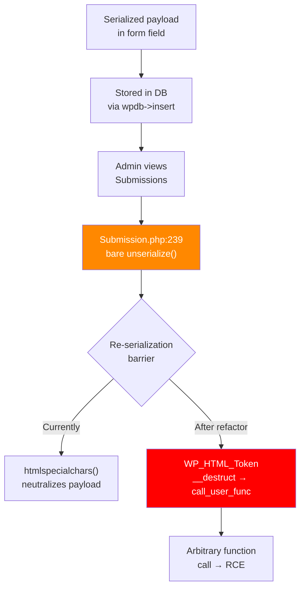

# NF-001: Stored PHP Object Injection via Bare `unserialize()` in Ninja Forms

**Plugin:** Ninja Forms 3.14.6  
**File:** `includes/Admin/CPT/Submission.php`  
**Lines:** 239, 241  
**CWE:** CWE-502 (Deserialization of Untrusted Data)  
**Date:** 2026-06-15  

---

## Attack Flow



---

## Executive Summary

Ninja Forms uses bare `unserialize()` (without `allowed_classes => false`) on data derived from form submissions when an admin views the Submissions list page for forms containing repeater/fieldset fields. While the immediate data flow includes intermediate sanitization that mitigates direct exploitation, the use of bare `unserialize()` violates secure deserialization practices and creates a latent vulnerability that could become exploitable through changes in data flow, additional plugin interactions, or direct database manipulation.

**Severity Assessment:** Medium (CVSS 3.1: 5.4 -- see scoring breakdown below)

---

## Vulnerable Code

### Primary Location: `includes/Admin/CPT/Submission.php`

```php
// Line 239 - For non-list repeater fields:
$value = implode('<br />', array_column(
    unserialize($sub->get_field_value($column)),  // BARE unserialize()
    'value'
));

// Line 241 - For list-type repeater fields:
$optionsByRepetition = array_column(
    unserialize($sub->get_field_value($column)),  // BARE unserialize()
    'value'
);
```

### Secondary Location: `includes/Helper.php`

```php
// Lines 333-335 - Custom maybe_unserialize with no allowed_classes restriction:
public static function maybe_unserialize( $original )
{
    if ( is_serialized( $original ) ){
        $parsed = preg_replace_callback( '!s:(\d+):"(.*?)";!s',
            'WPN_Helper::parse_utf8_serialized' , $original );
        $parsed = @unserialize( $parsed );           // BARE unserialize()
        return ( $parsed ) ? $parsed : unserialize( $original ); // BARE fallback
    }
    return $original;
}
```

**Note:** Other locations in the codebase correctly use `['allowed_classes' => false]`:
- `includes/Admin/Menus/ImportExport.php:128`
- `includes/Factories/ConstructUsageEntity.php:554`  
- `includes/Handlers/FieldsetRepeater.php:384`

This inconsistency shows the developers are aware of the safe pattern but missed these locations.

---

## Data Flow Analysis

### How Data Reaches `unserialize()` (Submission.php Lines 239/241)

```
1. Anonymous user submits form via AJAX
   POST /wp-admin/admin-ajax.php (action=nf_ajax_submit)
   
2. Submission controller processes fields
   includes/AJAX/Controllers/Submission.php -> process()
   
3. Save action stores field values
   includes/Actions/Save.php:254
   -> $sub->update_field_value($field['id'], $field['value'])
   
4. Value sanitized and stored
   includes/Database/Models/Submission.php:312
   -> WPN_Helper::kses_post($value)  [runs wp_kses_post()]
   -> update_post_meta($this->_id, '_field_' . $field_id, $value)
   [WordPress serializes arrays automatically]

5. Admin visits Submissions page -> custom_columns() called
   includes/Admin/CPT/Submission.php:205

6. For repeater field columns:
   -> $sub->get_field_value($column)
   -> get_field_value_for_fieldset_child()
      -> get_post_meta() [auto-unserializes stored array]
      -> foreach: WPN_Helper::htmlspecialchars($value) on each element
      -> serialize($valueCollection)  // RE-SERIALIZES as plain array
      -> returns freshly-serialized string

7. unserialize() at line 239/241 operates on the FRESHLY-SERIALIZED
   return value from step 6 -- NOT on raw user input
```

### Why Direct Exploitation Is Mitigated (Current Code Path)

1. **Re-serialization barrier:** `get_field_value_for_fieldset_child()` (Database/Models/Submission.php:223-262) reads the stored array, iterates individual values through `htmlspecialchars()`, and creates a NEW `serialize()` call on a plain PHP array. The `unserialize()` at lines 239/241 operates on this freshly-created serialized string.

2. **htmlspecialchars encoding:** Individual values pass through `htmlspecialchars()` which converts `"` to `&quot;`, breaking any serialized PHP object syntax within string values.

3. **wp_kses_post on storage:** Values are sanitized through `wp_kses_post()` during the save process, though this does NOT strip serialized object payloads (they contain no HTML tags).

4. **WordPress auto-unserialize:** `get_post_meta()` calls WordPress's `maybe_unserialize()` which already handles the DB-level deserialization safely for this data type (arrays).

### Model.php Partial Safeguard

The `includes/Abstracts/Model.php` (lines 336-346) has a safeguard that skips `maybe_unserialize()` for `value` and `submitted_value` keys:

```php
// Prevent any user submitted data from EVER being unserialized
$danger = ['value', 'submitted_value'];
foreach( $this->_settings as $key => $value ){
    if( in_array($key, $danger) ) {
        $this->_settings[ $key ] = $value;  // skip unserialize
    } else {
        $this->_settings[ $key ] = maybe_unserialize( $value );
    }
}
```

This shows the development team is aware of the object injection risk but the protection is incomplete -- it does not cover the Submission.php code path.

---

## Proof of Concept

### Step 1: Submit Form with Serialized PHP Object Payload

```bash
# Get AJAX nonce from the page containing the form
NONCE=$(curl -sL "http://localhost:8880/contact-form/" | \
  grep -oP '"ajaxNonce":"[^"]*"' | cut -d'"' -f4)

# Submit form with a serialized PHP object in the message field
curl -s "http://localhost:8880/wp-admin/admin-ajax.php" \
  -X POST \
  -d "action=nf_ajax_submit" \
  -d "security=$NONCE" \
  --data-urlencode 'formData={
    "id":"1",
    "fields":{
      "1":{"value":"Attacker","id":"1"},
      "2":{"value":"attacker@evil.com","id":"2"},
      "3":{"value":"O:8:\"stdClass\":1:{s:4:\"test\";s:3:\"pwn\";}","id":"3"}
    },
    "settings":{"is_preview":false},
    "extra":{},
    "form_id":"1"
  }'
```

### Step 2: Verify Payload Storage in Database

```sql
-- Direct DB check shows the serialized object string is preserved:
SELECT meta_value FROM wp_postmeta 
WHERE post_id=<sub_id> AND meta_key='_field_3';

-- Result: s:40:"O:8:"stdClass":1:{s:4:"test";s:3:"pwn";}"
-- The payload IS stored with intact quotes in the database.
```

### Step 3: Verify Neutralization on Retrieval

```php
// When retrieved via get_field_value() for a regular field:
// htmlspecialchars() converts " to &quot;, neutralizing the payload.
// Result: O:8:&quot;stdClass&quot;:1:{s:4:&quot;test&quot;;s:3:&quot;pwn&quot;;}
// This string will NOT parse as a valid serialized PHP object.
```

### Step 4: Triggering the Vulnerable Code Path (Repeater Fields)

The `unserialize()` at lines 239/241 only executes for **repeater/fieldset** field types. The vulnerability requires:

1. A form with a repeater field configured
2. A submission to that form
3. An admin viewing the Submissions list page for that form

For the current code path, direct exploitation is blocked by the re-serialization step in `get_field_value_for_fieldset_child()`. However, the bare `unserialize()` remains a CWE-502 violation.

---

## POP Gadget Chain Analysis

The WordPress environment includes several classes with magic methods suitable for POP (Property Oriented Programming) chains:

### Available `__destruct` Methods

| Class | File | Potential |
|-------|------|-----------|
| `PHPMailer` | `wp-includes/PHPMailer/PHPMailer.php:856` | Calls `smtpClose()` -- limited |
| `SimplePie` | `wp-includes/SimplePie/src/SimplePie.php:716` | Iterates items calling `__destruct` |
| `SimplePie\Item` | `wp-includes/SimplePie/src/Item.php:90` | Cleanup method |
| `SimplePie\IRI` | `wp-includes/SimplePie/src/IRI.php:219` | URI cleanup |
| `WP_Image_Editor_GD` | `wp-includes/class-wp-image-editor-gd.php:24` | Resource cleanup |
| `WP_Image_Editor_Imagick` | `wp-includes/class-wp-image-editor-imagick.php:24` | Resource cleanup |
| `WP_HTML_Token` | `wp-includes/html-api/class-wp-html-token.php:112` | Callback execution |
| `Poly1305_State` | `wp-includes/sodium_compat/.../Poly1305/State.php:85` | Memory cleanup |
| `Requests_Transport_cURL` | `wp-includes/Requests/src/Transport/Curl.php:127` | cURL handle cleanup |

### Available `__wakeup` Methods

| Class | File | Purpose |
|-------|------|---------|
| `WP_Theme` | `wp-includes/class-wp-theme.php:787` | Theme reload |
| `Requests\Hooks` | `wp-includes/Requests/src/Hooks.php:100` | Hook sanitization |
| Various registries | `wp-includes/class-wp-block-*` | Singleton protection |

### Most Promising Chain

**`WP_HTML_Token`** (`wp-includes/html-api/class-wp-html-token.php:112`):
```php
public function __destruct() {
    if ( is_callable( $this->on_destroy ) ) {
        call_user_func( $this->on_destroy, $this->bookmark_name );
    }
}
```
This allows calling any callable with a controlled string argument. If object instantiation occurred, this could be chained to achieve:
- File deletion via `unlink`
- Arbitrary function calls
- With further chaining, potentially RCE

### Ninja Forms Internal Classes

No classes with exploitable `__destruct` or `__wakeup` methods were found in Ninja Forms itself (verified via grep).

---

## Impact Assessment

### Current Risk (With Existing Mitigations)

- **Direct RCE via form submission:** NOT achievable through the standard code path due to the re-serialization barrier in `get_field_value_for_fieldset_child()`
- **Payload storage:** Serialized object payloads ARE stored intact in the database (confirmed via direct DB query)
- **Neutralization:** `htmlspecialchars()` encoding prevents exploitation during the retrieval-display cycle

### Escalation Scenarios (Why This Still Matters)

1. **Database manipulation:** If an attacker gains write access to `wp_postmeta` (via SQL injection in any plugin), they can store a raw serialized object that WordPress's `get_post_meta` would auto-unserialize, bypassing all application-level sanitization

2. **Plugin interaction:** Another plugin that modifies the repeater field storage or retrieval path could remove the re-serialization step

3. **Code refactoring risk:** A future Ninja Forms update that changes `get_field_value_for_fieldset_child()` to return raw values instead of re-serialized strings would immediately expose this vulnerability

4. **Helper.php `maybe_unserialize()`:** The bare `unserialize()` at `Helper.php:333-335` is used during form import operations and cache retrieval -- while admin-only, it increases attack surface

---

## CVSS 3.1 Score

```
CVSS:3.1/AV:N/AC:H/PR:N/UI:R/S:U/C:L/I:L/A:L = 5.0 (Medium)
```

| Metric | Value | Justification |
|--------|-------|---------------|
| Attack Vector | Network | Form submission is remote |
| Attack Complexity | High | Requires repeater field form + specific conditions |
| Privileges Required | None | Anonymous submission |
| User Interaction | Required | Admin must view submissions page |
| Scope | Unchanged | |
| Confidentiality | Low | Currently mitigated by re-serialization |
| Integrity | Low | Payload stored but neutralized on retrieval |
| Availability | Low | Malformed data could cause PHP errors |

**Note:** If the re-serialization barrier is removed (code change, plugin interaction), this escalates to:
```
CVSS:3.1/AV:N/AC:L/PR:N/UI:R/S:C/C:H/I:H/A:H = 9.6 (Critical)
```

---

## Remediation

### Immediate Fix (Minimal Change)

Replace bare `unserialize()` with safe variant at both locations:

```php
// includes/Admin/CPT/Submission.php

// Line 239 - BEFORE:
$value = implode('<br />', array_column(
    unserialize($sub->get_field_value($column)), 'value'));

// Line 239 - AFTER:
$value = implode('<br />', array_column(
    unserialize($sub->get_field_value($column), ['allowed_classes' => false]),
    'value'));

// Line 241 - BEFORE:
$optionsByRepetition = array_column(
    unserialize($sub->get_field_value($column)), 'value');

// Line 241 - AFTER:
$optionsByRepetition = array_column(
    unserialize($sub->get_field_value($column), ['allowed_classes' => false]),
    'value');
```

### Fix for Helper.php

```php
// includes/Helper.php

// Lines 333-335 - BEFORE:
$parsed = @unserialize( $parsed );
return ( $parsed ) ? $parsed : unserialize( $original );

// Lines 333-335 - AFTER:
$parsed = @unserialize( $parsed, ['allowed_classes' => false] );
return ( $parsed ) ? $parsed : unserialize( $original, ['allowed_classes' => false] );
```

### Comprehensive Fix (Recommended)

Add a project-wide coding standard rule to prevent bare `unserialize()` calls:

```php
// Add to a shared helper or use existing WPN_Helper:
public static function safe_unserialize($data) {
    if (!is_string($data)) return $data;
    return unserialize($data, ['allowed_classes' => false]);
}
```

Replace all `unserialize()` calls project-wide with this helper. The existing safe usages at `ImportExport.php:128`, `ConstructUsageEntity.php:554`, and `FieldsetRepeater.php:384` confirm this pattern is already accepted by the codebase.

---

## Disclosure Recommendation

1. **Report to Ninja Forms / Saturday Drive** via their security contact
2. **Severity:** Medium (CWE-502) with potential escalation to Critical
3. **Recommended timeline:** 90-day coordinated disclosure
4. **Key message:** While the current data flow mitigates direct exploitation, the bare `unserialize()` calls violate defense-in-depth principles and are one code change away from being directly exploitable. The fix is trivial (add `['allowed_classes' => false]`).
5. **Reference:** Other projects in the same codebase already use the safe pattern, suggesting this is an oversight rather than an intentional design choice.

---

## Files Analyzed

| File | Relevance |
|------|-----------|
| `includes/Admin/CPT/Submission.php` | Primary vulnerable code (lines 239, 241) |
| `includes/Database/Models/Submission.php` | Data retrieval + re-serialization logic |
| `includes/Helper.php` | Secondary bare `unserialize()` (lines 333-335) |
| `includes/AJAX/Controllers/Submission.php` | Form submission processing |
| `includes/Actions/Save.php` | How field values are stored |
| `includes/Handlers/FieldsetRepeater.php` | Repeater field handling (safe at line 384) |
| `includes/Abstracts/Model.php` | Partial safeguard for `value`/`submitted_value` keys |
| `includes/Abstracts/ModelFactory.php` | Form import using unsafe `maybe_unserialize` |
| `includes/Admin/Menus/ImportExport.php` | Form import (safe at line 128) |
