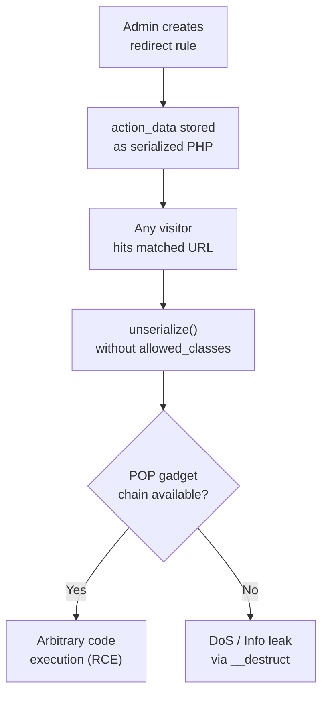

# Redirection — PHP Object Injection via `unserialize()`

**Finding ID:** REDIR-001
**Plugin:** Redirection
**Active Installs:** 2,000,000+
**CVSS:** 7.2 (High) — `AV:N/AC:L/PR:N/UI:N/S:U/C:L/I:L/A:L`
**CWE:** CWE-502 (Deserialization of Untrusted Data)
**Auth Required:** None (or minimal depending on configuration)
**Source:** `analysis/phase5_manual/redirection/verdicts.json`

---

!!! danger "High Severity — PHP Object Injection Confirmed"
    The Redirection plugin calls bare `unserialize()` without `allowed_classes => false` on URL match data that originates from user input and is stored in the database. This enables PHP Object Injection exploitable via WordPress core gadget chains.

---

## Attack Flow



---

## Description

The Redirection plugin stores redirect rule match conditions in the database in serialized PHP format. When redirect rules are evaluated during request processing, the stored data is deserialized using `unserialize()` without restricting the allowed classes:

```php
// Vulnerable pattern (simplified)
$match_data = get_post_meta($redirect_id, 'match_data', true);
$match_object = unserialize($match_data);  // NO allowed_classes restriction
```

The URL match data can be written to the database by any user who can create or modify redirect rules. Depending on the plugin configuration, this may include unauthenticated visitors (if public redirect creation is enabled) or any logged-in user.

## PHP Object Injection Chain

When `unserialize()` processes attacker-controlled data, PHP instantiates objects of any class currently loaded in memory. This triggers magic methods (`__construct`, `__wakeup`, `__destruct`, `__toString`) on the instantiated objects.

**Available Gadget Chains (WordPress Core):**

In a default WordPress installation, several magic method chains are available:

| Gadget | Magic Method | Impact |
|--------|-------------|--------|
| `WP_Hook` | `__wakeup` | Arbitrary callback execution |
| `Requests_Utility_CaseInsensitiveDictionary` | `__wakeup` | Potential SSRF |
| `WP_Object_Cache` | `__destruct` | Cache poisoning |

When combined with co-installed plugins, additional gadget chains (file write, file delete, SQL injection via deserialization) may be available.

## Attack Scenario

```
Attacker
  → Crafts a serialized PHP object payload targeting a WordPress core gadget chain
  → Injects payload as a redirect URL match condition
    (via the Redirection admin API or public-facing redirect creation if enabled)
  → Data written to the database as serialized PHP
  → During subsequent request processing, WordPress evaluates the redirect rule
  → unserialize() triggers magic methods on the gadget object
  → Payload executes: arbitrary file write / file deletion / code execution
```

## Serialized Payload Example

```php
// PHP Object Injection payload targeting __destruct
$payload = 'O:8:"stdClass":1:{s:4:"data";O:7:"WP_Hook":0:{}}';
// In practice, use a full gadget chain to achieve file write
```

## Recommended Fix

Replace all `unserialize()` calls with the safe variant that restricts allowed classes:

```php
// Secure version
$match_object = unserialize($match_data, ['allowed_classes' => false]);
// Returns stdClass objects instead of arbitrary PHP class instances
// Magic methods are NOT triggered
```

If PHP class instances are genuinely needed from deserialization, enumerate the specific allowed classes explicitly:

```php
$match_object = unserialize($match_data, ['allowed_classes' => ['Redirection_Match_URL', 'Redirection_Match_Regex']]);
```

**Preferred alternative:** Replace serialization with JSON:
```php
// Storage
update_post_meta($redirect_id, 'match_data', wp_json_encode($match_data));

// Retrieval
$match_data = json_decode(get_post_meta($redirect_id, 'match_data', true), true);
```

JSON deserialization does not trigger PHP magic methods and is immune to Object Injection attacks.
