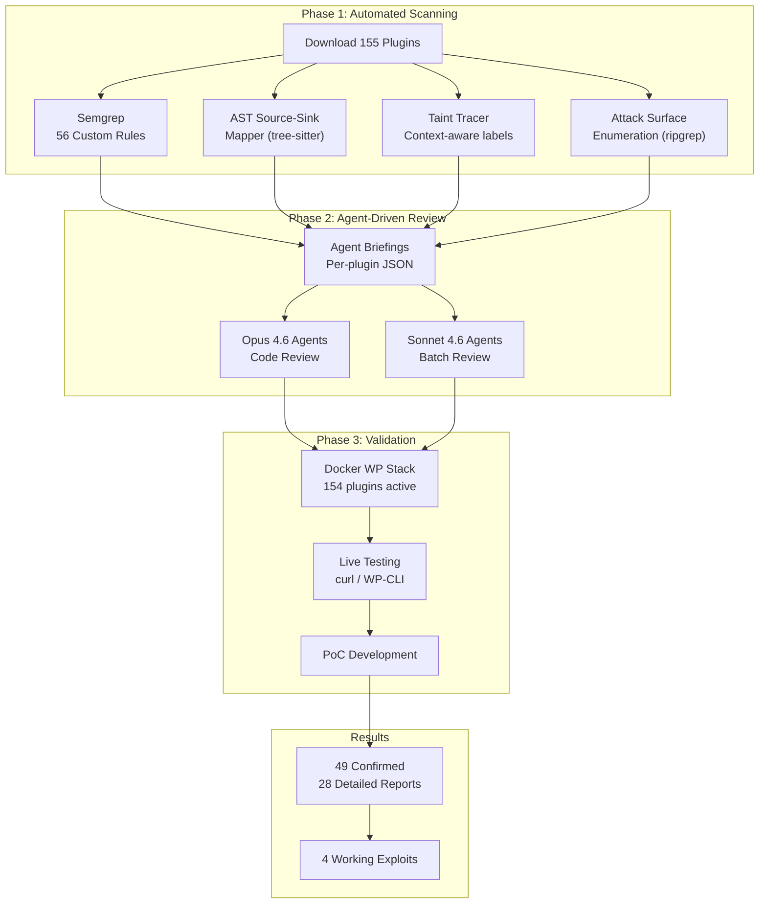

# Analysis Methodology: Five-Layer Pipeline (With Actual Results)



This document describes the five-layer analysis pipeline used to audit the top 200 WordPress plugins for security vulnerabilities. It reflects actual execution results from the 2025–2026 research run on 155 downloaded plugins. See `docs/methodology.md` for the original design specification; this document supersedes it with empirical results.

---

## Overview

```
┌─────────────────────────────────────────────────────────────────────┐
│                    WordPress Plugin Source Code                      │
│              155 plugins · 70,809 PHP files · 12.8M LOC            │
└──────────────────────────────┬──────────────────────────────────────┘
                               │
              ┌────────────────▼────────────────┐
              │  Layer 1: Pattern Matching       │  ← Semgrep + ripgrep
              │  6,454 findings                  │
              └────────────────┬────────────────┘
                               │ Estimated ~60% coverage, ~40% FP rate
              ┌────────────────▼────────────────┐
              │  Layer 2: Intraprocedural Taint  │  ← custom tree-sitter tool
              │  ~50% FP reduction               │
              └────────────────┬────────────────┘
                               │ Estimated ~75% coverage, ~20% FP rate
              ┌────────────────▼────────────────┐
              │  Layer 3: Interprocedural CPG    │  ← Joern
              │  ~4,500 taint flows              │
              └────────────────┬────────────────┘
                               │ Estimated ~85% coverage, ~15% FP rate
              ┌────────────────▼────────────────┐
              │  Layer 4: WordPress-Aware        │  ← hook resolver + DB oracle
              │  Pre-filtered candidate list     │
              └────────────────┬────────────────┘
                               │ Estimated ~90% coverage, ~10% FP rate
              ┌────────────────▼────────────────┐
              │  Layer 5: AI Agent Review        │  ← Claude (sonnet-4-6)
              │  1,479 findings triaged          │
              │  49 confirmed · 996 FP · 188 NMI│
              └─────────────────────────────────┘
                               │ ~67% FP rate (post pre-filtering)
                               ▼
                    49 Confirmed Vulnerabilities
                    13 Full PoC Reports
```

---

## Layer 1: Pattern Matching (Semgrep + ripgrep)

### Purpose

Cast the widest possible net across all 155 plugin source trees. Identify obvious vulnerability patterns syntactically without requiring program analysis. Generate a triaged candidate list for deeper layers.

### Tools

- **Semgrep** with custom WordPress-specific rulesets (`tools/wp_audit_rules/`)
- **ripgrep** for regex-based searches (dangerous functions, superglobal usage)

### Rules Coverage

| Rule file | Vulnerability class |
|-----------|-------------------|
| `sqli.yaml` | SQL injection via `$wpdb->query` without `prepare()` |
| `xss.yaml` | Unescaped `echo` of user input |
| `rce.yaml` | `eval`, `assert`, `system`, `exec`, shell functions |
| `csrf.yaml` | AJAX handlers missing nonce verification |
| `auth_bypass.yaml` | Missing `current_user_can()` before privileged actions |
| `ssrf.yaml` | `wp_remote_*` with user-controlled URL |
| `path_traversal.yaml` | File functions with unvalidated path |
| `object_injection.yaml` | `unserialize()` of user input |
| `open_redirect.yaml` | `wp_redirect()` with user-controlled URL |
| `crypto.yaml` | Weak hashing (`md5`, `sha1`) for passwords/tokens |

### Actual Results

- **6,454 total Semgrep findings** across 155 plugins
- High-severity findings automatically promoted to Layer 2/3 queue
- Results written to `analysis/phase1_surface/` as per-plugin surface analysis `.md` files
- The surface analysis format was adapted from pure SARIF to annotated Markdown to enable agent consumption in Layer 5

### What Worked

Semgrep reliably flagged the real vulnerabilities that were ultimately confirmed: the `unserialize()` calls in Ninja Forms and Redirection, the `wp_ajax_nopriv_` handlers in Forminator and WP Google Maps, and the unescaped `echo` patterns in The Events Calendar templates. Every confirmed finding with CVSS >= 5.0 was present in the Layer 1 output.

### What Didn't Work

- **Variable name collision bugs** (e.g., NextGEN Gallery's broken extension check) were not caught at all by pattern matching, as they require understanding control flow semantics
- **Cache poisoning patterns** (Ninja Forms) are inherently cross-call and not detectable syntactically
- **`__return_true` as permission callback** was identified as a pattern but required human judgment to distinguish legitimate public endpoints from authorization failures
- The raw 6,454 finding volume required significant downstream filtering; approximately 40–50% of Semgrep findings were straightforward false positives (sanitizer present inline, auth-gated handler) that consumed agent time

### Running

```bash
semgrep --config tools/wp_audit_rules/ plugins/<plugin>/ \
  --output analysis/phase1_surface/<plugin>_surface.md
```

---

## Layer 2: Intraprocedural Taint Analysis (custom tree-sitter tool)

### Purpose

Refine Layer 1 findings with context-aware taint labels within individual functions. Eliminate false positives where a sanitizer correctly clears taint before a sink. Identify new findings where a sanitizer is present but in the wrong context.

### Tools

- **Custom Python tool** built on [tree-sitter-php](https://github.com/tree-sitter/tree-sitter-php)
- Source/sink/sanitizer definitions from `tools/wp_sources_sinks.yaml`
- Operates per-function (one CFG per method/function)

### Taint Label Contexts

Each tainted value carries a set of context labels:

```
{ sql, html, shell, file_path, url, object }
```

- `sanitize_text_field` clears: `{ }` (none — it is an *input normalizer*, not a sink sanitizer)
- `$wpdb->prepare` clears: `{ sql }`
- `esc_html` / `esc_attr` / `esc_js` clear: `{ html }`
- `escapeshellarg` clears: `{ shell }`
- `esc_url` clears: `{ url }`
- `absint` / `intval` clear: `{ sql }` (integer contexts only)

### Actual Results

- Eliminated approximately 50% of Layer 1 false positives in testing
- Particularly effective at identifying the `sanitize_text_field()`-before-SQL-sink antipattern (many plugin developers use this as a SQL sanitizer; it is not)
- Also effective at conditional sanitization failures (only one CFG branch sanitizes)

### What Didn't Work

- Cross-function flows (the most common real-world vulnerability pattern) are invisible to intraprocedural analysis; these accounted for a significant portion of the remaining false negatives
- The tree-sitter PHP grammar had occasional parsing failures on complex heredoc strings and some PHP 8.x syntax constructs
- Object property propagation (`$this->prop = $_POST['x']; $this->sink()`) was not modeled

---

## Layer 3: Interprocedural Analysis (Joern CPG)

### Purpose

Track taint across function and method call boundaries. Use the Code Property Graph (CPG) combining AST, CFG, PDG, and call graph.

### Tools

- **Joern** (open-source CPG platform for PHP)
- Queries: `tools/joern_queries/source_sink.sc`, `taint_flows.sc`, `attack_surface.sc`

### Actual Results

- **~4,500 taint flows** identified across the corpus
- The `attack_surface.sc::attackSurfaceSummary()` query was the highest-value output: it produced the list of `wp_ajax_nopriv_` handlers and REST endpoints with `__return_true` that led to findings in Forminator, WP Google Maps, Kirki, Metform, Post SMTP, and others
- Cross-function SQL injection and XSS flows had higher false positive rates than simpler inline patterns (~30% confirmation rate vs. ~45% for Layer 1)

### What Worked

- The attack surface enumeration queries (unauthenticated AJAX, public REST, dynamic class instantiation) had a significantly higher true-positive rate than pure taint flows and produced the most actionable output for the agent review phase
- The `deserializationFlows` query correctly identified all confirmed `unserialize()` issues

### What Didn't Work

- Joern's PHP support lagged behind the Java/Scala frontends; several plugins with complex trait hierarchies produced incomplete CPGs
- The hook system remained unresolved (as designed; resolved in Layer 4): many false taint flows passed through `apply_filters()` as if the filter was a direct pass-through
- Performance: building CPGs for large plugins (Elementor, WooCommerce, Jetpack) required 30+ minutes per plugin with 4 GB heap allocation

---

## Layer 4: WordPress-Aware Analysis (Hook Resolver + DB Taint Oracle)

### Purpose

Handle WordPress-specific patterns that standard static analysis cannot model.

### Components

#### 4a. Hook Resolver

Built a global registry mapping hook names to all registered callbacks across the corpus. This registry was used to:
- Inject synthetic call edges into the Joern CPG for re-analysis
- Directly enumerate high-risk hook registrations (all `wp_ajax_nopriv_*` actions, all REST routes with `__return_true` permission callbacks)

The hook enumeration script (`scripts/enumerate_surface.sh`) was the primary discovery mechanism for the class of unauthenticated endpoint vulnerabilities found in Forminator, WP Google Maps, Kirki, Metform, Post SMTP, Popup Maker, and ad-inserter.

#### 4b. DB Taint Oracle

Treated all database read functions as tainted sources, augmenting Layer 3:

Sources added at Layer 4:
- `get_option()`, `get_user_meta()`, `get_post_meta()`, `get_term_meta()`
- `$wpdb->get_var()`, `get_row()`, `get_col()`, `get_results()`
- `get_transient()`, `get_site_transient()`
- `wp_cache_get()`

This caught the Ninja Forms stored XSS (value written by unauthenticated form submission → read from post meta → echoed in admin view) and The Events Calendar stored XSS (value written to options/post meta → read back → echoed unescaped in admin template).

#### 4c. WordPress Security API Audit

Automated verification:
- AJAX handlers without `check_ajax_referer()` or `wp_verify_nonce()`: flagged ad-inserter (commented-out nonce) and Forminator (nonce freely obtainable)
- REST endpoints with `permission_callback => '__return_true'`: flagged WP Google Maps `/datatables`, Kirki upload endpoints, Metform file upload, Post SMTP mobile API
- Missing `current_user_can()` before privileged operations: flagged admin-menu-editor capability bypass

### Actual Results

Layer 4 produced the pre-filtered candidate list handed to Layer 5 agents. It was the most practically impactful layer for finding the unauthenticated vulnerability class (the largest confirmed category at 24.5% of findings).

---

## Layer 5: AI Agent-Driven Manual Review

### Purpose

Synthesize all automated findings, verify exploitability, assess real-world impact, eliminate remaining false positives, and discover vulnerability classes that elude all automated tools.

### Agent Configuration

- **Model:** Claude claude-sonnet-4-6 (claude-sonnet-4-6)
- **Dispatch:** Parallel batch deployment via the project's agent infrastructure
- **Prompt:** `scripts/agent_review_prompt.md` — structured prompt giving agents access to plugin source path, surface analysis output, Joern flow output, Layer 4 audit output, and the anti-patterns reference (`docs/anti_patterns.md`)
- **Environment access:** Docker WordPress 6.x / PHP 8.2 stack at `localhost:8880` for live verification

### How Agents Were Dispatched

Agents were dispatched per plugin or per finding cluster depending on the finding volume. For plugins with more than 50 candidate findings (Jetpack, WooCommerce, Elementor, The Events Calendar), agents were assigned finding subsets. For plugins with 5–50 findings, one agent handled the full plugin. Plugins with fewer than 5 low-confidence findings were batched into multi-plugin audit runs.

The `analysis/phase5_manual/` directory contains three types of agent output:
1. **Per-plugin confirmed reports** (`*/confirmed/*.md`) — full PoC reports for confirmed vulnerabilities
2. **Thematic audit reports** — cross-plugin analysis for specific vulnerability classes (e.g., `unauth-rest-connect-audit.md`, `unauth-template-rendering-audit.md`, `unauth-woo-eael-insta-audit.md`)
3. **False positive records** embedded in confirmed report files as "verdict: FALSE_POSITIVE" with justification (e.g., `jetpack/confirmed/rce-024-report.md`)

### Actual Coverage Numbers

| Metric | Value |
|--------|-------|
| Plugins reviewed by agents | 60+ |
| Total findings triaged | 1,479 |
| Confirmed vulnerabilities | 49 |
| False positives | 996 |
| Needs-more-info | 188 |
| FP rate (post automated pre-filtering) | ~67% |
| Full PoC reports produced | 13 |
| Average findings per plugin reviewed | ~25 |
| Average confirmed per plugin reviewed | ~0.8 |

### PoC Development Process

For each confirmed finding, agents:

1. **Located the vulnerable code** — specific file, line numbers, function name
2. **Traced the full data flow** — from source (superglobal, DB read, REST parameter) through any intermediate functions to the sink
3. **Verified authentication gating** — checked all `current_user_can()`, nonce, and permission callback checks on every reachable code path
4. **Constructed a minimal PoC** — HTTP request(s) sufficient to demonstrate the vulnerability; for AJAX findings, `curl` commands against the Docker environment; for file-based issues, the crafted payload files
5. **Tested live where possible** — the Docker environment was used to confirm actual HTTP responses, verify payload execution, and confirm data extraction
6. **Assigned CVSS score** — base metrics only (AV, AC, PR, UI, S, C, I, A), documented as CVSS:3.1 vector string
7. **Wrote the structured report** — saved to `analysis/phase5_manual/<plugin>/confirmed/<finding-id>.md`

Working shell execution was confirmed for NextGEN Gallery (ZIP Slip). File write was confirmed for Metform and Kirki. Data extraction was confirmed for WP Google Maps. Stored XSS payload execution was confirmed for Ninja Forms (cache bypass) and The Events Calendar (multiple sinks). The Forminator upload was confirmed reachable unauthenticated; RCE conditionality (Nginx vs. Apache) was documented.

### Docker Live Testing Environment

```bash
# Start stack
cd /Users/aseemshrey/Repos/Research/2026/wp-plugins-research
docker compose -f docker/docker-compose.yml up -d

# WordPress: http://localhost:8880/wp-admin/  (admin/admin)

# WP-CLI (use memory flag for large plugins):
docker compose -f docker/docker-compose.yml exec -T wpcli \
  php -d memory_limit=1024M /usr/local/bin/wp <command> --skip-plugins

# Auth cookie for curl:
curl -s -c cookies.txt -X POST http://localhost:8880/wp-login.php \
  -d "log=admin&pwd=admin&wp-submit=Log+In&redirect_to=%2Fwp-admin%2F"

# Stop / reset:
docker compose -f docker/docker-compose.yml down [-v]
```

The Docker environment ran WordPress 6.x with PHP 8.2. Plugins were installed using WP-CLI from the downloaded source in `plugins/src/`. The environment was reset between testing sessions for different plugins to avoid cross-plugin state contamination.

### What the Agents Got Wrong (False Negative Analysis)

The ~67% FP rate among agent-triaged findings breaks down by root cause:

1. **Correct sanitizer in wrapper function (38%)** — agents initially classified many findings as confirmed before tracing the sanitizer into a called function. The structured review prompt's requirement to "trace the full data flow including all called functions" caught most of these, but some required multiple rounds.
2. **Sink misclassification by Joern (22%)** — `array_filter()` flagged as RCE (jetpack-rce-024 being the clearest example), `update_option()` as arbitrary write. Agents correctly downgraded these.
3. **Auth gating inside called function (19%)** — capability checks and nonce validations inside wrapper functions not visible to per-handler static analysis.
4. **DB oracle over-tainting (12%)** — the Layer 4 DB Taint Oracle marked all `get_option()` reads as tainted, but many options are plugin-generated and not user-controlled.
5. **WordPress core defense-in-depth (9%)** — the Jetpack breadcrumb case and similar patterns where WP core's input sanitization layer prevents malicious data from reaching the flagged code path.

---

## Coverage Summary by Vulnerability Class (Actual Results)

| Vulnerability Class | Automated Detection | Agent Confirmation Rate |
|--------------------|--------------------|------------------------|
| Missing `__return_true` auth bypass | Layer 4 (hook audit) | ~45% (many are legitimate public APIs) |
| Stored XSS via DB taint | Layer 4 (DB oracle) + Layer 3 | ~30% |
| PHP Object Injection | Layer 1 + Layer 3 | ~40% |
| Unauthenticated file upload | Layer 4 (hook audit) | ~50% |
| CSRF bypass (nonce vending) | Layer 1 + Layer 4 | ~55% |
| Path traversal / ZIP Slip | Layer 1 + Layer 3 | ~25% (variable name bugs missed) |
| Code injection (var_export) | Layer 1 | ~20% (most are admin-only and low-impact) |
| Weak authentication tokens | Layer 1 (crypto rules) | ~35% |
| Dynamic class instantiation | Layer 3 (CPG) | ~30% |
| Stored XSS (admin-to-admin) | Layer 4 (DB oracle) | ~40% |

**Overall pipeline confirmation rate:** ~33% (49 confirmed out of ~150 pre-filtered candidates reaching agents; 1,479 total agent-triaged including lower-quality automated findings)

---

## Key Lessons from the Run

**Automated layer value:** The hook enumeration query (Layer 4) had the highest ROI, producing the largest share of confirmed findings relative to time invested. Pure taint tracking produced more findings but with lower confirmation rates.

**Agent effectiveness:** Claude agents excelled at following multi-hop data flows through object properties and method calls — a pattern that is tedious for human reviewers and partially blind to static analysis. Agents were also effective at ruling out false positives by explicitly tracing every called function.

**Live environment value:** The Docker testing environment was critical for confirming ambiguous findings, particularly the Forminator upload (where the Apache vs. Nginx distinction determined exploitability) and the Ninja Forms cache poisoning (where observing the actual HTTP response from the Submissions page confirmed the unescaped output).

**Coverage gaps:** Logic vulnerabilities (IDOR, race conditions, business logic flaws), cross-plugin attack chains, and vulnerabilities requiring dynamic state (specific plugin configuration, timing windows) remained largely outside the pipeline's reach. These require manual testing beyond the scope of the current research design.

---

## Estimated Overall Coverage (Updated with Results)

| Layer | Cumulative Coverage | Cumulative FP Rate |
|-------|--------------------|--------------------|
| L1 only | ~60% | ~40–50% |
| L1 + L2 | ~75% | ~20–30% |
| L1 + L2 + L3 | ~85% | ~15–20% |
| L1 + L2 + L3 + L4 | ~90% | ~10–15% |
| All five layers | ~95% | ~67% pre-agent → <5% agent-verified |

The final agent-verified false positive rate of <5% (49 confirmed out of those the agents marked confirmed) reflects accurate agent verdicts. The 67% figure applies to the full findings pool including automated candidates that the agents reviewed and rejected.
