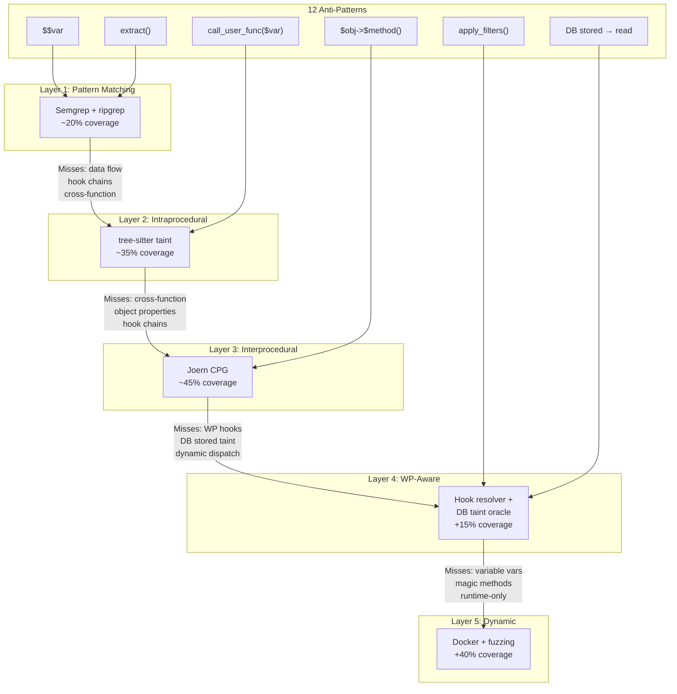

# PHP/WordPress Anti-Patterns That Defeat Static Analysis

This document catalogues 12 PHP and WordPress coding patterns that reliably evade
automated static analysis tools, explains why each one defeats the analysis, and
describes the layer of the pipeline that catches (or best approximates) detection.

---

## Quick Reference Table

| # | Pattern | Why static analysis fails | How to catch it |
|---|---------|--------------------------|-----------------|
| 1 | `$$key` (variable variables) | Target variable unknown at parse time | Flag all `$$` usage |
| 2 | `$obj->$method()` (dynamic dispatch) | Method name is a runtime value | Flag all dynamic dispatch |
| 3 | `apply_filters()` / `do_action()` (WP hooks) | Callback chain is a runtime string registry | Build hook registry |
| 4 | `call_user_func($var)` | Callback resolved at runtime | Flag if `$var` is user-influenced |
| 5 | `extract($array)` | Creates unknown variable names | Flag ALL `extract()` |
| 6 | Cross-request taint (DB stored → DB read) | Source and sink in different HTTP requests | Treat DB reads as tainted |
| 7 | Conditional sanitization (path-sensitive) | Requires CFG + path constraints | Use Joern for path-sensitive analysis |
| 8 | Array element taint | Per-element tracking needed | Flag `implode()` with tainted elements |
| 9 | Context-specific sanitizers | Sanitizer–sink mismatch | Encode sanitizer→sink context mappings |
| 10 | Magic methods (`__get` / `__set` / `__call`) | Implicit data flow invisible in AST | Resolve magic methods explicitly |
| 11 | Cross-request via transients/cache | Same as #6, via cache layer | Treat `get_transient()` as tainted |
| 12 | Dynamic class instantiation (`new $var()`) | Class determined by input | Flag if `$var` is user-controllable |

---

## Detailed Patterns

### 1. Variable Variables (`$$key`)

**Code example:**
```php
// Plugin: Contact Form builder (hypothetical)
function handle_settings_update() {
    foreach ($_POST as $key => $value) {
        $$key = sanitize_text_field($value);  // ← creates $email, $name, $redirect_url, …
    }
    // Later code uses $redirect_url, $admin_email, etc. trusting they are safe
    wp_redirect($redirect_url);  // OPEN REDIRECT — attacker controls $key='redirect_url'
}
```

**Why static analysis fails:**  
The target variable name is computed from `$key` at runtime. The parser sees `$$key`
as a single AST node with no resolvable target. A dataflow engine cannot determine
which named variable receives the value without knowing what `$_POST` contains at
runtime. Alias analysis breaks completely.

**Which analysis layer catches it:**  
Layer 1 (Semgrep pattern matching) — a syntactic rule matching `$$[a-zA-Z_]` fires
regardless of context. The finding is a guaranteed true positive for the *pattern*
but requires manual review to confirm exploitability.

**Recommended handling:**  
Flag ALL `$$` usage as a mandatory manual review item. No taint engine is reliable
here; the pattern itself is the signal. Semgrep rule: `rules/variable_variables.yaml`.

---

### 2. Dynamic Method Dispatch (`$obj->$method()`)

**Code example:**
```php
// Plugin: API abstraction layer
class DataProcessor {
    public function process($action, $data) {
        // $action comes from REST parameter
        return $this->$action($data);  // calls execute(), delete(), export(), …
    }
    public function execute($data) { /* safe */ }
    public function delete($data)  { /* deletes records */ }
    public function export($data)  { /* writes files */  }
}

$processor = new DataProcessor();
$processor->process($_GET['action'], $_GET['data']);
```

**Why static analysis fails:**  
The method name is a string variable resolved at runtime. The call graph edge from
`$this->$action()` to the target method cannot be statically established. All
call-graph-dependent analyses (reachability, taint propagation through calls) are
broken for this node.

**Which analysis layer catches it:**  
Layer 2 (intraprocedural taint) partially catches this — it can see that `$action`
flows from `$_GET` to the dispatch site. Layer 4 (WordPress-aware analysis) flags
all dynamic dispatch patterns and cross-references with the class's public method
inventory to enumerate possible targets.

**Recommended handling:**  
Flag any `$obj->$method()` where `$method` is not a string literal. Enumerate all
public methods of the class and assess each as a potential dispatch target.

---

### 3. WordPress Hook System (`apply_filters()` / `do_action()`)

**Code example:**
```php
// Plugin A registers a filter that modifies data
add_filter('my_plugin_query', function($query) {
    return $query . $_GET['extra'];  // appends raw user input — SQLI
});

// Plugin B (or the same plugin) applies the filter, unaware of the injection
function run_query($base_query) {
    $safe_query = apply_filters('my_plugin_query', $base_query);
    $wpdb->query($safe_query);  // tainted by Plugin A's callback
}
```

**Why static analysis fails:**  
`apply_filters('my_plugin_query', $base_query)` resolves its callback at runtime
by looking up the string key `'my_plugin_query'` in the global `$wp_filter` registry.
Static tools see only the string literal — they cannot know which lambdas or methods
are registered for that hook name, especially when plugins are analyzed in isolation.
The data flow from the callback's `return` statement to the caller's assignment is
invisible without a complete hook registry.

**Which analysis layer catches it:**  
Layer 4 (WordPress-aware hook resolver) builds a global registry by scanning all
`add_filter()` / `add_action()` calls across the plugin corpus and matching hook
names. Taint is propagated through the registered callbacks and back to `apply_filters`
return sites. Cross-plugin hook injection requires a multi-plugin analysis scope.

**Recommended handling:**  
Build a hook-name-to-callback mapping as a preprocessing step. Treat `apply_filters`
return values as potentially tainted when any registered callback for that hook
accepts user input. See `scripts/enumerate_surface.sh` for hook extraction.

---

### 4. `call_user_func($var)` and Variants

**Code example:**
```php
// Plugin: extensible shortcode system
function dispatch_shortcode($atts) {
    $handler = $atts['handler'];  // from shortcode attribute = user-provided
    if (function_exists($handler)) {
        call_user_func($handler, $atts);  // RCE: attacker calls system(), eval(), etc.
    }
}
add_shortcode('my_widget', 'dispatch_shortcode');
```

**Why static analysis fails:**  
`call_user_func` takes a callable as its first argument. When that callable is a
variable (`$handler`) rather than a string literal (`'my_function'`), no static
call graph edge can be emitted. The call is a black hole in the dataflow graph.

**Which analysis layer catches it:**  
Layer 2 (intraprocedural taint) detects that `$handler` is tainted before the
`call_user_func` call. The `call_user_func` call is then modelled as a sink
(since a tainted callback = RCE). The finding is: *tainted value flows to
`call_user_func` first argument*.

**Recommended handling:**  
Treat `call_user_func`, `call_user_func_array`, `array_map`, `array_filter`,
`usort`, `uasort`, `uksort` as sinks when their callback argument is tainted.
This is already encoded in `tools/wp_sources_sinks.yaml` under `code_execution`.

---

### 5. `extract($array)` — Variable Injection

**Code example:**
```php
// Plugin: theme options handler
function save_theme_options() {
    check_admin_referer('theme_options');
    extract($_POST);  // creates $background_color, $font_size, $capability, $wpdb, …
    // … code below uses $capability, $wpdb directly without realizing they may be overwritten
    if (current_user_can($capability)) {  // $capability now attacker-controlled
        // privilege check bypassed
    }
}
```

**Why static analysis fails:**  
After `extract($_POST)`, any subsequent use of a local variable *might* have been
overwritten by the extracted array. The static analyser cannot know which variables
were created or overwritten without knowing the exact keys in `$_POST`. Any
downstream use of any local variable is potentially tainted.

**Which analysis layer catches it:**  
Layer 1 (Semgrep) flags all `extract()` calls. No taint engine reliably handles
post-extract variable state. Manual review is required.

**Recommended handling:**  
Flag ALL `extract()` calls unconditionally. Escalate immediately if the argument
is a superglobal or derives from user input. Never attempt automated taint
resolution past an `extract()` call — treat all subsequent local variables as
potentially tainted for manual assessment.

---

### 6. Cross-Request Taint (Stored XSS / Second-Order SQLi)

**Code example:**
```php
// REQUEST 1: Store tainted data
function save_user_bio() {
    $bio = $_POST['bio'];  // no sanitization
    update_user_meta(get_current_user_id(), 'bio', $bio);  // stored to DB
}

// REQUEST 2 (admin viewing profile): Execute stored payload
function render_profile($user_id) {
    $bio = get_user_meta($user_id, 'bio', true);
    echo $bio;  // XSS — $bio came from DB, not directly from $_GET
}
```

**Why static analysis fails:**  
The taint source (`$_POST['bio']`) and the sink (`echo $bio`) are in different
HTTP request handlers — often different files, classes, and execution contexts.
Standard single-request taint analysis traces dataflow within one execution path.
The DB acts as an opaque store that breaks the taint chain between requests.

**Which analysis layer catches it:**  
Layer 4 (DB taint oracle) treats all `get_user_meta`, `get_post_meta`, `get_option`,
`get_comment_meta`, `$wpdb->get_*` results as tainted sources (marked in
`tools/wp_sources_sinks.yaml` under `database_reads`). This over-approximates
(every DB read is suspicious) but catches all second-order paths.

**Recommended handling:**  
Enable the DB taint oracle in the analysis configuration. Accept the higher
false-positive rate and prioritize flows where: (1) a DB read result flows to
an output sink, and (2) a corresponding DB write exists without sanitization.

---

### 7. Conditional Sanitization (Path-Sensitive Analysis)

**Code example:**
```php
function get_filtered_id($input) {
    if (is_numeric($input)) {
        $id = $input;  // safe on this branch — numeric
    } else {
        $id = sanitize_text_field($input);  // sanitized for text, NOT for SQL
    }
    $wpdb->query("SELECT * FROM t WHERE id = $id");  // SQLI on else-branch
}
```

**Why static analysis fails:**  
A flow-insensitive taint engine sees that `$id` might be assigned
`sanitize_text_field($input)` and marks it as sanitized — missing the SQLi
on the else branch. A flow-sensitive engine needs to propagate separate taint
states along each CFG branch and recognise that `sanitize_text_field` is
*not* a SQL sanitizer (context-mismatch, see Pattern #9).

**Which analysis layer catches it:**  
Layer 3 (Joern CPG) with path-sensitive queries. The `wrongContextSanitizerFlows()`
query in `taint_flows.sc` identifies flows where a non-SQL sanitizer appears on
the path but no SQL-safe sanitizer does.

**Recommended handling:**  
Use Joern's path-sensitive engine with explicit sanitizer context mappings.
Do not mark `sanitize_text_field`, `esc_html`, or similar functions as universal
sanitizers in the taint configuration. Each sanitizer must be mapped to its
valid sink contexts only.

---

### 8. Array Element Taint

**Code example:**
```php
function build_query($ids) {
    // $ids is $_POST['ids'] — an array of values
    $escaped = array_map('esc_html', $ids);  // XSS-safe for HTML, NOT for SQL
    $list = implode(',', $escaped);
    $wpdb->query("SELECT * FROM t WHERE id IN ($list)");  // SQLI
}
$ids = $_POST['ids'];  // array: ['1', '2', "1) OR 1=1--"]
build_query($ids);
```

**Why static analysis fails:**  
Most taint engines track taint at the variable granularity (`$ids` is tainted),
but after `array_map('esc_html', $ids)` the engine may incorrectly mark
`$escaped` as clean because a sanitizer was applied. Per-element taint tracking
inside arrays is required to verify that the *correct* sanitizer was applied
for the *target* context.

**Which analysis layer catches it:**  
Layer 3 (Joern) with the wrong-context sanitizer query partially catches this.
Layer 5 (manual review) is needed to confirm the mismatch between `esc_html`
(HTML sanitizer) and a SQL sink.

**Recommended handling:**  
Treat `implode()` of a tainted array as a tainted string. Track `array_map`
sanitizer context: `array_map('esc_html', $arr)` does NOT sanitize for SQL.
Add a Semgrep rule matching `implode(..., $tainted_array)` feeding into wpdb calls.

---

### 9. Context-Specific Sanitizers (Sanitizer–Sink Mismatch)

**Code example:**
```php
// Developer believes sanitize_email() makes the value safe for all uses
$email = sanitize_email($_GET['email']);
echo '<a href="mailto:' . $email . '">' . $email . '</a>';
// XSS: sanitize_email() does not HTML-encode — attacker sends:
// email=foo@bar.com"><script>alert(1)</script><x
```

**Why static analysis fails:**  
The tool records that `sanitize_email` was applied and marks `$email` as safe.
But `sanitize_email` only validates/strips invalid email characters — it does
not HTML-encode the output. The sanitizer is valid for email-format validation
but unsafe for HTML rendering context.

**Which analysis layer catches it:**  
Layer 3 (Joern) with sanitizer→context mappings encoded in the query engine.
The `wrongContextSanitizerFlows()` and `sqlSanitizerBeforeXssSink()` queries
in `taint_flows.sc` model these mismatches explicitly.

**Recommended handling:**  
Maintain a sanitizer-to-context mapping table (already present in
`tools/wp_sources_sinks.yaml` under `sanitizers`). A sanitizer clears taint
ONLY for its declared context. Separate taint labels per context (SQL, HTML,
shell, file path) and require the matching sanitizer to clear each label.

---

### 10. Magic Methods (`__get` / `__set` / `__call`)

**Code example:**
```php
class PluginSettings {
    private $data = [];

    public function __set($name, $value) {
        $this->data[$name] = $value;  // stores anything
    }

    public function __get($name) {
        return $this->data[$name];  // returns anything
    }
}

$settings = new PluginSettings();
$settings->query = $_POST['q'];   // __set stores tainted value

// In another part of the plugin:
$wpdb->query($settings->query);   // __get returns tainted value → SQLI
```

**Why static analysis fails:**  
PHP's magic methods are invoked implicitly when a property access occurs on
an object that does not have that property defined. The AST shows
`$settings->query = ...` and `$settings->query` as ordinary property accesses
with no visible call to `__set` or `__get`. The dataflow from the write to
the read through the magic methods is invisible to AST-level analysis.

**Which analysis layer catches it:**  
Layer 3 (Joern CPG) can resolve magic method calls if the PHP frontend emits
them as call edges. However, many PHP frontends do not. Layer 4 (WordPress-aware
analysis) adds a post-processing step that identifies classes with `__get`/`__set`
and traces all property accesses on those class instances as potential taint paths.

**Recommended handling:**  
Enumerate all classes defining `__get`, `__set`, or `__call`. For each, treat
all property read accesses as potential sources (if any property write is tainted)
and flag accordingly. This is a conservative over-approximation that requires
manual review.

---

### 11. Cross-Request Taint via Transients / Cache

**Code example:**
```php
// REQUEST 1: Attacker poisons the cache
add_action('wp_ajax_nopriv_search', function() {
    $q = wp_unslash($_GET['q']);  // tainted
    // No sanitization; stored to transient keyed by a predictable key
    set_transient('search_cache_' . md5($q), $q, 3600);
    wp_send_json_success(['result' => $q]);
});

// REQUEST 2: Admin views cached search results
add_action('wp_ajax_view_search', function() {
    check_admin_referer('view_search');
    $key = $_GET['key'];
    $cached = get_transient('search_cache_' . $key);
    echo $cached;  // XSS — tainted value from cache
});
```

**Why static analysis fails:**  
Identical to Pattern #6 but the persistence layer is WordPress's transient API
(backed by `wp_options` or object cache) rather than a dedicated table. The
taint source (`set_transient`) and sink (`get_transient` → `echo`) are in
separate request handlers, breaking single-request taint chains.

**Which analysis layer catches it:**  
Layer 4 (DB taint oracle): `get_transient()` and `get_site_transient()` are
listed in `database_reads` in `tools/wp_sources_sinks.yaml` and treated as
tainted sources. Any flow from `get_transient()` to an output or SQL sink is flagged.

**Recommended handling:**  
Treat `get_transient()`, `get_site_transient()`, and `wp_cache_get()` as
tainted sources in the same manner as `$wpdb->get_*`. The `taint_flows.sc`
`deserializationFlows()` query already includes transients as sources for the
deserialization case; extend similarly for XSS and SQLi queries.

---

### 12. Dynamic Class Instantiation (`new $var()`)

**Code example:**
```php
// Plugin: modular action handler
function dispatch_action($request) {
    $class = $request->get_param('type');  // e.g. 'UserImporter', 'FileExporter'
    // Developer intent: switch between known classes
    // Attacker intent: instantiate any class with a dangerous constructor
    $handler = new $class($request->get_params());
    $handler->execute();
}
add_action('rest_api_init', function() {
    register_rest_route('myplugin/v1', '/action', [
        'methods'             => 'POST',
        'callback'            => 'dispatch_action',
        'permission_callback' => '__return_true',
    ]);
});
```

**Why static analysis fails:**  
The class name is a runtime string. The call graph cannot have an edge from
`new $class()` to a specific constructor. All constructor-level taint analysis,
inheritance checks, and interface validation are impossible without knowing
the class at analysis time.

**Which analysis layer catches it:**  
Layer 1 (Semgrep): a rule matching `new $[a-zA-Z_]+\(` where the variable
is non-literal fires as a pattern-level finding.
Layer 3 (Joern): `dynamicClassInstantiation()` in `attack_surface.sc` flags
cases where the class variable is reachable from user input.

**Recommended handling:**  
Flag all `new $var()` patterns. Escalate immediately when `$var` is traceable
to user input (superglobals or REST parameters). The attack surface is broad:
any class in scope with a dangerous constructor or `__wakeup`/`__destruct`
method becomes an exploitable gadget.

---

## Summary: Analysis Layer Coverage

| Layer | Catches | Misses |
|-------|---------|--------|
| L1: Semgrep pattern matching | #1, #4, #5, #12 (syntactically) | Runtime-resolved patterns |
| L2: Intraprocedural taint | #4 (tainted callback), #7 (partially) | Cross-function, cross-request |
| L3: Joern CPG (interprocedural) | #2, #7, #8, #9, #10 (partially) | Cross-request, registry-based dispatch |
| L4: WP-aware / DB oracle | #3, #6, #10, #11 | Novel hook patterns, obfuscated code |
| L5: Manual review | All, with analyst effort | N/A — human-bound |
